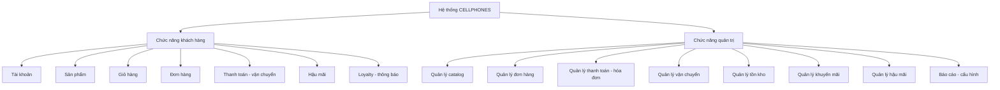
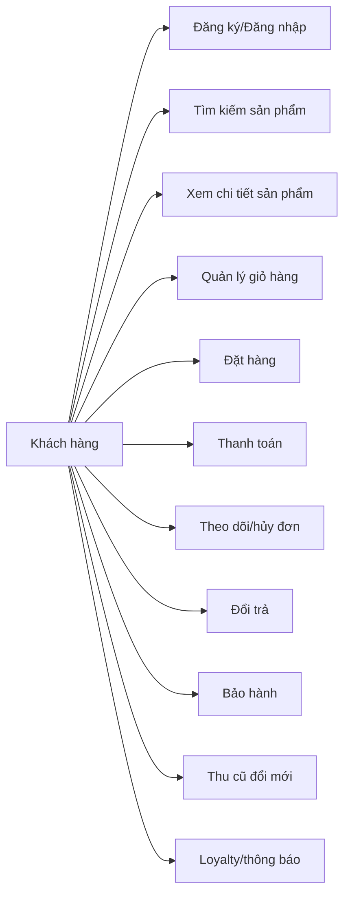
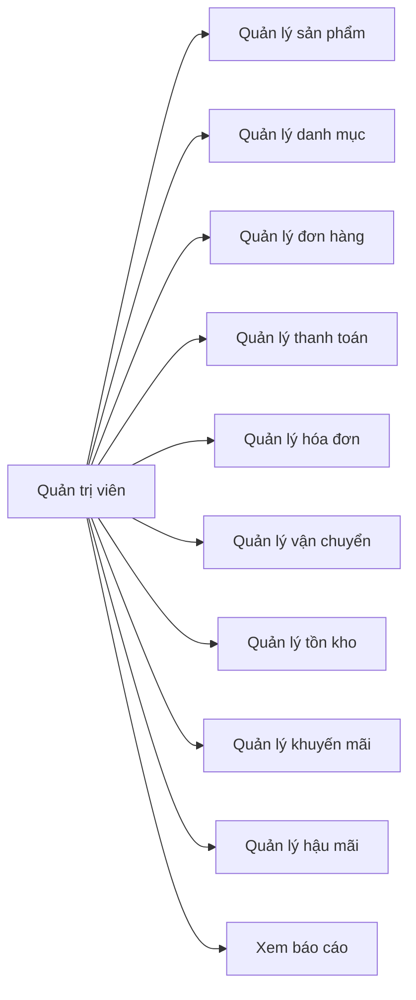
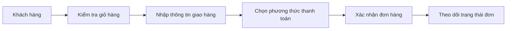
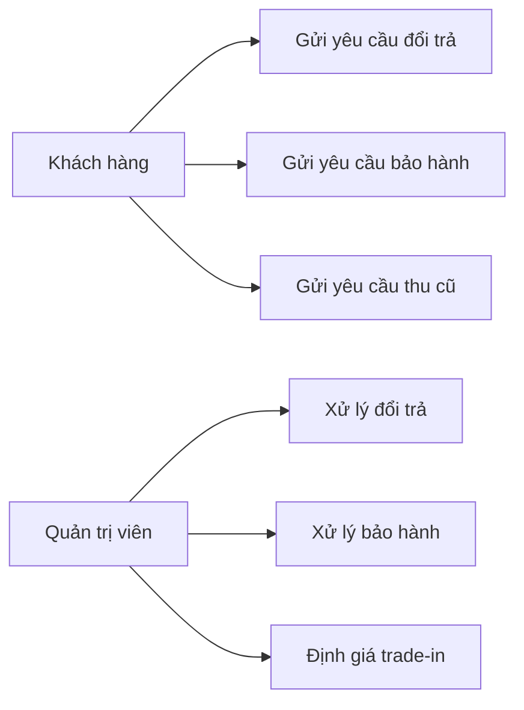
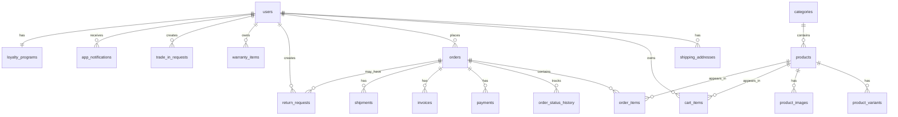
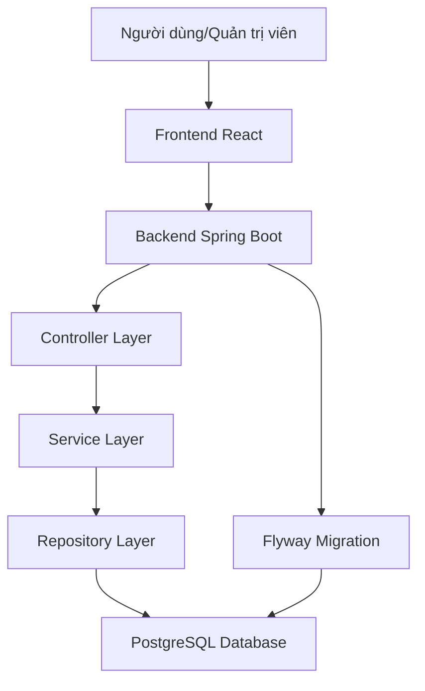
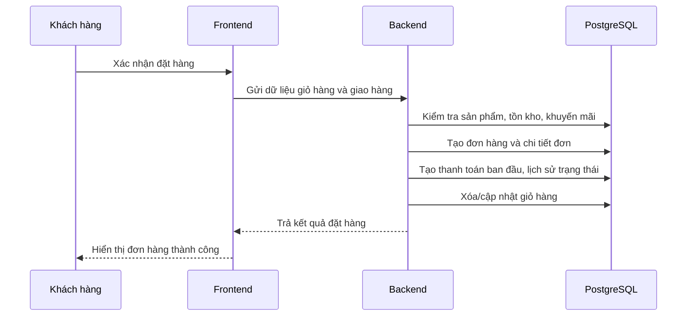

# TRƯỜNG ĐẠI HỌC [TÊN TRƯỜNG]

## KHOA [TÊN KHOA]

# ĐỒ ÁN TỐT NGHIỆP

## ĐỀ TÀI

# XÂY DỰNG WEBSITE THƯƠNG MẠI ĐIỆN TỬ BÁN ĐIỆN THOẠI VÀ PHỤ KIỆN CÔNG NGHỆ CELLPHONES

Giảng viên hướng dẫn: [Tên giảng viên hướng dẫn]

Sinh viên thực hiện: [Họ và tên sinh viên]

Lớp: [Lớp]

Mã sinh viên: [Mã sinh viên]

Hà Nội - 2026

---

# LỜI CẢM ƠN

Lời đầu tiên, em xin gửi lời cảm ơn chân thành đến các thầy giáo, cô giáo của Trường [Tên trường], đặc biệt là các thầy cô trong Khoa [Tên khoa] đã tận tình giảng dạy, truyền đạt cho em những kiến thức nền tảng và chuyên môn trong suốt quá trình học tập tại trường.

Em xin gửi lời cảm ơn sâu sắc đến thầy/cô [Tên giảng viên hướng dẫn], người đã trực tiếp hướng dẫn, góp ý và tạo điều kiện để em hoàn thành đồ án tốt nghiệp này. Những định hướng và nhận xét của thầy/cô là cơ sở quan trọng giúp em hoàn thiện đề tài, từ quá trình phân tích yêu cầu, thiết kế hệ thống đến xây dựng chương trình.

Trong quá trình thực hiện đồ án, do thời gian và kinh nghiệm thực tế còn hạn chế, báo cáo không thể tránh khỏi những thiếu sót. Em rất mong nhận được sự góp ý của quý thầy cô để có thể bổ sung, hoàn thiện kiến thức và nâng cao chất lượng sản phẩm trong tương lai.

Em xin chân thành cảm ơn!

Hà Nội, ngày [..] tháng [..] năm 2026

Sinh viên thực hiện

[Họ và tên sinh viên]

---

# MỤC LỤC

LỜI CẢM ƠN

DANH MỤC CÁC TỪ VIẾT TẮT

DANH MỤC BẢNG BIỂU

DANH MỤC HÌNH ẢNH

MỞ ĐẦU

CHƯƠNG 1: TỔNG QUAN VỀ ĐỀ TÀI

1.1. Mục tiêu và phạm vi của đồ án

1.2. Khảo sát website thương mại điện tử bán điện thoại

1.3. Phân tích quy trình nghiệp vụ

1.4. Công nghệ sử dụng

CHƯƠNG 2: PHÂN TÍCH THIẾT KẾ HỆ THỐNG

2.1. Sơ đồ phân rã chức năng

2.2. Thiết kế Use Case

2.3. Thiết kế cơ sở dữ liệu

2.4. Thiết kế kiến trúc xử lý và luồng dữ liệu

CHƯƠNG 3: CÀI ĐẶT CHƯƠNG TRÌNH

3.1. Cài đặt frontend

3.2. Cài đặt backend

3.3. Giao diện người dùng

3.4. Giao diện quản trị

KẾT LUẬN

TÀI LIỆU THAM KHẢO

---

# DANH MỤC CÁC TỪ VIẾT TẮT

| STT | Từ viết tắt | Tên đầy đủ |
| --- | --- | --- |
| 1 | Admin | Administrator - Quản trị viên |
| 2 | API | Application Programming Interface |
| 3 | BE | Backend |
| 4 | CRUD | Create, Read, Update, Delete |
| 5 | DB | Database |
| 6 | DTO | Data Transfer Object |
| 7 | ERD | Entity Relationship Diagram |
| 8 | FE | Frontend |
| 9 | JPA | Java Persistence API |
| 10 | JWT | JSON Web Token |
| 11 | OTP | One Time Password |
| 12 | UI/UX | User Interface/User Experience |
| 13 | VND | Việt Nam Đồng |

---

# DANH MỤC BẢNG BIỂU

| STT | Tên bảng |
| --- | --- |
| Bảng 1.1 | Phạm vi chức năng của hệ thống |
| Bảng 1.2 | Công nghệ sử dụng phía frontend |
| Bảng 1.3 | Công nghệ sử dụng phía backend |
| Bảng 2.1 | Bảng Use Case đăng nhập |
| Bảng 2.2 | Bảng Use Case tìm kiếm và xem sản phẩm |
| Bảng 2.3 | Bảng Use Case quản lý giỏ hàng |
| Bảng 2.4 | Bảng Use Case đặt hàng |
| Bảng 2.5 | Bảng Use Case thanh toán |
| Bảng 2.6 | Bảng Use Case theo dõi và hủy đơn hàng |
| Bảng 2.7 | Bảng Use Case yêu cầu đổi trả |
| Bảng 2.8 | Bảng Use Case yêu cầu bảo hành |
| Bảng 2.9 | Bảng Use Case thu cũ đổi mới |
| Bảng 2.10 | Bảng Use Case quản lý sản phẩm |
| Bảng 2.11 | Bảng Use Case quản lý đơn hàng |
| Bảng 2.12 | Bảng Use Case quản lý khuyến mãi |
| Bảng 2.13 | Bảng Use Case quản lý tồn kho |
| Bảng 2.14 | Bảng Use Case xem báo cáo thống kê |
| Bảng 2.15 | Các bảng chính trong cơ sở dữ liệu |
| Bảng 2.16 | Bảng users |
| Bảng 2.17 | Bảng products |
| Bảng 2.18 | Bảng product_variants |
| Bảng 2.19 | Bảng orders |
| Bảng 2.20 | Bảng order_items |
| Bảng 2.21 | Bảng payments |
| Bảng 2.22 | Bảng invoices |
| Bảng 2.23 | Bảng shipments |
| Bảng 2.24 | Bảng return_requests |
| Bảng 2.25 | Bảng warranty_items |
| Bảng 2.26 | Bảng trade_in_requests |
| Bảng 2.27 | Bảng loyalty_programs |
| Bảng 2.28 | Bảng app_notifications |

---

# DANH MỤC HÌNH ẢNH

| STT | Tên hình |
| --- | --- |
| Hình 2.1 | Sơ đồ phân rã chức năng hệ thống |
| Hình 2.2 | Sơ đồ Use Case tổng quát của khách hàng |
| Hình 2.3 | Sơ đồ Use Case tổng quát của quản trị viên |
| Hình 2.4 | Sơ đồ Use Case đặt hàng và thanh toán |
| Hình 2.5 | Sơ đồ Use Case hậu mãi |
| Hình 2.6 | Mô hình ERD rút gọn |
| Hình 2.7 | Kiến trúc xử lý tổng thể |
| Hình 2.8 | Luồng xử lý đặt hàng |
| Hình 3.1 | Giao diện trang chủ |
| Hình 3.2 | Giao diện danh sách sản phẩm |
| Hình 3.3 | Giao diện chi tiết sản phẩm |
| Hình 3.4 | Giao diện giỏ hàng |
| Hình 3.5 | Giao diện thanh toán |
| Hình 3.6 | Giao diện lịch sử đơn hàng |
| Hình 3.7 | Giao diện bảo hành/đổi trả/thu cũ |
| Hình 3.8 | Giao diện thông báo hoặc loyalty |
| Hình 3.9 | Giao diện dashboard quản trị |
| Hình 3.10 | Giao diện quản lý sản phẩm |
| Hình 3.11 | Giao diện quản lý đơn hàng |
| Hình 3.12 | Giao diện quản lý tồn kho |
| Hình 3.13 | Giao diện quản lý khuyến mãi |
| Hình 3.14 | Giao diện báo cáo thống kê |

---

# MỞ ĐẦU

Trong thời đại số hóa, thương mại điện tử đã trở thành một kênh mua sắm quan trọng, giúp người dùng tiếp cận sản phẩm nhanh chóng, so sánh thông tin thuận tiện và thực hiện giao dịch mọi lúc mọi nơi. Đối với nhóm sản phẩm điện thoại di động và phụ kiện công nghệ, nhu cầu mua sắm trực tuyến ngày càng tăng do sản phẩm có nhiều mẫu mã, cấu hình, mức giá và chương trình khuyến mãi khác nhau. Người mua thường cần xem thông số kỹ thuật, so sánh giá, kiểm tra tình trạng hàng, lựa chọn phương thức thanh toán, theo dõi đơn hàng và sử dụng các dịch vụ sau bán hàng như bảo hành, đổi trả hoặc thu cũ đổi mới.

Bên cạnh trải nghiệm của khách hàng, phía quản trị hệ thống cũng cần một công cụ tập trung để quản lý danh mục, sản phẩm, tồn kho, đơn hàng, hóa đơn, vận chuyển, khuyến mãi, khách hàng và báo cáo thống kê. Nếu các nghiệp vụ này được xử lý rời rạc, quá trình vận hành dễ phát sinh sai sót, khó theo dõi trạng thái đơn hàng và khó đánh giá hiệu quả kinh doanh.

Xuất phát từ nhu cầu đó, đề tài "Xây dựng website thương mại điện tử bán điện thoại và phụ kiện công nghệ CELLPHONES" được thực hiện nhằm xây dựng một hệ thống bán hàng trực tuyến phục vụ cả khách hàng và quản trị viên. Hệ thống hỗ trợ các chức năng chính như xem danh mục sản phẩm, tìm kiếm sản phẩm, quản lý giỏ hàng, đặt hàng, thanh toán, theo dõi đơn hàng, xử lý đổi trả, bảo hành, thu cũ đổi mới, tích điểm thành viên và quản trị dữ liệu bán hàng.

Nội dung báo cáo được chia thành các phần chính như sau:

Chương 1: Tổng quan về đề tài. Chương này trình bày mục tiêu, phạm vi của đồ án, khảo sát một số website thương mại điện tử bán điện thoại, phân tích các quy trình nghiệp vụ chính và giới thiệu công nghệ được sử dụng trong quá trình xây dựng hệ thống.

Chương 2: Phân tích thiết kế hệ thống. Chương này tập trung vào việc phân rã chức năng, xác định tác nhân, mô tả các Use Case, thiết kế cơ sở dữ liệu, mô hình quan hệ và kiến trúc xử lý tổng thể của hệ thống.

Chương 3: Cài đặt chương trình. Chương này trình bày quá trình cài đặt frontend, backend và mô tả các giao diện chính của website dành cho khách hàng và quản trị viên.

Kết luận: Phần kết luận tổng hợp các kết quả đã đạt được, nêu những hạn chế còn tồn tại và đề xuất hướng phát triển tiếp theo cho hệ thống.

---

# CHƯƠNG 1: TỔNG QUAN VỀ ĐỀ TÀI

## 1.1. Mục tiêu và phạm vi của đồ án

Nội dung đề tài tập trung nghiên cứu và xây dựng một website thương mại điện tử B2C chuyên về điện thoại di động và phụ kiện công nghệ. Hệ thống CELLPHONES được định hướng phục vụ ba nhóm người dùng chính: khách hàng, quản trị viên và nhân viên vận hành.

Đối với khách hàng, hệ thống cung cấp các chức năng phục vụ quá trình mua sắm trực tuyến, từ việc duyệt danh mục sản phẩm, tìm kiếm, lọc sản phẩm, xem chi tiết thông số kỹ thuật, thêm sản phẩm vào giỏ hàng, đặt hàng, thanh toán đến theo dõi trạng thái đơn hàng. Ngoài ra, hệ thống còn hỗ trợ các dịch vụ sau bán hàng như đổi trả, bảo hành, thu cũ đổi mới, kiểm tra IMEI, đánh giá sản phẩm, danh sách yêu thích, chương trình tích điểm và thông báo.

Đối với quản trị viên, hệ thống cung cấp công cụ để quản lý sản phẩm, danh mục, biến thể sản phẩm, hình ảnh, tồn kho, đơn hàng, thanh toán, hóa đơn, vận chuyển, khuyến mãi, chương trình loyalty, khách hàng, nhân viên, chi nhánh, báo cáo thống kê và cấu hình hệ thống. Đây là phần giúp quá trình vận hành bán hàng được tập trung, có kiểm soát và dễ mở rộng.

Đối với nhân viên, hệ thống hỗ trợ các thao tác vận hành tùy theo phân quyền như xử lý đơn hàng, cập nhật vận chuyển, hỗ trợ khách hàng, xử lý đổi trả, bảo hành hoặc kiểm tra thông tin tồn kho.

Bảng 1.1 trình bày phạm vi chức năng chính của hệ thống:

| Nhóm chức năng | Nội dung |
| --- | --- |
| Khách hàng | Xem sản phẩm, tìm kiếm, lọc, giỏ hàng, đặt hàng, thanh toán, theo dõi đơn hàng |
| Hậu mãi | Đổi trả, bảo hành, thu cũ đổi mới, kiểm tra IMEI |
| Tương tác | Đánh giá sản phẩm, wishlist, thông báo, chương trình tích điểm |
| Quản trị catalog | Quản lý danh mục, sản phẩm, biến thể, hình ảnh, thông số điện thoại |
| Quản trị đơn hàng | Quản lý đơn hàng, thanh toán, hóa đơn, vận chuyển |
| Quản trị vận hành | Quản lý tồn kho, khuyến mãi, chi nhánh, nhân viên, cấu hình hệ thống |
| Báo cáo | Thống kê doanh thu, sản phẩm, khách hàng, tồn kho, đổi trả |

Phạm vi của đồ án tập trung vào việc xây dựng website chạy thử trên môi trường cục bộ, có frontend phục vụ người dùng và quản trị viên, backend xử lý nghiệp vụ, cơ sở dữ liệu PostgreSQL lưu trữ dữ liệu chính. Dựa trên kết quả của đề tài, hệ thống có thể tiếp tục phát triển để triển khai trên môi trường thực tế với dữ liệu lớn hơn, bảo mật đầy đủ hơn và tích hợp các dịch vụ thanh toán bên ngoài.

## 1.2. Khảo sát website thương mại điện tử bán điện thoại

Hiện nay có nhiều website thương mại điện tử chuyên bán điện thoại và phụ kiện công nghệ như CellphoneS, Thế Giới Di Động, FPT Shop, Hoàng Hà Mobile. Các hệ thống này đều cung cấp những chức năng cơ bản như danh mục sản phẩm, tìm kiếm theo tên hoặc thương hiệu, lọc theo mức giá, bộ nhớ, RAM, camera, pin, màn hình, hệ điều hành, xem chi tiết sản phẩm, so sánh sản phẩm, đặt hàng trực tuyến, thanh toán, theo dõi đơn hàng và bảo hành.

Qua khảo sát các website trên, có thể nhận thấy một hệ thống bán điện thoại hiệu quả cần đáp ứng các yêu cầu sau:

- Thông tin sản phẩm phải rõ ràng, bao gồm tên sản phẩm, thương hiệu, giá bán, khuyến mãi, hình ảnh, thông số kỹ thuật và tình trạng hàng.
- Chức năng tìm kiếm và lọc sản phẩm cần linh hoạt để người dùng nhanh chóng tìm được sản phẩm phù hợp với nhu cầu.
- Quy trình mua hàng cần đơn giản, gồm thêm vào giỏ hàng, kiểm tra thông tin, áp dụng khuyến mãi, nhập địa chỉ giao hàng và xác nhận đơn.
- Hệ thống phải cho phép khách hàng theo dõi trạng thái đơn hàng từ lúc tạo đơn đến khi giao thành công.
- Các chính sách sau bán hàng như đổi trả, bảo hành, thu cũ đổi mới cần được số hóa để khách hàng dễ gửi yêu cầu và quản trị viên dễ xử lý.
- Phía quản trị cần có dashboard, báo cáo, quản lý sản phẩm, quản lý tồn kho và xử lý đơn hàng tập trung.

Từ kết quả khảo sát, hệ thống CELLPHONES được thiết kế theo hướng kết hợp trải nghiệm mua sắm trực tuyến cho khách hàng và công cụ quản trị vận hành cho nhân viên/quản trị viên.

## 1.3. Phân tích quy trình nghiệp vụ

### 1.3.1. Quy trình đăng ký và đăng nhập

Khách hàng truy cập vào hệ thống và có thể đăng ký tài khoản bằng các thông tin cơ bản như họ tên, email, số điện thoại và mật khẩu. Hệ thống kiểm tra tính hợp lệ của dữ liệu, đảm bảo email hoặc số điện thoại không bị trùng lặp và mật khẩu đáp ứng yêu cầu bảo mật. Sau khi đăng ký thành công, khách hàng có thể đăng nhập để sử dụng các chức năng dành cho tài khoản cá nhân như giỏ hàng, đơn hàng, địa chỉ giao hàng, bảo hành, đổi trả, loyalty và thông báo.

Khi đăng nhập, người dùng nhập thông tin tài khoản và mật khẩu. Nếu thông tin không chính xác, hệ thống hiển thị thông báo lỗi. Nếu đăng nhập thành công, hệ thống chuyển người dùng về giao diện phù hợp với vai trò: khách hàng truy cập storefront, quản trị viên truy cập trang quản trị.

### 1.3.2. Quy trình xem và tìm kiếm sản phẩm

Người dùng truy cập website để xem danh mục sản phẩm. Hệ thống hiển thị danh sách sản phẩm theo nhóm như điện thoại, phụ kiện, tai nghe, đồng hồ thông minh, sạc, pin dự phòng hoặc thiết bị công nghệ. Người dùng có thể nhập từ khóa để tìm kiếm sản phẩm theo tên, thương hiệu hoặc thông số. Ngoài ra, người dùng có thể lọc sản phẩm theo mức giá, RAM, bộ nhớ, camera, pin, màn hình, hệ điều hành hoặc tình trạng hàng.

Khi chọn một sản phẩm, hệ thống hiển thị trang chi tiết gồm hình ảnh, giá bán, khuyến mãi, mô tả, cấu hình kỹ thuật, biến thể màu sắc/dung lượng, chính sách bảo hành và sản phẩm liên quan. Đây là bước giúp khách hàng có đủ thông tin trước khi quyết định mua hàng.

### 1.3.3. Quy trình quản lý giỏ hàng

Sau khi chọn sản phẩm, khách hàng có thể thêm sản phẩm vào giỏ hàng. Nếu sản phẩm đã tồn tại trong giỏ, hệ thống gộp số lượng theo quy tắc merge item trùng lặp. Trong giỏ hàng, khách hàng có thể tăng, giảm số lượng, xóa từng sản phẩm hoặc xóa toàn bộ giỏ hàng. Trước khi thanh toán, hệ thống kiểm tra tính hợp lệ của giỏ hàng, bao gồm tồn kho, trạng thái sản phẩm, giá hiện tại và các ràng buộc về số lượng.

Quy trình này giúp đảm bảo đơn hàng được tạo từ dữ liệu hợp lệ, hạn chế tình trạng đặt sản phẩm đã hết hàng hoặc giá không còn đúng.

### 1.3.4. Quy trình đặt hàng

Khi khách hàng tiến hành thanh toán, hệ thống yêu cầu xác nhận thông tin giao hàng, phương thức thanh toán, danh sách sản phẩm, phí vận chuyển và khuyến mãi nếu có. Sau khi khách hàng xác nhận đặt hàng, hệ thống tạo đơn hàng, tạo các dòng sản phẩm trong đơn, ghi nhận lịch sử trạng thái ban đầu, tạo thông tin thanh toán tương ứng và xóa giỏ hàng sau khi đặt hàng thành công.

Mã đơn hàng được sinh theo quy tắc nghiệp vụ để thuận tiện tra cứu. Tổng tiền đơn hàng được tính dựa trên tổng tiền sản phẩm, giảm giá, phí vận chuyển và các khoản phát sinh khác. Hệ thống cũng kiểm tra tồn kho trước khi xác nhận đơn nhằm đảm bảo sản phẩm còn khả dụng.

### 1.3.5. Quy trình thanh toán

Hệ thống hỗ trợ nhiều hình thức thanh toán như thanh toán khi nhận hàng, chuyển khoản hoặc thanh toán trực tuyến. Với thanh toán khi nhận hàng, đơn hàng được ghi nhận ở trạng thái chờ xử lý và thanh toán sẽ được đánh dấu hoàn tất khi giao hàng thành công. Với thanh toán trực tuyến, hệ thống tạo phiên thanh toán và cập nhật trạng thái dựa trên kết quả trả về từ cổng thanh toán.

Trạng thái thanh toán có thể gồm chưa thanh toán, đã thanh toán, quá hạn, thất bại, hoàn tiền hoặc hoàn tiền một phần. Việc tách trạng thái đơn hàng và trạng thái thanh toán giúp hệ thống xử lý linh hoạt các tình huống thực tế như đơn đã giao nhưng thanh toán COD mới hoàn tất, hoặc đơn bị hủy cần hoàn tiền.

### 1.3.6. Quy trình quản trị và xử lý đơn hàng

Quản trị viên truy cập trang quản lý đơn hàng để xem danh sách đơn, lọc theo trạng thái, xem chi tiết khách hàng, sản phẩm, thanh toán, hóa đơn và vận chuyển. Khi đơn hàng được xác nhận, hệ thống cập nhật trạng thái và thực hiện các tác động liên quan như giữ tồn kho hoặc ghi nhận lịch sử trạng thái.

Khi đơn chuyển sang trạng thái vận chuyển, hệ thống có thể tạo thông tin giao hàng và hóa đơn. Khi đơn được giao thành công, hệ thống cập nhật trạng thái thanh toán nếu là COD, tạo thông tin bảo hành cho sản phẩm, cộng điểm loyalty và gửi thông báo đến khách hàng.

### 1.3.7. Quy trình đổi trả, bảo hành và thu cũ đổi mới

Sau khi đơn hàng được giao thành công, khách hàng có thể gửi yêu cầu đổi trả trong thời gian cho phép. Hệ thống kiểm tra điều kiện đổi trả, lý do, sản phẩm trong đơn và trạng thái đơn. Quản trị viên tiếp nhận yêu cầu, xem xét và cập nhật trạng thái xử lý. Nếu yêu cầu được duyệt hoàn tiền, hệ thống cập nhật thanh toán và có thể đảo điểm loyalty đã cộng trước đó.

Đối với bảo hành, hệ thống tạo thông tin bảo hành cho sản phẩm sau khi đơn hàng giao thành công. Khách hàng có thể xem danh sách sản phẩm còn bảo hành và gửi yêu cầu bảo hành nếu sản phẩm đáp ứng điều kiện. Quản trị viên xử lý yêu cầu và cập nhật trạng thái bảo hành.

Đối với thu cũ đổi mới, khách hàng nhập thông tin thiết bị cũ như dòng máy, dung lượng, tình trạng ngoại hình, màn hình, pin và phụ kiện. Hệ thống tính giá ước lượng dựa trên công thức định giá, sau đó khách hàng có thể gửi yêu cầu. Quản trị viên kiểm tra thực tế, định giá chính thức và hoàn tất giao dịch nếu khách hàng chấp nhận.

### 1.3.8. Quy trình loyalty và thông báo

Khi khách hàng mua hàng thành công, hệ thống cộng điểm loyalty dựa trên giá trị đơn hàng theo quy tắc tích điểm. Điểm thưởng có thể được sử dụng để đổi ưu đãi hoặc phần thưởng. Hệ thống cũng có thể phân hạng thành viên dựa trên tổng chi tiêu hoặc tổng điểm tích lũy.

Thông báo được tạo trong các sự kiện quan trọng như đặt hàng thành công, cập nhật trạng thái đơn hàng, thanh toán thành công, giao hàng thành công, yêu cầu đổi trả, bảo hành, trade-in hoặc thay đổi điểm loyalty. Chức năng thông báo giúp khách hàng theo dõi quá trình xử lý mà không cần kiểm tra thủ công liên tục.

## 1.4. Công nghệ sử dụng

### 1.4.1. Công nghệ frontend

Frontend của hệ thống được xây dựng bằng React, TypeScript và Vite. React hỗ trợ xây dựng giao diện theo mô hình component, giúp chia nhỏ giao diện phức tạp thành các thành phần độc lập, dễ tái sử dụng và bảo trì. TypeScript bổ sung kiểu dữ liệu tĩnh cho JavaScript, giúp giảm lỗi trong quá trình phát triển, đặc biệt đối với các dự án có nhiều màn hình, nhiều kiểu dữ liệu và nhiều luồng nghiệp vụ.

Vite được sử dụng làm công cụ phát triển và build ứng dụng. Vite có tốc độ khởi động nhanh, hỗ trợ hot module replacement, phù hợp cho quá trình phát triển frontend hiện đại. Tailwind CSS được dùng để xây dựng giao diện theo hướng utility-first, giúp tăng tốc độ thiết kế, đồng thời giữ sự thống nhất về spacing, màu sắc và responsive.

React Router được dùng để tổ chức điều hướng trong ứng dụng. Các thư viện Radix UI/shadcn UI cung cấp các thành phần giao diện nền tảng như dialog, tabs, select, checkbox, tooltip, popover. Lucide React được sử dụng cho hệ thống biểu tượng. Recharts hỗ trợ biểu đồ trong trang quản trị, Sonner hỗ trợ thông báo trạng thái, react-hook-form hỗ trợ xử lý form.

Bảng 1.2 trình bày các công nghệ chính phía frontend:

| Công nghệ | Phiên bản | Vai trò |
| --- | --- | --- |
| React | 18.3.1 | Xây dựng giao diện người dùng |
| TypeScript | Theo cấu hình dự án | Bổ sung kiểu dữ liệu cho mã nguồn frontend |
| Vite | 6.3.5 | Công cụ phát triển và build |
| Tailwind CSS | 4.1.12 | Xây dựng giao diện bằng utility classes |
| React Router | 7.13.0 | Điều hướng trong ứng dụng |
| Radix UI/shadcn UI | Theo package | Thành phần giao diện tái sử dụng |
| lucide-react | 0.487.0 | Biểu tượng |
| Recharts | 2.15.2 | Biểu đồ thống kê |
| Sonner | 2.0.3 | Toast notification |
| react-hook-form | 7.55.0 | Quản lý form |

### 1.4.2. Công nghệ backend

Backend của hệ thống được xây dựng bằng Java 21 và Spring Boot 4.0.6. Spring Boot giúp xây dựng ứng dụng backend nhanh chóng với cấu hình tối giản, tích hợp tốt với các thư viện trong hệ sinh thái Spring. Spring Web được sử dụng để xây dựng các controller xử lý yêu cầu từ frontend. Spring Data JPA hỗ trợ thao tác cơ sở dữ liệu thông qua repository, giảm lượng mã lặp khi truy vấn và cập nhật dữ liệu.

PostgreSQL 15 được sử dụng làm hệ quản trị cơ sở dữ liệu quan hệ. Đây là hệ quản trị cơ sở dữ liệu mã nguồn mở, ổn định, hỗ trợ tốt kiểu dữ liệu quan hệ, ràng buộc khóa ngoại, transaction và các nhu cầu mở rộng cho hệ thống thương mại điện tử. Flyway được sử dụng để quản lý migration, giúp quá trình thay đổi cấu trúc cơ sở dữ liệu có lịch sử rõ ràng và dễ triển khai trên nhiều môi trường.

Bean Validation được sử dụng để kiểm tra dữ liệu đầu vào. Springdoc OpenAPI/Swagger UI hỗ trợ tạo tài liệu kỹ thuật tự động cho backend trong quá trình phát triển và kiểm thử. Docker Compose được dùng để khởi tạo PostgreSQL cục bộ, giúp môi trường chạy backend ổn định và dễ tái lập.

Bảng 1.3 trình bày các công nghệ chính phía backend:

| Công nghệ | Phiên bản | Vai trò |
| --- | --- | --- |
| Java | 21 | Ngôn ngữ lập trình backend |
| Spring Boot | 4.0.6 | Framework xây dựng ứng dụng backend |
| Spring Web | Theo Spring Boot | Xử lý request từ frontend |
| Spring Data JPA | Theo Spring Boot | Tương tác cơ sở dữ liệu |
| Bean Validation | Theo Spring Boot | Kiểm tra dữ liệu đầu vào |
| PostgreSQL | 15 | Cơ sở dữ liệu chính |
| Flyway | Theo dependency | Quản lý migration cơ sở dữ liệu |
| Springdoc OpenAPI | 3.0.3 | Sinh tài liệu kỹ thuật tự động |
| Docker Compose | Theo môi trường | Khởi tạo PostgreSQL cục bộ |

---

# CHƯƠNG 2: PHÂN TÍCH THIẾT KẾ HỆ THỐNG

## 2.1. Sơ đồ phân rã chức năng

Hệ thống CELLPHONES được phân rã thành hai nhóm chức năng lớn: nhóm chức năng dành cho khách hàng và nhóm chức năng dành cho quản trị viên/nhân viên vận hành.

Nhóm chức năng khách hàng tập trung vào trải nghiệm mua sắm. Người dùng có thể đăng ký, đăng nhập, duyệt danh mục sản phẩm, tìm kiếm, lọc, xem chi tiết sản phẩm, thêm vào giỏ hàng, đặt hàng, thanh toán, theo dõi đơn hàng, gửi yêu cầu đổi trả, bảo hành, thu cũ đổi mới, xem thông báo, xem điểm loyalty và đánh giá sản phẩm.

Nhóm chức năng quản trị tập trung vào vận hành hệ thống. Quản trị viên có thể quản lý sản phẩm, danh mục, biến thể, hình ảnh, tồn kho, đơn hàng, thanh toán, hóa đơn, vận chuyển, khuyến mãi, hậu mãi, loyalty, thông báo, nhân viên, chi nhánh, báo cáo và cấu hình hệ thống.

Hình 2.1: Sơ đồ phân rã chức năng hệ thống

## 2.2. Thiết kế Use Case

### 2.2.1. Xác định các tác nhân

Các tác nhân chính tham gia hệ thống gồm:

- Khách hàng: người sử dụng website để xem sản phẩm, mua hàng, thanh toán, theo dõi đơn, gửi yêu cầu hậu mãi và nhận thông báo.
- Quản trị viên: người quản lý dữ liệu hệ thống, sản phẩm, đơn hàng, thanh toán, tồn kho, khuyến mãi, báo cáo và cấu hình.
- Nhân viên: người hỗ trợ vận hành theo phân quyền như xử lý đơn hàng, cập nhật vận chuyển, hỗ trợ đổi trả hoặc bảo hành.

### 2.2.2. Xác định các Use Case

Các Use Case của khách hàng:

- Đăng ký, đăng nhập.
- Tìm kiếm và xem sản phẩm.
- Quản lý giỏ hàng.
- Đặt hàng.
- Thanh toán.
- Theo dõi hoặc hủy đơn hàng.
- Gửi yêu cầu đổi trả.
- Gửi yêu cầu bảo hành.
- Gửi yêu cầu thu cũ đổi mới.
- Xem điểm loyalty và thông báo.

Các Use Case của quản trị viên:

- Quản lý danh mục và sản phẩm.
- Quản lý đơn hàng.
- Quản lý thanh toán, hóa đơn và vận chuyển.
- Quản lý tồn kho.
- Quản lý khuyến mãi.
- Quản lý đổi trả, bảo hành, trade-in.
- Xem dashboard và báo cáo thống kê.
- Quản lý cấu hình hệ thống.

Hình 2.2: Sơ đồ Use Case tổng quát của khách hàng

Hình 2.3: Sơ đồ Use Case tổng quát của quản trị viên

### 2.2.3. Use Case đăng nhập

Bảng 2.1. Bảng Use Case đăng nhập

| Thuộc tính | Nội dung |
| --- | --- |
| Mô tả | Tác nhân đăng nhập vào hệ thống để sử dụng các chức năng tương ứng với vai trò |
| Tác nhân | Khách hàng, quản trị viên, nhân viên |
| Kích hoạt | Tác nhân muốn truy cập chức năng yêu cầu tài khoản |
| Điều kiện trước | Tài khoản đã tồn tại trong hệ thống |
| Điều kiện sau | Đăng nhập thành công, hệ thống chuyển đến giao diện phù hợp |
| Luồng sự kiện chính | Tác nhân mở trang đăng nhập; nhập email/số điện thoại và mật khẩu; hệ thống kiểm tra thông tin; nếu hợp lệ, hệ thống cho phép truy cập |
| Luồng ngoại lệ | Nếu thông tin không chính xác hoặc tài khoản bị khóa, hệ thống hiển thị thông báo lỗi |
| Thông tin bổ sung | Mật khẩu cần được lưu trữ an toàn và không hiển thị dưới dạng rõ |

### 2.2.4. Use Case tìm kiếm và xem sản phẩm

Bảng 2.2. Bảng Use Case tìm kiếm và xem sản phẩm

| Thuộc tính | Nội dung |
| --- | --- |
| Mô tả | Khách hàng tìm kiếm, lọc và xem thông tin chi tiết sản phẩm |
| Tác nhân | Khách hàng |
| Kích hoạt | Khách hàng truy cập trang sản phẩm hoặc nhập từ khóa tìm kiếm |
| Điều kiện trước | Hệ thống có dữ liệu sản phẩm |
| Điều kiện sau | Hệ thống hiển thị danh sách hoặc chi tiết sản phẩm phù hợp |
| Luồng sự kiện chính | Khách hàng nhập từ khóa hoặc chọn bộ lọc; hệ thống tìm sản phẩm phù hợp; khách hàng chọn một sản phẩm; hệ thống hiển thị chi tiết sản phẩm |
| Luồng ngoại lệ | Nếu không có sản phẩm phù hợp, hệ thống hiển thị thông báo không tìm thấy |
| Thông tin bổ sung | Có thể lọc theo giá, thương hiệu, RAM, bộ nhớ, camera, pin, màn hình, hệ điều hành |

### 2.2.5. Use Case quản lý giỏ hàng

Bảng 2.3. Bảng Use Case quản lý giỏ hàng

| Thuộc tính | Nội dung |
| --- | --- |
| Mô tả | Khách hàng thêm, sửa số lượng hoặc xóa sản phẩm trong giỏ hàng |
| Tác nhân | Khách hàng |
| Kích hoạt | Khách hàng chọn thêm sản phẩm vào giỏ hàng |
| Điều kiện trước | Sản phẩm tồn tại và còn khả dụng |
| Điều kiện sau | Giỏ hàng được cập nhật |
| Luồng sự kiện chính | Khách hàng chọn sản phẩm và biến thể; nhấn thêm vào giỏ; hệ thống thêm sản phẩm hoặc gộp số lượng nếu đã tồn tại; khách hàng cập nhật số lượng nếu cần |
| Luồng ngoại lệ | Nếu sản phẩm hết hàng hoặc số lượng vượt giới hạn, hệ thống hiển thị thông báo lỗi |
| Thông tin bổ sung | Hệ thống tự động tính giá tạm tính trong giỏ hàng |

### 2.2.6. Use Case đặt hàng

Bảng 2.4. Bảng Use Case đặt hàng

| Thuộc tính | Nội dung |
| --- | --- |
| Mô tả | Khách hàng tạo đơn hàng từ giỏ hàng |
| Tác nhân | Khách hàng |
| Kích hoạt | Khách hàng nhấn nút thanh toán hoặc đặt hàng |
| Điều kiện trước | Giỏ hàng có sản phẩm hợp lệ, có thông tin giao hàng |
| Điều kiện sau | Đơn hàng được tạo và ghi nhận trạng thái ban đầu |
| Luồng sự kiện chính | Khách hàng kiểm tra giỏ hàng; nhập địa chỉ; chọn phương thức thanh toán; xác nhận đặt hàng; hệ thống kiểm tra tồn kho, tính tổng tiền và tạo đơn hàng |
| Luồng ngoại lệ | Nếu giỏ hàng rỗng, sản phẩm hết hàng hoặc thông tin giao hàng không hợp lệ, hệ thống yêu cầu chỉnh sửa |
| Thông tin bổ sung | Sau khi đặt hàng thành công, giỏ hàng được xóa hoặc cập nhật lại |

Hình 2.4: Sơ đồ Use Case đặt hàng và thanh toán

### 2.2.7. Use Case thanh toán

Bảng 2.5. Bảng Use Case thanh toán

| Thuộc tính | Nội dung |
| --- | --- |
| Mô tả | Khách hàng thanh toán đơn hàng bằng phương thức đã chọn |
| Tác nhân | Khách hàng |
| Kích hoạt | Đơn hàng được tạo và cần thanh toán |
| Điều kiện trước | Đơn hàng tồn tại, tổng tiền hợp lệ |
| Điều kiện sau | Trạng thái thanh toán được cập nhật |
| Luồng sự kiện chính | Khách hàng chọn phương thức thanh toán; hệ thống ghi nhận thông tin thanh toán; khi thanh toán thành công, hệ thống cập nhật trạng thái |
| Luồng ngoại lệ | Nếu thanh toán thất bại hoặc quá hạn, hệ thống ghi nhận trạng thái tương ứng và thông báo cho khách hàng |
| Thông tin bổ sung | Thanh toán COD được ghi nhận hoàn tất khi giao hàng thành công |

### 2.2.8. Use Case theo dõi và hủy đơn hàng

Bảng 2.6. Bảng Use Case theo dõi và hủy đơn hàng

| Thuộc tính | Nội dung |
| --- | --- |
| Mô tả | Khách hàng xem danh sách đơn hàng, chi tiết đơn và hủy đơn nếu còn được phép |
| Tác nhân | Khách hàng |
| Kích hoạt | Khách hàng truy cập trang đơn hàng |
| Điều kiện trước | Khách hàng đã có đơn hàng |
| Điều kiện sau | Hệ thống hiển thị thông tin đơn hoặc cập nhật trạng thái hủy |
| Luồng sự kiện chính | Khách hàng mở danh sách đơn; chọn đơn cần xem; hệ thống hiển thị chi tiết; nếu đơn còn ở trạng thái cho phép, khách hàng có thể hủy |
| Luồng ngoại lệ | Nếu đơn đã giao hoặc đang ở trạng thái không cho phép hủy, hệ thống từ chối thao tác |
| Thông tin bổ sung | Hệ thống lưu lịch sử thay đổi trạng thái đơn hàng |

### 2.2.9. Use Case yêu cầu đổi trả

Bảng 2.7. Bảng Use Case yêu cầu đổi trả

| Thuộc tính | Nội dung |
| --- | --- |
| Mô tả | Khách hàng gửi yêu cầu đổi trả sản phẩm sau khi nhận hàng |
| Tác nhân | Khách hàng, quản trị viên |
| Kích hoạt | Khách hàng phát sinh nhu cầu đổi trả |
| Điều kiện trước | Đơn hàng đã giao thành công và còn trong thời gian được phép đổi trả |
| Điều kiện sau | Yêu cầu đổi trả được tạo và chờ xử lý |
| Luồng sự kiện chính | Khách hàng chọn đơn hàng; chọn sản phẩm cần đổi trả; nhập lý do; gửi yêu cầu; quản trị viên xem xét và cập nhật trạng thái |
| Luồng ngoại lệ | Nếu quá thời gian đổi trả hoặc sản phẩm không đủ điều kiện, hệ thống từ chối yêu cầu |
| Thông tin bổ sung | Khi hoàn tiền, hệ thống cần xử lý lại thanh toán và điểm loyalty nếu có |

### 2.2.10. Use Case yêu cầu bảo hành

Bảng 2.8. Bảng Use Case yêu cầu bảo hành

| Thuộc tính | Nội dung |
| --- | --- |
| Mô tả | Khách hàng gửi yêu cầu bảo hành đối với sản phẩm đã mua |
| Tác nhân | Khách hàng, quản trị viên |
| Kích hoạt | Sản phẩm gặp lỗi trong thời gian bảo hành |
| Điều kiện trước | Sản phẩm có thông tin bảo hành và chưa hết hạn |
| Điều kiện sau | Yêu cầu bảo hành được ghi nhận |
| Luồng sự kiện chính | Khách hàng chọn sản phẩm bảo hành; nhập mô tả lỗi; gửi yêu cầu; quản trị viên tiếp nhận, xử lý và cập nhật trạng thái |
| Luồng ngoại lệ | Nếu sản phẩm hết hạn bảo hành hoặc không thuộc đơn hàng của khách, hệ thống từ chối |
| Thông tin bổ sung | Thời hạn bảo hành được tính từ ngày giao hàng thành công |

### 2.2.11. Use Case thu cũ đổi mới

Bảng 2.9. Bảng Use Case thu cũ đổi mới

| Thuộc tính | Nội dung |
| --- | --- |
| Mô tả | Khách hàng gửi yêu cầu định giá thiết bị cũ để đổi sang sản phẩm mới |
| Tác nhân | Khách hàng, quản trị viên |
| Kích hoạt | Khách hàng muốn bán lại thiết bị cũ |
| Điều kiện trước | Khách hàng cung cấp thông tin thiết bị cần định giá |
| Điều kiện sau | Yêu cầu trade-in được tạo hoặc hoàn tất |
| Luồng sự kiện chính | Khách hàng nhập dòng máy, dung lượng, tình trạng; hệ thống ước lượng giá; khách hàng gửi yêu cầu; quản trị viên kiểm tra và định giá chính thức |
| Luồng ngoại lệ | Nếu thiết bị không đủ điều kiện hoặc khách hàng không chấp nhận giá, yêu cầu bị từ chối hoặc hủy |
| Thông tin bổ sung | Giá trị thu cũ dựa trên giá cơ sở, dung lượng và tình trạng máy |

Hình 2.5: Sơ đồ Use Case hậu mãi

### 2.2.12. Use Case quản lý sản phẩm

Bảng 2.10. Bảng Use Case quản lý sản phẩm

| Thuộc tính | Nội dung |
| --- | --- |
| Mô tả | Quản trị viên thêm, sửa, xóa, cập nhật thông tin sản phẩm |
| Tác nhân | Quản trị viên |
| Kích hoạt | Quản trị viên truy cập chức năng quản lý sản phẩm |
| Điều kiện trước | Quản trị viên đã đăng nhập |
| Điều kiện sau | Dữ liệu sản phẩm được cập nhật |
| Luồng sự kiện chính | Quản trị viên mở danh sách sản phẩm; thêm hoặc chỉnh sửa thông tin; nhập tên, thương hiệu, giá, mô tả, thông số, hình ảnh; xác nhận lưu |
| Luồng ngoại lệ | Nếu thiếu dữ liệu bắt buộc hoặc trùng mã sản phẩm, hệ thống hiển thị lỗi |
| Thông tin bổ sung | Sản phẩm có thể có nhiều biến thể và nhiều hình ảnh |

### 2.2.13. Use Case quản lý đơn hàng

Bảng 2.11. Bảng Use Case quản lý đơn hàng

| Thuộc tính | Nội dung |
| --- | --- |
| Mô tả | Quản trị viên xem và cập nhật trạng thái đơn hàng |
| Tác nhân | Quản trị viên |
| Kích hoạt | Có đơn hàng mới hoặc cần xử lý |
| Điều kiện trước | Quản trị viên đã đăng nhập |
| Điều kiện sau | Trạng thái đơn hàng được cập nhật |
| Luồng sự kiện chính | Quản trị viên mở danh sách đơn; xem chi tiết; xác nhận, chuyển vận chuyển, giao thành công hoặc hủy theo nghiệp vụ |
| Luồng ngoại lệ | Nếu trạng thái chuyển đổi không hợp lệ, hệ thống từ chối |
| Thông tin bổ sung | Mỗi lần đổi trạng thái cần lưu lịch sử |

### 2.2.14. Use Case quản lý khuyến mãi

Bảng 2.12. Bảng Use Case quản lý khuyến mãi

| Thuộc tính | Nội dung |
| --- | --- |
| Mô tả | Quản trị viên tạo và cập nhật chương trình khuyến mãi |
| Tác nhân | Quản trị viên |
| Kích hoạt | Có nhu cầu tạo mã giảm giá hoặc chương trình ưu đãi |
| Điều kiện trước | Quản trị viên đã đăng nhập |
| Điều kiện sau | Khuyến mãi được lưu và có thể áp dụng nếu hợp lệ |
| Luồng sự kiện chính | Quản trị viên nhập mã, loại giảm giá, thời gian hiệu lực, điều kiện áp dụng; hệ thống lưu chương trình |
| Luồng ngoại lệ | Nếu mã trùng, hết hạn hoặc điều kiện không hợp lệ, hệ thống hiển thị lỗi |
| Thông tin bổ sung | Khuyến mãi có thể giảm theo phần trăm hoặc số tiền cố định |

### 2.2.15. Use Case quản lý tồn kho

Bảng 2.13. Bảng Use Case quản lý tồn kho

| Thuộc tính | Nội dung |
| --- | --- |
| Mô tả | Quản trị viên theo dõi và điều chỉnh tồn kho sản phẩm |
| Tác nhân | Quản trị viên, nhân viên |
| Kích hoạt | Có thay đổi nhập/xuất kho hoặc cần kiểm tra tồn |
| Điều kiện trước | Sản phẩm và biến thể đã tồn tại |
| Điều kiện sau | Số lượng tồn kho được cập nhật |
| Luồng sự kiện chính | Nhân viên chọn sản phẩm/biến thể; nhập số lượng điều chỉnh; hệ thống cập nhật tồn kho và ghi nhận lịch sử |
| Luồng ngoại lệ | Nếu số lượng không hợp lệ hoặc vượt tồn kho khả dụng, hệ thống từ chối |
| Thông tin bổ sung | Hệ thống cần cảnh báo khi tồn kho thấp |

### 2.2.16. Use Case xem báo cáo thống kê

Bảng 2.14. Bảng Use Case xem báo cáo thống kê

| Thuộc tính | Nội dung |
| --- | --- |
| Mô tả | Quản trị viên xem số liệu doanh thu, sản phẩm, khách hàng, tồn kho và đổi trả |
| Tác nhân | Quản trị viên |
| Kích hoạt | Quản trị viên cần theo dõi tình hình kinh doanh |
| Điều kiện trước | Hệ thống có dữ liệu giao dịch |
| Điều kiện sau | Báo cáo được hiển thị theo bộ lọc |
| Luồng sự kiện chính | Quản trị viên chọn loại báo cáo và khoảng thời gian; hệ thống tổng hợp dữ liệu; hiển thị bảng và biểu đồ |
| Luồng ngoại lệ | Nếu không có dữ liệu trong khoảng thời gian, hệ thống hiển thị báo cáo rỗng |
| Thông tin bổ sung | Báo cáo hỗ trợ đánh giá hiệu quả vận hành và kinh doanh |

## 2.3. Thiết kế cơ sở dữ liệu

Cơ sở dữ liệu của hệ thống được thiết kế theo mô hình quan hệ và sử dụng PostgreSQL. Các bảng được chia theo nhóm nghiệp vụ chính như người dùng, catalog, giỏ hàng, đơn hàng, thanh toán, hóa đơn, vận chuyển, khuyến mãi, hậu mãi, loyalty, thông báo và quản trị vận hành.

Bảng 2.15. Các bảng chính trong cơ sở dữ liệu

| Nhóm | Bảng chính | Ý nghĩa |
| --- | --- | --- |
| Người dùng | users, shipping_addresses | Lưu tài khoản và địa chỉ giao hàng |
| Catalog | categories, products, product_variants, product_images, phone_specs | Lưu danh mục, sản phẩm, biến thể và thông số điện thoại |
| Giỏ hàng | cart_items | Lưu sản phẩm trong giỏ hàng |
| Đơn hàng | orders, order_items, order_status_history | Lưu đơn hàng, chi tiết đơn và lịch sử trạng thái |
| Thanh toán | payments, invoices, shipments | Lưu thanh toán, hóa đơn và vận chuyển |
| Khuyến mãi | promotions | Lưu chương trình giảm giá |
| Hậu mãi | return_requests, warranty_items, trade_in_requests | Lưu đổi trả, bảo hành, thu cũ đổi mới |
| Loyalty | loyalty_programs | Lưu điểm và hạng thành viên |
| Thông báo | app_notifications | Lưu thông báo trong hệ thống |
| Quản trị | branches, staff_members, inventory_items, activity_logs | Lưu chi nhánh, nhân viên, tồn kho và nhật ký hoạt động |

### 2.3.1. Bảng users

Bảng users lưu thông tin tài khoản người dùng trong hệ thống.

Bảng 2.16. Bảng users

| Thuộc tính | Ý nghĩa |
| --- | --- |
| id | Khóa chính của người dùng |
| email | Email đăng nhập |
| phone | Số điện thoại |
| password_hash | Mật khẩu đã mã hóa |
| full_name | Họ tên |
| role | Vai trò người dùng |
| status | Trạng thái tài khoản |
| created_at | Thời điểm tạo |
| updated_at | Thời điểm cập nhật |

### 2.3.2. Bảng products

Bảng products lưu thông tin sản phẩm chính.

Bảng 2.17. Bảng products

| Thuộc tính | Ý nghĩa |
| --- | --- |
| id | Khóa chính sản phẩm |
| category_id | Danh mục của sản phẩm |
| name | Tên sản phẩm |
| slug | Đường dẫn thân thiện |
| brand | Thương hiệu |
| description | Mô tả sản phẩm |
| price | Giá bán |
| original_price | Giá gốc |
| status | Trạng thái sản phẩm |
| warranty | Thời gian bảo hành |
| created_at | Thời điểm tạo |
| updated_at | Thời điểm cập nhật |

### 2.3.3. Bảng product_variants

Bảng product_variants lưu các biến thể của sản phẩm như màu sắc, dung lượng và tồn kho.

Bảng 2.18. Bảng product_variants

| Thuộc tính | Ý nghĩa |
| --- | --- |
| id | Khóa chính biến thể |
| product_id | Sản phẩm cha |
| sku | Mã SKU |
| color | Màu sắc |
| storage | Dung lượng |
| price | Giá của biến thể |
| stock | Số lượng tồn |
| status | Trạng thái biến thể |

### 2.3.4. Bảng orders

Bảng orders lưu thông tin đơn hàng.

Bảng 2.19. Bảng orders

| Thuộc tính | Ý nghĩa |
| --- | --- |
| id | Khóa chính đơn hàng |
| order_number | Mã đơn hàng |
| user_id | Khách hàng đặt đơn |
| status | Trạng thái đơn hàng |
| subtotal | Tổng tiền hàng |
| discount_total | Tổng giảm giá |
| shipping_fee | Phí vận chuyển |
| total_amount | Tổng tiền thanh toán |
| payment_method | Phương thức thanh toán |
| shipping_address | Địa chỉ giao hàng |
| created_at | Thời điểm tạo |
| updated_at | Thời điểm cập nhật |

### 2.3.5. Bảng order_items

Bảng order_items lưu danh sách sản phẩm trong từng đơn hàng.

Bảng 2.20. Bảng order_items

| Thuộc tính | Ý nghĩa |
| --- | --- |
| id | Khóa chính |
| order_id | Đơn hàng |
| product_id | Sản phẩm |
| variant_id | Biến thể |
| product_name | Tên sản phẩm tại thời điểm mua |
| quantity | Số lượng |
| unit_price | Đơn giá |
| total_price | Thành tiền |

### 2.3.6. Bảng payments

Bảng payments lưu thông tin thanh toán.

Bảng 2.21. Bảng payments

| Thuộc tính | Ý nghĩa |
| --- | --- |
| id | Khóa chính thanh toán |
| order_id | Đơn hàng liên quan |
| method | Phương thức thanh toán |
| status | Trạng thái thanh toán |
| amount | Số tiền |
| paid_at | Thời điểm thanh toán |
| transaction_ref | Mã giao dịch nếu có |

### 2.3.7. Bảng invoices

Bảng invoices lưu thông tin hóa đơn.

Bảng 2.22. Bảng invoices

| Thuộc tính | Ý nghĩa |
| --- | --- |
| id | Khóa chính hóa đơn |
| order_id | Đơn hàng |
| invoice_number | Số hóa đơn |
| status | Trạng thái hóa đơn |
| issued_at | Thời điểm phát hành |
| total_amount | Tổng tiền |

### 2.3.8. Bảng shipments

Bảng shipments lưu thông tin vận chuyển.

Bảng 2.23. Bảng shipments

| Thuộc tính | Ý nghĩa |
| --- | --- |
| id | Khóa chính vận chuyển |
| order_id | Đơn hàng |
| carrier | Đơn vị vận chuyển |
| tracking_number | Mã vận đơn |
| status | Trạng thái vận chuyển |
| shipped_at | Thời điểm gửi hàng |
| delivered_at | Thời điểm giao hàng |

### 2.3.9. Bảng return_requests

Bảng return_requests lưu yêu cầu đổi trả.

Bảng 2.24. Bảng return_requests

| Thuộc tính | Ý nghĩa |
| --- | --- |
| id | Khóa chính yêu cầu |
| order_id | Đơn hàng |
| user_id | Khách hàng |
| reason | Lý do đổi trả |
| status | Trạng thái xử lý |
| refund_amount | Số tiền hoàn trả |
| created_at | Thời điểm tạo |

### 2.3.10. Bảng warranty_items

Bảng warranty_items lưu thông tin bảo hành sản phẩm.

Bảng 2.25. Bảng warranty_items

| Thuộc tính | Ý nghĩa |
| --- | --- |
| id | Khóa chính |
| order_item_id | Sản phẩm trong đơn hàng |
| user_id | Khách hàng |
| product_id | Sản phẩm |
| serial_number | Số serial/IMEI |
| warranty_start | Ngày bắt đầu bảo hành |
| warranty_end | Ngày hết hạn bảo hành |
| status | Trạng thái bảo hành |

### 2.3.11. Bảng trade_in_requests

Bảng trade_in_requests lưu yêu cầu thu cũ đổi mới.

Bảng 2.26. Bảng trade_in_requests

| Thuộc tính | Ý nghĩa |
| --- | --- |
| id | Khóa chính yêu cầu |
| user_id | Khách hàng |
| device_name | Tên thiết bị cũ |
| storage | Dung lượng |
| condition | Tình trạng máy |
| estimated_value | Giá ước lượng |
| final_value | Giá chính thức |
| status | Trạng thái xử lý |

### 2.3.12. Bảng loyalty_programs

Bảng loyalty_programs lưu thông tin điểm thưởng và hạng thành viên.

Bảng 2.27. Bảng loyalty_programs

| Thuộc tính | Ý nghĩa |
| --- | --- |
| id | Khóa chính |
| user_id | Khách hàng |
| current_points | Điểm hiện tại |
| total_earned_points | Tổng điểm đã tích |
| total_spend | Tổng chi tiêu |
| tier | Hạng thành viên |

### 2.3.13. Bảng app_notifications

Bảng app_notifications lưu thông báo trong hệ thống.

Bảng 2.28. Bảng app_notifications

| Thuộc tính | Ý nghĩa |
| --- | --- |
| id | Khóa chính thông báo |
| user_id | Người nhận |
| type | Loại thông báo |
| title | Tiêu đề |
| message | Nội dung |
| is_read | Trạng thái đã đọc |
| created_at | Thời điểm tạo |

Hình 2.6: Mô hình ERD rút gọn

## 2.4. Thiết kế kiến trúc xử lý và luồng dữ liệu

Hệ thống được xây dựng theo mô hình client-server. Frontend là ứng dụng React chạy trên trình duyệt, chịu trách nhiệm hiển thị giao diện và nhận thao tác từ người dùng. Backend là ứng dụng Spring Boot, chịu trách nhiệm xử lý nghiệp vụ, kiểm tra dữ liệu, thực hiện giao dịch và truy xuất cơ sở dữ liệu PostgreSQL.

Trong backend, mã nguồn được tổ chức theo các module nghiệp vụ như auth, catalog, cart, order, promotion, aftersales, loyalty, notification, admin và store. Mỗi module thường bao gồm controller, service, repository, entity và các lớp DTO/request/response. Controller tiếp nhận yêu cầu từ frontend, service xử lý nghiệp vụ, repository thao tác với cơ sở dữ liệu. Cách tổ chức này giúp hệ thống dễ bảo trì, dễ mở rộng và tách biệt rõ trách nhiệm giữa các tầng.

Hình 2.7: Kiến trúc xử lý tổng thể

### 2.4.1. Luồng xử lý xem sản phẩm

Người dùng truy cập trang danh sách sản phẩm. Frontend gửi yêu cầu lấy dữ liệu sản phẩm đến backend. Backend truy vấn danh mục, sản phẩm, biến thể và hình ảnh từ cơ sở dữ liệu, sau đó trả dữ liệu để frontend hiển thị. Khi người dùng chọn một sản phẩm, hệ thống tải thêm thông tin chi tiết như mô tả, cấu hình, hình ảnh, biến thể và sản phẩm liên quan.

### 2.4.2. Luồng xử lý giỏ hàng

Khi khách hàng thêm sản phẩm vào giỏ, frontend gửi thông tin sản phẩm, biến thể và số lượng. Backend kiểm tra sản phẩm có tồn tại, biến thể còn khả dụng và số lượng không vượt quá tồn kho. Nếu sản phẩm đã có trong giỏ, hệ thống gộp số lượng; nếu chưa có, hệ thống tạo dòng giỏ hàng mới. Khi khách hàng cập nhật hoặc xóa sản phẩm, backend cập nhật lại dữ liệu giỏ hàng trong cơ sở dữ liệu.

### 2.4.3. Luồng xử lý đặt hàng

Hình 2.8: Luồng xử lý đặt hàng

Khi khách hàng xác nhận đặt hàng, backend kiểm tra giỏ hàng, tính tổng tiền, kiểm tra khuyến mãi, tạo đơn hàng, tạo các dòng chi tiết đơn, ghi lịch sử trạng thái và tạo thông tin thanh toán ban đầu. Sau khi đơn hàng được tạo thành công, hệ thống xóa dữ liệu giỏ hàng tương ứng.

### 2.4.4. Luồng xử lý trạng thái đơn hàng

Đơn hàng có nhiều trạng thái như chờ xử lý, đã xác nhận, đang giao, đã giao, đã hủy hoặc đã trả hàng. Khi quản trị viên cập nhật trạng thái đơn hàng, backend kiểm tra trạng thái chuyển đổi có hợp lệ hay không. Nếu hợp lệ, hệ thống cập nhật đơn hàng, ghi lịch sử trạng thái và thực hiện các tác động liên quan. Ví dụ, khi đơn chuyển sang đang giao, hệ thống có thể tạo hóa đơn và vận chuyển; khi đơn giao thành công, hệ thống cập nhật thanh toán COD, tạo bảo hành, cộng điểm loyalty và gửi thông báo.

### 2.4.5. Luồng xử lý hậu mãi

Đối với đổi trả, bảo hành và thu cũ đổi mới, khách hàng gửi yêu cầu từ giao diện người dùng. Backend kiểm tra điều kiện nghiệp vụ như trạng thái đơn hàng, thời gian đổi trả, thời hạn bảo hành hoặc thông tin thiết bị thu cũ. Sau khi yêu cầu được tạo, quản trị viên xử lý trên giao diện quản trị và cập nhật trạng thái. Các thay đổi quan trọng như hoàn tiền hoặc đảo điểm loyalty được ghi nhận để đảm bảo dữ liệu nhất quán.

---

# CHƯƠNG 3: CÀI ĐẶT CHƯƠNG TRÌNH

## 3.1. Cài đặt frontend

Frontend của hệ thống nằm trong thư mục `B2B eCommerce Platform Plan`. Dự án sử dụng React, TypeScript và Vite. File `package.json` định nghĩa các thư viện cần thiết và script chạy chương trình. Lệnh `npm run dev` được dùng để chạy môi trường phát triển, còn `npm run build` được dùng để build ứng dụng.

Cấu trúc frontend được tổ chức theo hướng tách biệt chức năng:

- `src/app`: chứa phần chính của ứng dụng.
- `src/app/components`: chứa các component và trang giao diện.
- `src/app/services`: chứa service layer phục vụ giao tiếp dữ liệu.
- `src/app/context`: chứa các context dùng chung như xác thực, giỏ hàng, wishlist, thông báo.
- `src/app/types`: chứa các kiểu dữ liệu TypeScript.
- `src/styles`: chứa file style, theme và cấu hình giao diện.

Cách tổ chức này giúp phần giao diện dễ mở rộng. Các màn hình khách hàng và quản trị có thể tái sử dụng component chung như bảng dữ liệu, form, dialog, badge trạng thái, bộ lọc và các thành phần điều hướng. Việc sử dụng TypeScript giúp dữ liệu giữa component và service layer rõ ràng hơn, hạn chế lỗi khi thay đổi cấu trúc dữ liệu.

## 3.2. Cài đặt backend

Backend của hệ thống nằm trong thư mục `be`. Dự án sử dụng Java 21, Spring Boot 4.0.6, Spring Web, Spring Data JPA, PostgreSQL và Flyway. File `pom.xml` định nghĩa các dependency chính. Cơ sở dữ liệu PostgreSQL có thể được khởi tạo bằng Docker Compose.

Cấu trúc backend được tổ chức theo package gốc `com.b2b.ecommerce`, trong đó các module nghiệp vụ được chia theo chức năng:

- `auth`: xử lý đăng nhập, đăng ký và thông tin người dùng.
- `catalog`: xử lý danh mục, sản phẩm, biến thể, hình ảnh và thông số điện thoại.
- `cart`: xử lý giỏ hàng.
- `order`: xử lý đơn hàng, thanh toán, hóa đơn và vận chuyển.
- `promotion`: xử lý khuyến mãi.
- `aftersales`: xử lý đổi trả, bảo hành và thu cũ đổi mới.
- `loyalty`: xử lý điểm thưởng và chương trình thành viên.
- `notification`: xử lý thông báo.
- `admin`: xử lý các chức năng quản trị.
- `common`: chứa response chuẩn, lỗi, exception và xử lý lỗi toàn cục.
- `config`: chứa cấu hình CORS, OpenAPI, web config và migration config.

Trong mỗi module, controller tiếp nhận yêu cầu từ frontend, service xử lý nghiệp vụ và repository thao tác với cơ sở dữ liệu thông qua JPA. Flyway quản lý các thay đổi cơ sở dữ liệu trong thư mục migration, giúp quá trình cập nhật schema rõ ràng và có thể kiểm soát.

## 3.3. Giao diện người dùng

Theo flow của file mẫu, phần này sẽ chèn hình ảnh giao diện thực tế sau khi chạy hệ thống. Dưới đây là nội dung mô tả cho từng màn hình cần đưa vào báo cáo.

### 3.3.1. Giao diện trang chủ

Hình 3.1. Giao diện trang chủ

Trang chủ là màn hình đầu tiên khi khách hàng truy cập website. Giao diện trang chủ hiển thị các nhóm sản phẩm nổi bật, sản phẩm mới, sản phẩm hot, banner khuyến mãi và lối vào các danh mục chính. Mục tiêu của trang chủ là giúp khách hàng nhanh chóng tiếp cận các sản phẩm đang được quan tâm và điều hướng đến danh sách sản phẩm.

### 3.3.2. Giao diện danh sách sản phẩm

Hình 3.2. Giao diện danh sách sản phẩm

Giao diện danh sách sản phẩm hiển thị các sản phẩm theo danh mục hoặc từ khóa tìm kiếm. Người dùng có thể lọc theo thương hiệu, giá, cấu hình, bộ nhớ, RAM, camera, pin hoặc các thuộc tính khác. Mỗi sản phẩm hiển thị các thông tin cơ bản như tên, ảnh, giá, giá khuyến mãi, đánh giá và tình trạng hàng.

### 3.3.3. Giao diện chi tiết sản phẩm

Hình 3.3. Giao diện chi tiết sản phẩm

Trang chi tiết sản phẩm hiển thị đầy đủ thông tin của một sản phẩm, bao gồm ảnh sản phẩm, tên, thương hiệu, giá bán, biến thể màu sắc/dung lượng, thông số kỹ thuật, mô tả, chính sách bảo hành và sản phẩm liên quan. Tại đây, khách hàng có thể chọn biến thể phù hợp và thêm sản phẩm vào giỏ hàng.

### 3.3.4. Giao diện giỏ hàng

Hình 3.4. Giao diện giỏ hàng

Giao diện giỏ hàng hiển thị danh sách sản phẩm khách hàng đã chọn. Người dùng có thể thay đổi số lượng, xóa sản phẩm, xem tạm tính, phí vận chuyển, giảm giá và tổng tiền. Trước khi chuyển sang thanh toán, hệ thống kiểm tra tính hợp lệ của giỏ hàng để đảm bảo sản phẩm còn hàng và giá trị đơn hàng chính xác.

### 3.3.5. Giao diện thanh toán

Hình 3.5. Giao diện thanh toán

Giao diện thanh toán cho phép khách hàng nhập thông tin nhận hàng, chọn phương thức thanh toán và kiểm tra lại toàn bộ đơn hàng. Sau khi xác nhận, hệ thống tạo đơn hàng và chuyển khách hàng đến màn hình kết quả đặt hàng.

### 3.3.6. Giao diện lịch sử đơn hàng

Hình 3.6. Giao diện lịch sử đơn hàng

Giao diện lịch sử đơn hàng giúp khách hàng xem các đơn đã đặt, trạng thái đơn, tổng tiền, ngày tạo và chi tiết từng đơn. Khách hàng có thể theo dõi quá trình xử lý đơn hàng hoặc hủy đơn nếu đơn còn ở trạng thái cho phép.

### 3.3.7. Giao diện bảo hành, đổi trả và thu cũ

Hình 3.7. Giao diện bảo hành/đổi trả/thu cũ

Giao diện hậu mãi hỗ trợ khách hàng gửi yêu cầu đổi trả, xem danh sách sản phẩm bảo hành, gửi yêu cầu bảo hành hoặc tạo yêu cầu thu cũ đổi mới. Các form nhập liệu được thiết kế để khách hàng cung cấp lý do, mô tả tình trạng sản phẩm hoặc thông tin thiết bị cũ.

### 3.3.8. Giao diện thông báo và loyalty

Hình 3.8. Giao diện thông báo hoặc loyalty

Giao diện thông báo hiển thị các sự kiện liên quan đến đơn hàng, thanh toán, khuyến mãi, loyalty hoặc hậu mãi. Giao diện loyalty cho phép khách hàng xem điểm hiện tại, hạng thành viên, lịch sử điểm và các phần thưởng có thể đổi.

## 3.4. Giao diện quản trị

### 3.4.1. Giao diện dashboard quản trị

Hình 3.9. Giao diện dashboard quản trị

Dashboard quản trị cung cấp cái nhìn tổng quan về tình hình hoạt động của hệ thống. Giao diện có thể hiển thị doanh thu, số đơn hàng, số khách hàng, sản phẩm bán chạy, đơn hàng gần đây, biểu đồ doanh thu và các cảnh báo vận hành.

### 3.4.2. Giao diện quản lý sản phẩm

Hình 3.10. Giao diện quản lý sản phẩm

Giao diện quản lý sản phẩm cho phép quản trị viên xem danh sách sản phẩm, tìm kiếm, lọc, thêm mới, chỉnh sửa hoặc xóa sản phẩm. Quản trị viên có thể cập nhật thông tin như tên sản phẩm, thương hiệu, danh mục, giá, mô tả, trạng thái, thông số kỹ thuật, biến thể và hình ảnh.

### 3.4.3. Giao diện quản lý đơn hàng

Hình 3.11. Giao diện quản lý đơn hàng

Giao diện quản lý đơn hàng hiển thị danh sách đơn hàng theo trạng thái. Quản trị viên có thể xem chi tiết đơn, thông tin khách hàng, sản phẩm, thanh toán, vận chuyển và lịch sử trạng thái. Các thao tác chính gồm xác nhận đơn, cập nhật trạng thái, hủy đơn hoặc ghi chú nội bộ.

### 3.4.4. Giao diện quản lý tồn kho

Hình 3.12. Giao diện quản lý tồn kho

Giao diện quản lý tồn kho giúp quản trị viên theo dõi số lượng sản phẩm theo biến thể và chi nhánh. Hệ thống hỗ trợ điều chỉnh tồn kho, xem danh sách sản phẩm sắp hết hàng và ghi nhận lịch sử biến động kho.

### 3.4.5. Giao diện quản lý khuyến mãi

Hình 3.13. Giao diện quản lý khuyến mãi

Giao diện quản lý khuyến mãi cho phép quản trị viên tạo và cập nhật mã giảm giá. Các thông tin quản lý gồm mã khuyến mãi, loại giảm giá, giá trị giảm, thời gian hiệu lực, điều kiện áp dụng, số lượt sử dụng và trạng thái.

### 3.4.6. Giao diện báo cáo thống kê

Hình 3.14. Giao diện báo cáo thống kê

Giao diện báo cáo thống kê cung cấp các bảng và biểu đồ về doanh thu, sản phẩm, khách hàng, tồn kho, đơn hàng và đổi trả. Chức năng này hỗ trợ quản trị viên đánh giá hiệu quả kinh doanh và đưa ra quyết định vận hành.

---

# KẾT LUẬN

Sau quá trình tìm hiểu, phân tích và xây dựng hệ thống, đồ án "Xây dựng website thương mại điện tử bán điện thoại và phụ kiện công nghệ CELLPHONES" đã đạt được các kết quả chính sau:

- Phân tích được nhu cầu và phạm vi chức năng của một hệ thống thương mại điện tử B2C chuyên về điện thoại và phụ kiện công nghệ.
- Xác định được các nhóm người dùng chính gồm khách hàng, quản trị viên và nhân viên vận hành.
- Mô tả được các quy trình nghiệp vụ quan trọng như đăng nhập, xem sản phẩm, quản lý giỏ hàng, đặt hàng, thanh toán, xử lý đơn hàng, đổi trả, bảo hành, thu cũ đổi mới, loyalty và thông báo.
- Thiết kế được các Use Case chính cho khách hàng và quản trị viên.
- Thiết kế được cơ sở dữ liệu quan hệ với các nhóm bảng phục vụ người dùng, sản phẩm, đơn hàng, thanh toán, vận chuyển, hậu mãi, loyalty và quản trị.
- Xây dựng được định hướng cài đặt frontend bằng React, TypeScript, Vite, Tailwind CSS và các thư viện giao diện hỗ trợ.
- Xây dựng được định hướng cài đặt backend bằng Java 21, Spring Boot, Spring Data JPA, PostgreSQL và Flyway.

Bên cạnh những kết quả đạt được, hệ thống vẫn còn một số hạn chế. Phần phân quyền và bảo mật cần tiếp tục được hoàn thiện ở mức production, đặc biệt là xác thực JWT, phân quyền theo vai trò và kiểm soát quyền truy cập theo từng tài nguyên. Tích hợp thanh toán trực tuyến cần được bổ sung thông tin cổng thanh toán thật, chữ ký xác thực và quy trình kiểm thử bảo mật. Ngoài ra, hệ thống cần thêm kiểm thử hiệu năng, logging, monitoring và quy trình triển khai tự động nếu đưa vào sử dụng thực tế.

Trong tương lai, hệ thống có thể phát triển thêm các chức năng như tìm kiếm nâng cao bằng Elasticsearch hoặc PostgreSQL full-text search, tư vấn sản phẩm bằng AI, so sánh sản phẩm trực quan, biểu đồ lịch sử giá, tối ưu hóa báo cáo quản trị, tích hợp vận chuyển thực tế, tích hợp thanh toán production, triển khai CI/CD và bổ sung hệ thống giám sát vận hành.

Nhìn chung, đồ án đã xây dựng được nền tảng cho một website thương mại điện tử bán điện thoại và phụ kiện công nghệ, đáp ứng các luồng nghiệp vụ chính và có khả năng mở rộng trong các giai đoạn phát triển tiếp theo.

---

# TÀI LIỆU THAM KHẢO

[1] React Documentation, https://react.dev/

[2] TypeScript Documentation, https://www.typescriptlang.org/docs/

[3] Vite Documentation, https://vite.dev/

[4] Tailwind CSS Documentation, https://tailwindcss.com/docs

[5] Spring Boot Documentation, https://spring.io/projects/spring-boot

[6] Spring Data JPA Documentation, https://spring.io/projects/spring-data-jpa

[7] PostgreSQL Documentation, https://www.postgresql.org/docs/

[8] Flyway Documentation, https://documentation.red-gate.com/fd

[9] Tài liệu phân tích nghiệp vụ hệ thống CELLPHONES trong thư mục `B2B eCommerce Platform Plan/ba-docs/`.

[10] Mã nguồn frontend trong thư mục `B2B eCommerce Platform Plan/`.

[11] Mã nguồn backend trong thư mục `be/`.
