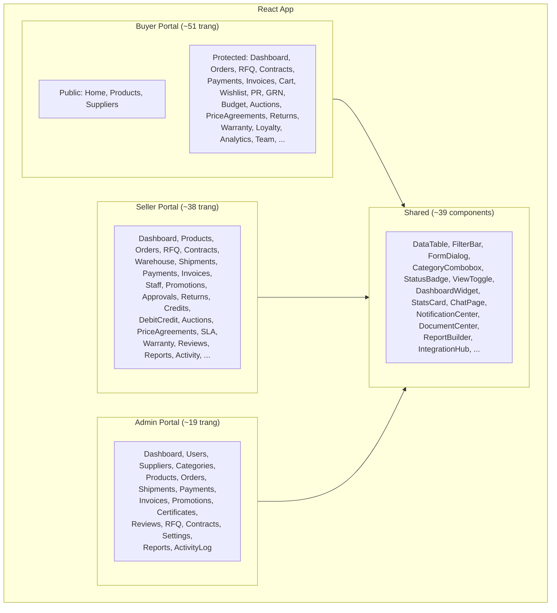
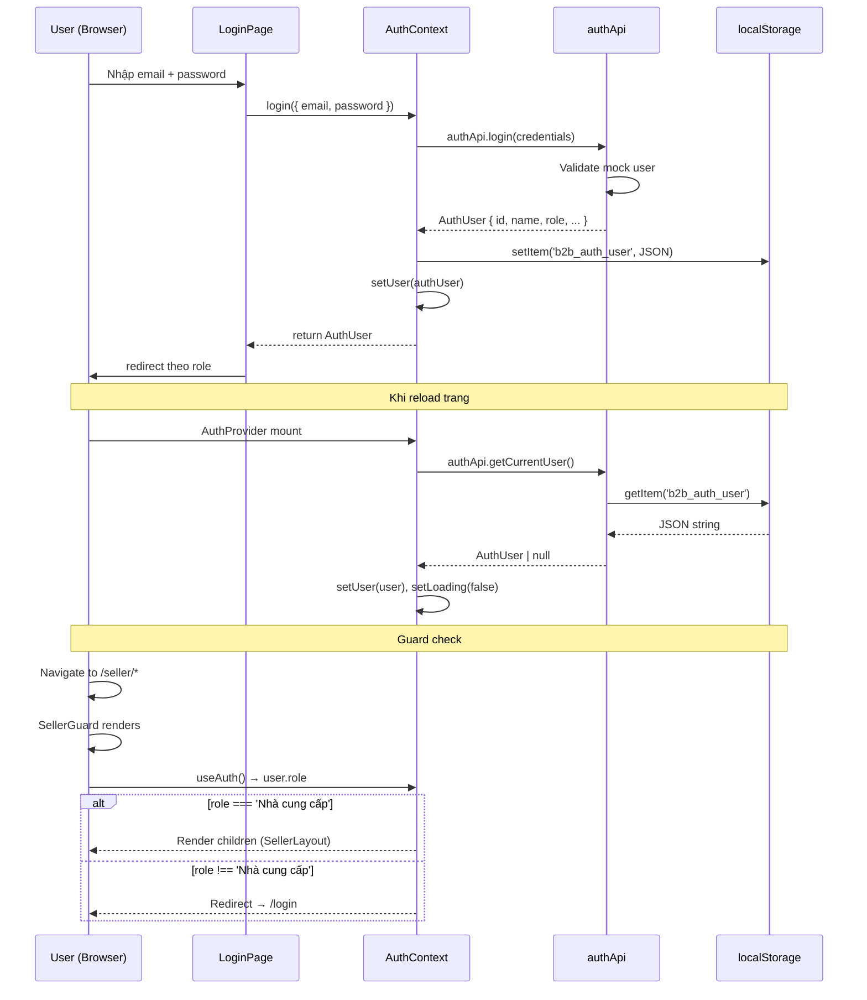
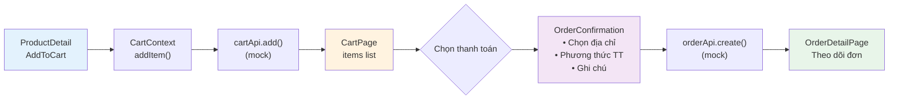

# 02 — Kiến trúc hệ thống & Diagrams

> Sơ đồ kiến trúc, module, routing, data flow, authentication, notification, cart/checkout,
> service dependency, và chiến lược migration sang Supabase.

---

## 1. Kiến trúc tổng thể

```
┌─────────────────────────────────────────────────────────┐
│                       BROWSER                           │
│  ┌───────────────────────────────────────────────────┐  │
│  │              React SPA (Vite build)               │  │
│  │  ┌─────────┐ ┌─────────┐ ┌─────────┐ ┌────────┐  │  │
│  │  │  Buyer  │ │ Seller  │ │  Admin  │ │ Shared │  │  │
│  │  │ Portal  │ │ Portal  │ │ Portal  │ │  Comp. │  │  │
│  │  └────┬────┘ └────┬────┘ └────┬────┘ └───┬────┘  │  │
│  │       │           │           │           │       │  │
│  │  ┌────┴───────────┴───────────┴───────────┴────┐  │  │
│  │  │           Context Layer                     │  │  │
│  │  │  AuthContext · CartContext · WishlistContext  │  │  │
│  │  │  NotificationContext                         │  │  │
│  │  └──────────────────┬──────────────────────────┘  │  │
│  │                     │                             │  │
│  │  ┌──────────────────┴──────────────────────────┐  │  │
│  │  │           Service Layer (Mock API)          │  │  │
│  │  │  api.ts (30 APIs) + 20 file riêng xxxApi.ts │  │  │
│  │  └──────────────────┬──────────────────────────┘  │  │
│  │                     │                             │  │
│  │  ┌──────────────────┴──────────────────────────┐  │  │
│  │  │        Mock Data (In-memory arrays)         │  │  │
│  │  │  mockData.ts · mockAdminData.ts · let arrays │  │  │
│  │  └─────────────────────────────────────────────┘  │  │
│  └───────────────────────────────────────────────────┘  │
│                           │                             │
│                     (Tương lai)                         │
│                           ▼                             │
│  ┌───────────────────────────────────────────────────┐  │
│  │              Supabase Backend                     │  │
│  │  Auth · PostgreSQL · Storage · Realtime · Edge Fn │  │
│  └───────────────────────────────────────────────────┘  │
└─────────────────────────────────────────────────────────┘
```

---

## 2. Sơ đồ module — 3 Portals + Shared



**Số lượng trang thực tế (từ routes.ts)**:
- Buyer: 6 public + 45 protected = **51 routes**
- Seller: **37 routes** (tất cả protected)
- Admin: **17 routes** (tất cả protected)
- Auth: **2 routes** (login, register)
- **Tổng: 107 routes** + 1 not-found

---

## 3. Sơ đồ Routing Hierarchy

```mermaid
flowchart TB
  ROOT["createBrowserRouter"]

  ROOT --> AUTH_LAYOUT["AuthLayout"]
  AUTH_LAYOUT --> LOGIN["/login → LoginPage"]
  AUTH_LAYOUT --> REGISTER["/register → RegisterPage"]

  ROOT --> BUYER_LAYOUT["/ → BuyerLayout"]
  BUYER_LAYOUT --> HOME["/ → HomePage 🌐"]
  BUYER_LAYOUT --> PRODS["/products → ProductListPage 🌐"]
  BUYER_LAYOUT --> PROD_ID["/products/:id → ProductDetailPage 🌐"]
  BUYER_LAYOUT --> PROD_CMP["/products/compare → ProductComparePage 🌐"]
  BUYER_LAYOUT --> SUPPS["/suppliers → SupplierListPage 🌐"]
  BUYER_LAYOUT --> SUPP_ID["/suppliers/:id → SupplierDetailPage 🌐"]
  BUYER_LAYOUT --> BG["BuyerGuard 🔒"]
  BG --> DASH["/dashboard"]
  BG --> CART["/cart"]
  BG --> ORDERS["/orders, /orders/:id"]
  BG --> RFQ["/rfq, /rfq/new, /rfq/:id"]
  BG --> CONTR["/contracts, /contracts/:id"]
  BG --> SHIP["/shipments, /shipments/:id"]
  BG --> PAY["/payments, /payments/:id"]
  BG --> INV["/invoices, /invoices/:id"]
  BG --> MORE["... +28 routes nữa"]

  ROOT --> SG["SellerGuard 🔒"]
  SG --> SL["/seller → SellerLayout"]
  SL --> SD["/seller → SellerDashboard"]
  SL --> SP["/seller/products, /new, /:id"]
  SL --> SO["/seller/orders, /:id"]
  SL --> SR["/seller/rfq, /:id"]
  SL --> SC["/seller/contracts, /:id"]
  SL --> SW["/seller/warehouse"]
  SL --> SMORE["... +28 routes nữa"]

  ROOT --> AG["AdminGuard 🔒"]
  AG --> AL["/admin → AdminLayout"]
  AL --> AD["/admin → AdminDashboard"]
  AL --> AU["/admin/users"]
  AL --> AS["/admin/suppliers"]
  AL --> AC["/admin/categories"]
  AL --> AMORE["... +12 routes nữa"]

  style HOME fill:#e0f7fa
  style PRODS fill:#e0f7fa
  style PROD_ID fill:#e0f7fa
  style PROD_CMP fill:#e0f7fa
  style SUPPS fill:#e0f7fa
  style SUPP_ID fill:#e0f7fa
```



> 🌐 = Public (không cần đăng nhập) · 🔒 = Protected (cần auth + đúng role)

---

## 4. Data flow cho 1 trang điển hình

Ví dụ: **OrderListPage** (Buyer)

```
┌──────────────────────────────────────────────────────────┐
│ OrderListPage                                            │
│                                                          │
│  useState:                                               │
│    orders[], totalItems, pagination, sort,                │
│    searchTerm, activeFilters, loading                    │
│                                                          │
│  useEffect([pagination, sort, searchTerm, filters])      │
│    │                                                     │
│    ▼                                                     │
│  orderApi.getOrders(pagination, sort, filters)           │
│    │                                                     │
│    ▼ (await delay 300ms)                                 │
│  Mock: filter mockOrders → sort → paginate               │
│    │                                                     │
│    ▼                                                     │
│  PaginatedResponse<Order> { data, total, page, ... }     │
│    │                                                     │
│    ▼                                                     │
│  setOrders(data), setTotalItems(total)                   │
│    │                                                     │
│    ▼                                                     │
│  ┌────────────────────────────────────────────────┐      │
│  │ FilterBar (search + status + date filters)     │      │
│  ├────────────────────────────────────────────────┤      │
│  │ DataTable                                      │      │
│  │   columns: [orderNumber, buyer, total, status] │      │
│  │   renderActions: (order) => View/Edit/Delete   │      │
│  │   pagination + sort controls                   │      │
│  └────────────────────────────────────────────────┘      │
└──────────────────────────────────────────────────────────┘
```

---

## 5. Component hierarchy — OrderOverview (Admin, trang phức tạp)

```
OrderOverview
├── <div className="container mx-auto px-4 py-6">
│   ├── Header (title + stats)
│   │   └── StatsCard × 4 (Tổng, Chờ xử lý, Đang giao, Hoàn thành)
│   ├── FilterBar
│   │   ├── Search (order number, buyer)
│   │   ├── Filter: Status (select)
│   │   ├── Filter: Date range
│   │   └── Filter: Supplier
│   ├── ViewToggle (table / grid)
│   ├── DataTable
│   │   ├── ColumnConfig[] (8-10 columns, sortable)
│   │   ├── renderActions → View / Edit status / Delete
│   │   ├── Pagination (page, pageSize)
│   │   └── Sort (field, direction)
│   ├── FormDialog (edit order status)
│   │   └── FormField[] (status select, note textarea)
│   ├── StatusBadge (per row)
│   └── ConfirmDialog (delete confirmation)
```

---

## 6. Authentication flow



---

## 7. Notification flow

```
┌─────────────┐     ┌──────────────────┐     ┌────────────────────┐
│ User Action  │────▶│  Service API     │────▶│ notificationApi    │
│ (đặt hàng,  │     │ (orderApi.create, │     │ .create({          │
│  gửi RFQ,   │     │  rfqApi.submit,   │     │   type, title,     │
│  thanh toán) │     │  paymentApi.pay)  │     │   message, userId  │
│              │     └──────────────────┘     │ })                 │
└─────────────┘                               └────────┬───────────┘
                                                       │
                                                       ▼
                                              ┌────────────────────┐
                                              │ In-memory array    │
                                              │ mockNotifications  │
                                              └────────┬───────────┘
                                                       │
                                                       ▼
                                              ┌────────────────────┐
                                              │ NotificationContext│
                                              │ • refresh() poll   │
                                              │ • unreadCount      │
                                              │ • notifications[]  │
                                              └────────┬───────────┘
                                                       │
                                    ┌──────────────────┼──────────────────┐
                                    ▼                  ▼                  ▼
                           ┌──────────────┐  ┌──────────────┐  ┌──────────────┐
                           │ Notification │  │ Notification │  │ toast()      │
                           │ Dropdown     │  │ CenterPage   │  │ (Sonner)     │
                           │ (header)     │  │ (full page)  │  │              │
                           │ badge count  │  │ list + filter│  │ instant pop  │
                           └──────────────┘  └──────────────┘  └──────────────┘
```

---

## 8. Cart / Checkout flow



**Quick paths**:
- **QuickOrder**: Nhập SKU + qty → addToCart → Checkout
- **BulkOrder**: Upload CSV → parse → addToCart (batch) → Checkout
- **OrderTemplate**: Load template items → addToCart → Checkout
- **PriceAgreement**: Order from agreement → auto pricing → Checkout

---

## 9. Service layer file dependency graph

```
┌─────────────────────────────────────────────────────────────┐
│ /src/app/types/index.ts                                     │
│ (~2014 dòng — tất cả types/interfaces)                      │
└──────────────────────────┬──────────────────────────────────┘
                           │ import type { ... }
              ┌────────────┼────────────────┐
              ▼            ▼                ▼
┌───────────────────┐ ┌──────────┐ ┌────────────────────────┐
│ /services/api.ts  │ │ /data/   │ │ /services/*Api.ts (×20)│
│ (~2900+ dòng)     │ │ mockData │ │ adminApi, auctionApi,  │
│                   │ │ .ts      │ │ budgetApi, grnApi,     │
│ 30 API objects:   │ └─────┬────┘ │ prApi, slaApi, ...     │
│ authApi, orderApi,│       │      └───────────┬────────────┘
│ productApi, ...   │       │                  │
└────────┬──────────┘       │                  │
         │                  │                  │
         │  import mockData │                  │
         ├──────────────────┘                  │
         │                                     │
         │  (một số service import từ api.ts)  │
         ├─────────────────────────────────────┘
         │
         ▼
  ┌──────────────────────────────┐
  │ Components (pages)           │
  │ import { xxxApi } from ...   │
  │ Gọi: xxxApi.getAll(...)      │
  └──────────────────────────────┘
```

### APIs trong `api.ts` (KHÔNG thêm mới):
`authApi`, `userApi`, `categoryApi`, `productApi`, `orderApi`, `rfqApi`, `quotationApi`, `contractApi`, `warehouseApi`, `inventoryApi`, `stockMovementApi`, `stockAlertApi`, `shipmentApi`, `paymentApi`, `invoiceSellerApi`, `invoiceBuyerApi`, `staffApi`, `promotionApi`, `certificateApi`, `chatApi`, `notificationApi`, `reviewApi`, `supplierReviewApi`, `cartApi`, `wishlistApi`, `orderTemplateApi`, `approvalApi`, `returnApi`, `creditApi`, `supplierApi`.

### APIs đã tách file riêng (20 files):
| File | Chức năng |
|------|-----------|
| `adminApi.ts` | Dashboard stats, user management cho Admin |
| `analyticsApi.ts` | Phân tích Buyer/Seller |
| `auctionApi.ts` | Đấu giá ngược |
| `budgetApi.ts` | Ngân sách, phân bổ, giao dịch |
| `buyerDashboardApi.ts` | Dashboard stats cho Buyer |
| `debitCreditApi.ts` | Ghi nợ / ghi có |
| `documentApi.ts` | Trung tâm tài liệu |
| `grnApi.ts` | Biên bản nhận hàng |
| `integrationApi.ts` | Tích hợp ERP/CRM, webhook, API keys |
| `loyaltyApi.ts` | Khách hàng thân thiết, điểm, phần thưởng |
| `orderStatusHistoryApi.ts` | Lịch sử trạng thái đơn hàng |
| `prApi.ts` | Yêu cầu mua hàng |
| `priceAgreementApi.ts` | Thỏa thuận giá dài hạn |
| `productImageApi.ts` | Quản lý ảnh sản phẩm |
| `reportBuilderApi.ts` | Báo cáo tùy chỉnh |
| `rfqAttachmentApi.ts` | File đính kèm RFQ |
| `slaApi.ts` | SLA definitions, metrics, reports |
| `supplierCategoryApi.ts` | Danh mục NCC |
| `warehouseTransferApi.ts` | Chuyển kho |
| `warrantyApi.ts` | Bảo hành & claims |

---

## 10. Chiến lược Migration sang Supabase

### 10.1 Giai đoạn

| Phase | Scope | Mô tả |
|-------|-------|--------|
| **Phase 1** | Auth | `authApi` → Supabase Auth. `localStorage` → Session management. |
| **Phase 2** | Core | `productApi`, `categoryApi`, `supplierApi`, `orderApi` → Supabase tables. |
| **Phase 3** | Full | Tất cả 109 bảng còn lại → PostgreSQL. Storage cho file/image. Realtime cho chat/notification. |

### 10.2 Mapping chi tiết

| Hiện tại (Mock) | → Supabase |
|-----------------|-----------|
| `await delay(300)` | Network request (tự có latency) |
| `let mockArray: T[]` | `supabase.from('table_name')` |
| `mockArray.filter(...)` | `.eq()`, `.ilike()`, `.gte()`, `.in()` |
| `mockArray.sort(...)` | `.order('column', { ascending })` |
| `mockArray.slice(start, end)` | `.range(start, end)` |
| `mockArray.push(newItem)` | `.insert(newItem)` |
| `mockArray[i] = updated` | `.update(data).eq('id', id)` |
| `mockArray.splice(i, 1)` | `.delete().eq('id', id)` |
| `localStorage.setItem()` | `supabase.auth.signInWithPassword()` |
| `localStorage.getItem()` | `supabase.auth.getSession()` |
| In-memory aggregate | SQL aggregate / Materialized view |
| `PaginatedResponse<T>` | `{ data, count }` + `.range()` |

### 10.3 RLS (Row Level Security)
```sql
-- Ví dụ: Buyer chỉ thấy đơn hàng của mình
CREATE POLICY "buyer_own_orders" ON orders
  FOR SELECT USING (buyer_id = auth.uid());

-- Seller chỉ thấy đơn hàng gửi cho mình
CREATE POLICY "seller_assigned_orders" ON orders
  FOR SELECT USING (supplier_id IN (
    SELECT id FROM suppliers WHERE user_id = auth.uid()
  ));

-- Admin thấy tất cả
CREATE POLICY "admin_all_orders" ON orders
  FOR ALL USING (
    EXISTS (SELECT 1 FROM users WHERE id = auth.uid() AND role = 'admin')
  );
```

### 10.4 Service Migration Template
```tsx
// TRƯỚC (mock)
export const orderApi = {
  async getOrders(pagination, sort, filters?) {
    await delay(300);
    let result = applyFilters(mockOrders, filters);
    result = applySort(result, sort);
    return paginate(result, pagination);
  },
};

// SAU (Supabase)
export const orderApi = {
  async getOrders(pagination, sort, filters?) {
    let query = supabase.from('orders').select('*', { count: 'exact' });
    if (filters?.status) query = query.eq('status', filters.status);
    if (filters?.search) query = query.ilike('order_number', `%${filters.search}%`);
    query = query.order(sort.field, { ascending: sort.direction === 'asc' });
    const start = (pagination.page - 1) * pagination.pageSize;
    query = query.range(start, start + pagination.pageSize - 1);
    const { data, count } = await query;
    return { data: data ?? [], total: count ?? 0, page: pagination.page,
             pageSize: pagination.pageSize, totalPages: Math.ceil((count ?? 0) / pagination.pageSize) };
  },
};
```

---

## Tài liệu liên quan

- [01-system-overview.md](./01-system-overview.md) — Tổng quan hệ thống
- [03-coding-conventions.md](./03-coding-conventions.md) — Quy ước code
- [28-supabase-migration.md](./28-supabase-migration.md) — Chi tiết Supabase migration
- [32-vibe-coding-context.md](./32-vibe-coding-context.md) — AI Vibe Coding Context
