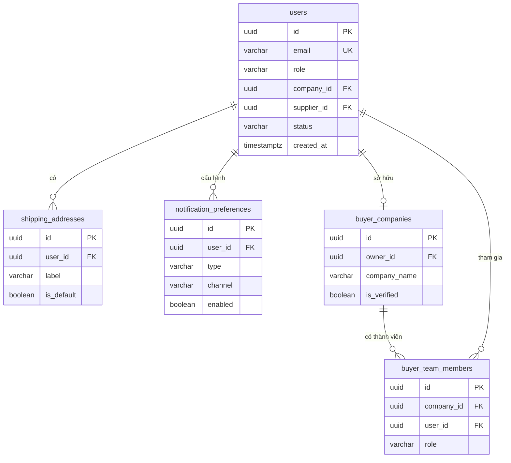
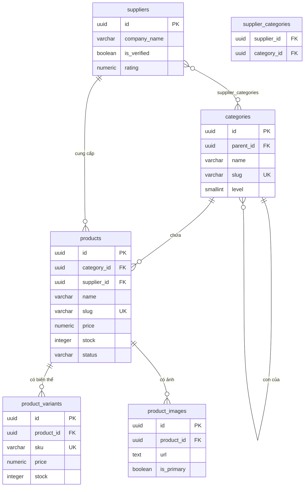
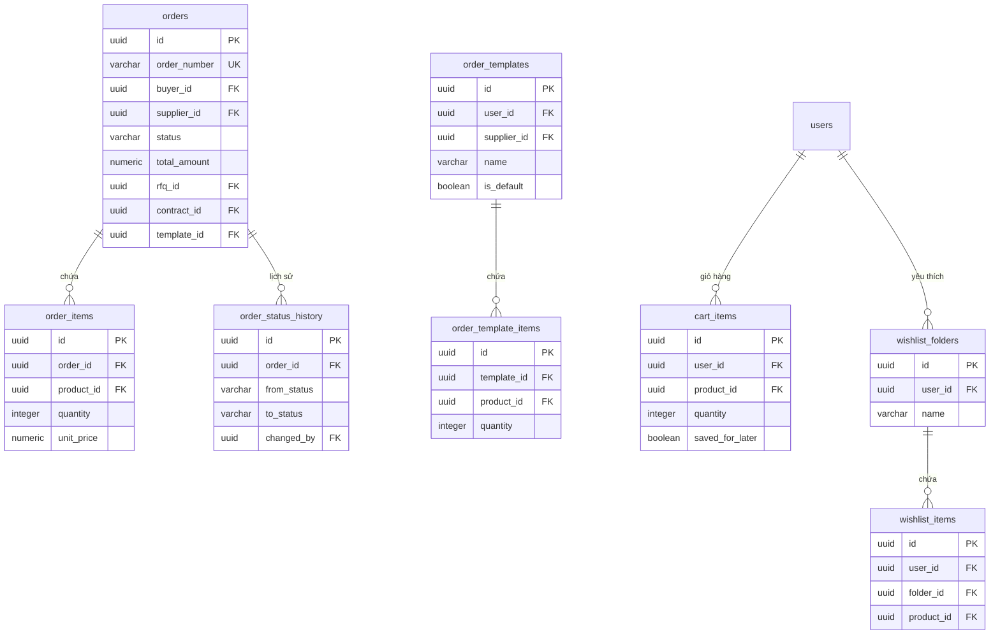
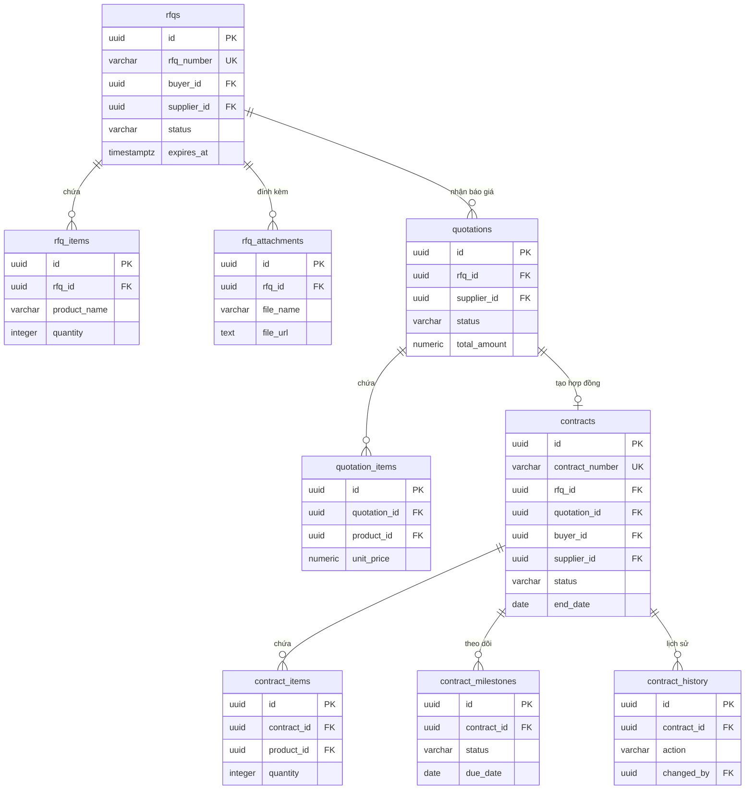
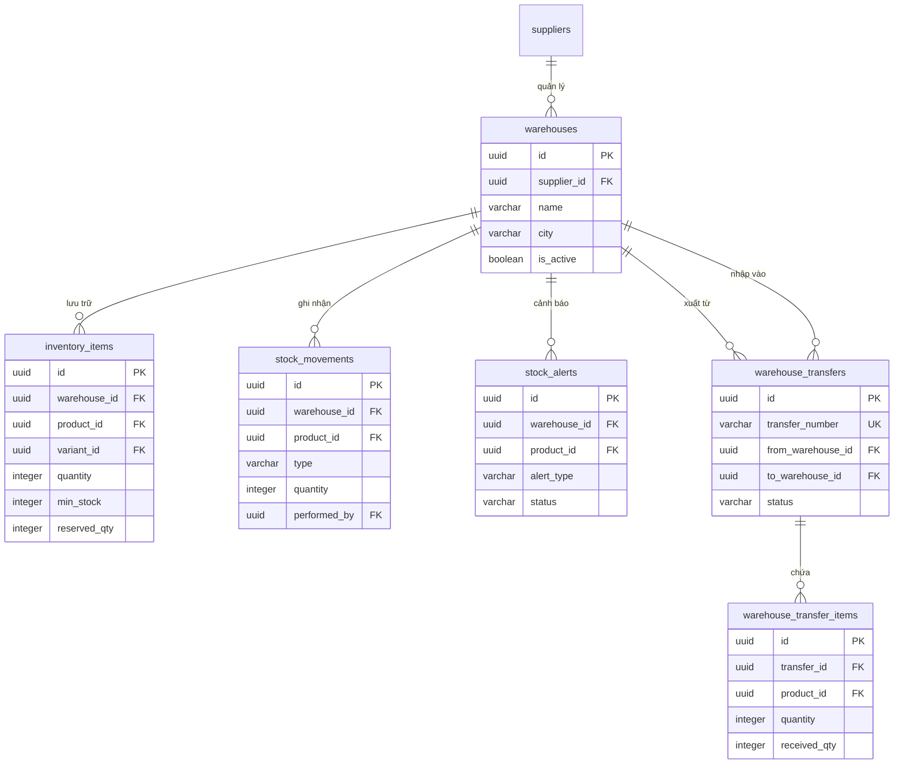
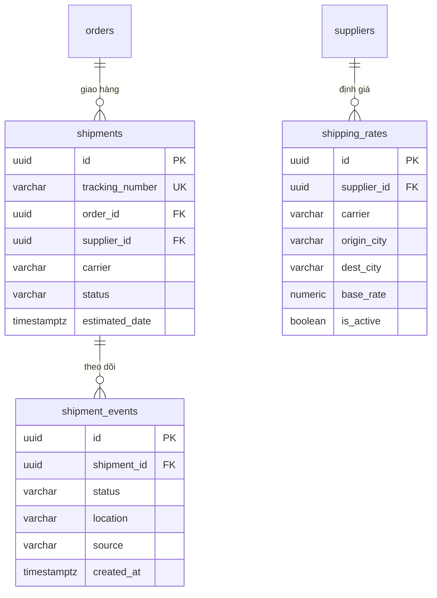
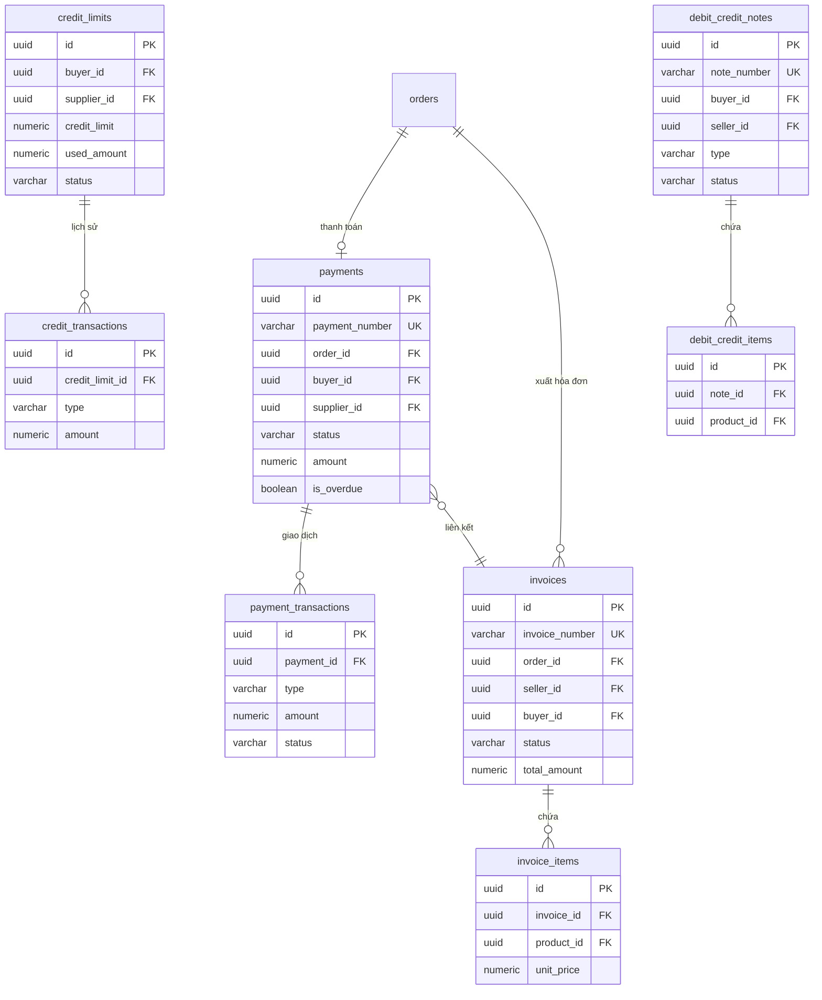
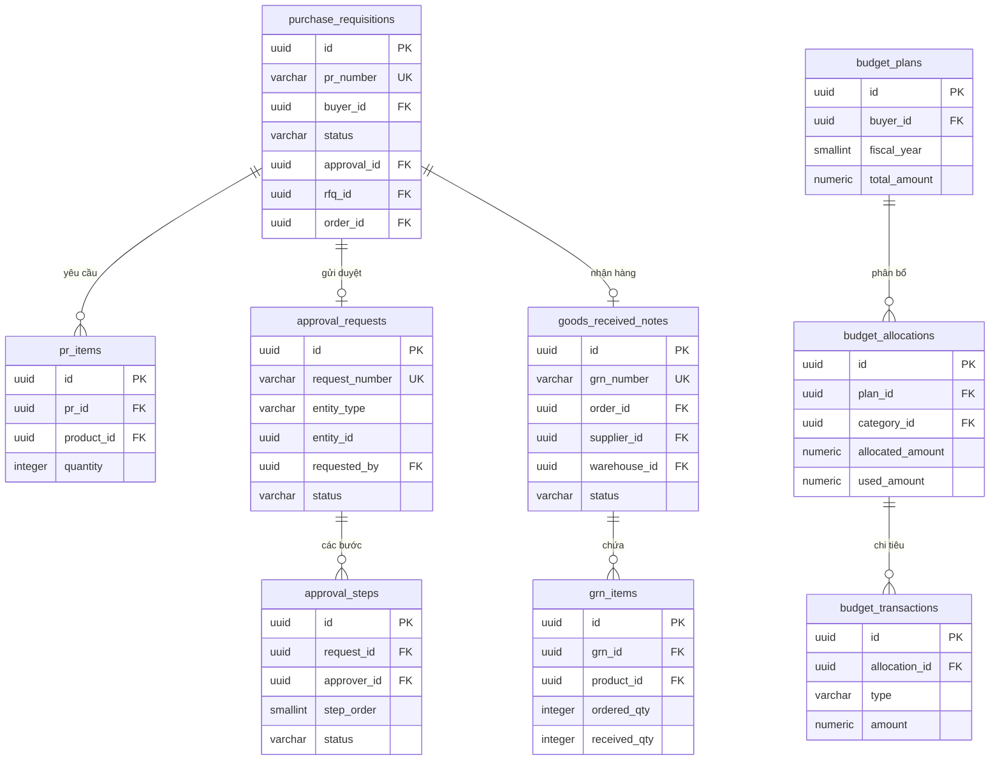
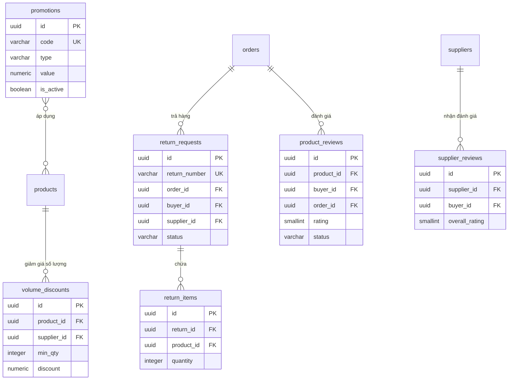

# 08 — Entity Relationship Diagrams (ERD)

> Sơ đồ quan hệ thực thể cho toàn bộ hệ thống B2B eCommerce.
> Chia theo domain để dễ đọc; ERD tổng thể ở phần cuối.

---

## 1. Domain: Người dùng (User)



---

## 2. Domain: Sản phẩm & Danh mục



---

## 3. Domain: Đơn hàng



---

## 4. Domain: Mua sắm (Sourcing)



---

## 5. Domain: Kho hàng



---

## 6. Domain: Vận chuyển



---

## 7. Domain: Tài chính



---

## 8. Domain: Phê duyệt & Mua hàng nội bộ



---

## 9. Domain: Trả hàng, Đánh giá, Khuyến mãi



---

## 10. ERD TỔNG THỂ — Sơ đồ FK chính giữa tất cả domains

```
┌──────────────── USERS ─────────────────────────────────────────────────────┐
│  users (id, role, email, supplier_id FK, company_id FK)                    │
│    ├── buyer_companies (owner_id FK → users)                               │
│    │     └── buyer_team_members (company_id, user_id)                      │
│    ├── shipping_addresses (user_id FK)                                     │
│    └── notification_preferences (user_id FK)                               │
└────────────────────────────────────────────────────────────────────────────┘
              │ buyer                           │ supplier_id
              ▼                                 ▼
┌──────────── SUPPLIERS ──────────────────────────────────────────────────────┐
│  suppliers (id, company_name, rating)                                       │
│    ├── products (supplier_id FK)                                            │
│    │     ├── product_variants (product_id FK)                               │
│    │     ├── product_images (product_id FK)                                 │
│    │     └── volume_discounts (product_id FK)                               │
│    ├── warehouses (supplier_id FK)                                          │
│    │     ├── inventory_items (warehouse_id FK)                              │
│    │     ├── stock_movements (warehouse_id FK)                              │
│    │     └── stock_alerts (warehouse_id FK)                                 │
│    ├── warehouse_transfers (from/to warehouse_id FK)                        │
│    ├── shipping_rates (supplier_id FK)                                      │
│    └── staff_members (supplier_id FK)                                       │
└─────────────────────────────────────────────────────────────────────────────┘
              │                                        │
              ▼ (buyer ↔ supplier transaction)         │
┌──────────── ORDERS ───────────────────────────────── ▼ ────────────────────┐
│  orders (buyer_id FK, supplier_id FK, rfq_id?, contract_id?, template_id?) │
│    ├── order_items (order_id FK, product_id FK)                             │
│    ├── order_status_history (order_id FK)                                   │
│    ├── shipments (order_id FK)                                              │
│    │     └── shipment_events (shipment_id FK)                               │
│    ├── payments (order_id FK)                                               │
│    │     └── payment_transactions (payment_id FK)                           │
│    ├── invoices (order_id FK)                                               │
│    │     └── invoice_items (invoice_id FK)                                  │
│    ├── return_requests (order_id FK)                                        │
│    │     ├── return_items (return_id FK)                                    │
│    │     └── return_images (return_id FK)                                   │
│    ├── product_reviews (order_id FK)                                        │
│    └── goods_received_notes (order_id FK)                                   │
└─────────────────────────────────────────────────────────────────────────────┘
              │ from rfq
              ▼
┌──────────── SOURCING ───────────────────────────────────────────────────────┐
│  rfqs (buyer_id FK, supplier_id FK?)                                        │
│    ├── rfq_items (rfq_id FK)                                                │
│    ├── rfq_attachments (rfq_id FK)                                          │
│    └── quotations (rfq_id FK, supplier_id FK)                               │
│          ├── quotation_items (quotation_id FK)                               │
│          └── contracts (quotation_id FK, rfq_id FK)                         │
│                ├── contract_items (contract_id FK)                           │
│                ├── contract_milestones (contract_id FK)                      │
│                └── contract_history (contract_id FK)                         │
└─────────────────────────────────────────────────────────────────────────────┘
              │ buyer-side procurement
              ▼
┌──────────── PROCUREMENT ───────────────────────────────────────────────────┐
│  purchase_requisitions (buyer_id FK)                                        │
│    ├── pr_items (pr_id FK)                                                  │
│    └── approval_requests (entity_id = pr.id)                                │
│          └── approval_steps (request_id FK, approver_id FK)                 │
│  budget_plans (buyer_id FK)                                                 │
│    └── budget_allocations (plan_id FK)                                      │
│          └── budget_transactions (allocation_id FK)                          │
└─────────────────────────────────────────────────────────────────────────────┘
              │ system
              ▼
┌──────────── SYSTEM ────────────────────────────────────────────────────────┐
│  notifications (user_id FK)                                                 │
│  activity_logs (user_id FK)                                                 │
│  system_configs (key-value)                                                 │
│  platform_fees                                                              │
│  banner_configs                                                             │
│  email_templates                                                            │
│  promotions →  promotion_products, promotion_categories                     │
│  credit_limits (buyer_id FK, supplier_id FK)                                │
│    └── credit_transactions (credit_limit_id FK)                             │
│  debit_credit_notes (buyer_id FK, seller_id FK)                             │
│    └── debit_credit_items (note_id FK)                                       │
└─────────────────────────────────────────────────────────────────────────────┘
```

---

## Bảng tổng hợp FK quan trọng nhất

| Bảng nguồn | Cột FK | Bảng đích | Cascade |
|------------|--------|-----------|---------|
| `products` | `supplier_id` | `suppliers` | SET NULL |
| `products` | `category_id` | `categories` | SET NULL |
| `orders` | `buyer_id` | `users` | RESTRICT |
| `orders` | `supplier_id` | `suppliers` | RESTRICT |
| `orders` | `rfq_id` | `rfqs` | SET NULL |
| `orders` | `contract_id` | `contracts` | SET NULL |
| `rfqs` | `buyer_id` | `users` | RESTRICT |
| `quotations` | `rfq_id` | `rfqs` | RESTRICT |
| `contracts` | `quotation_id` | `quotations` | SET NULL |
| `shipments` | `order_id` | `orders` | RESTRICT |
| `payments` | `order_id` | `orders` | RESTRICT |
| `invoices` | `order_id` | `orders` | SET NULL |
| `inventory_items` | `warehouse_id` | `warehouses` | CASCADE |
| `stock_movements` | `warehouse_id` | `warehouses` | RESTRICT |
| `notifications` | `user_id` | `users` | CASCADE |
| `activity_logs` | `user_id` | `users` | RESTRICT |

---

## Tài liệu liên quan

- [04-database-schema-part1.md](./04-database-schema-part1.md) — Schema: Người dùng, Sản phẩm
- [05-database-schema-part2.md](./05-database-schema-part2.md) — Schema: Đơn hàng, RFQ, Hợp đồng
- [06-database-schema-part3.md](./06-database-schema-part3.md) — Schema: Kho, Vận chuyển, Tài chính
- [07-database-schema-part4.md](./07-database-schema-part4.md) — Schema: Trả hàng, KM, Phê duyệt, System
- [14-business-rules-part1.md](./14-business-rules-part1.md) — Business rules: Core Commerce
