# 17 — State Machine Diagrams

> Sơ đồ trạng thái (State Machines) cho tất cả entities có workflow phức tạp trong hệ thống B2B.
> Sử dụng Mermaid stateDiagram-v2 syntax.

---

## 1. OrderStatus State Machine

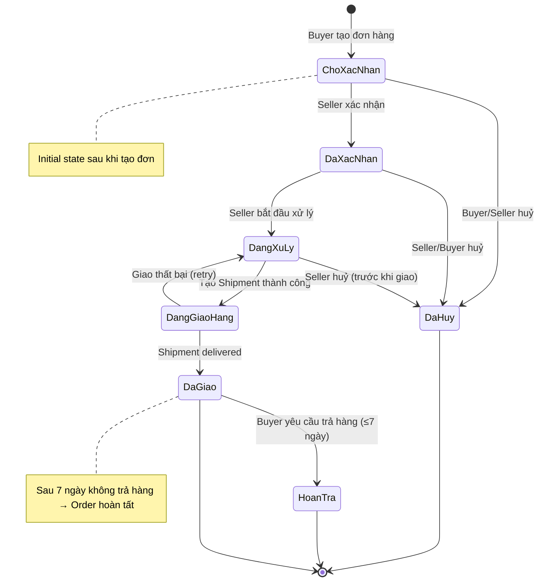

**Trạng thái tiếng Việt:**
- `ChoXacNhan` = "Chờ xác nhận"
- `DaXacNhan` = "Đã xác nhận"
- `DangXuLy` = "Đang xử lý"
- `DangGiaoHang` = "Đang giao hàng"
- `DaGiao` = "Đã giao"
- `DaHuy` = "Đã huỷ"
- `HoanTra` = "Hoàn trả"

---

## 2. RFQStatus State Machine

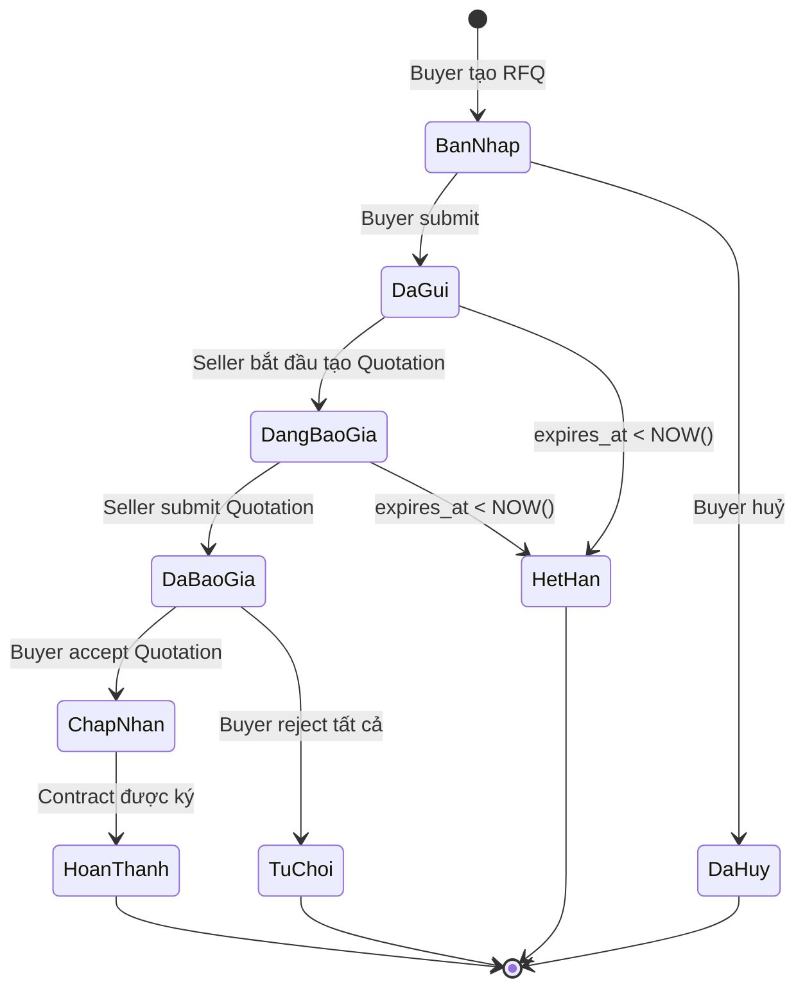

---

## 3. QuotationStatus State Machine

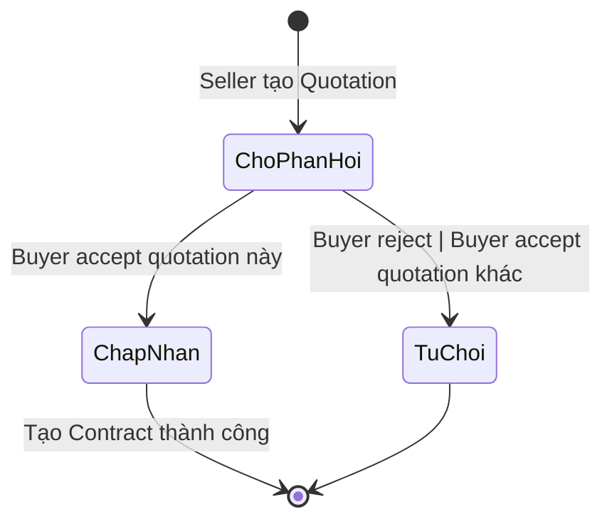

**Lưu ý:** Khi Buyer accept 1 Quotation → Tất cả Quotation còn lại của cùng RFQ → "Từ chối" (auto).

---

## 4. ContractStatus State Machine

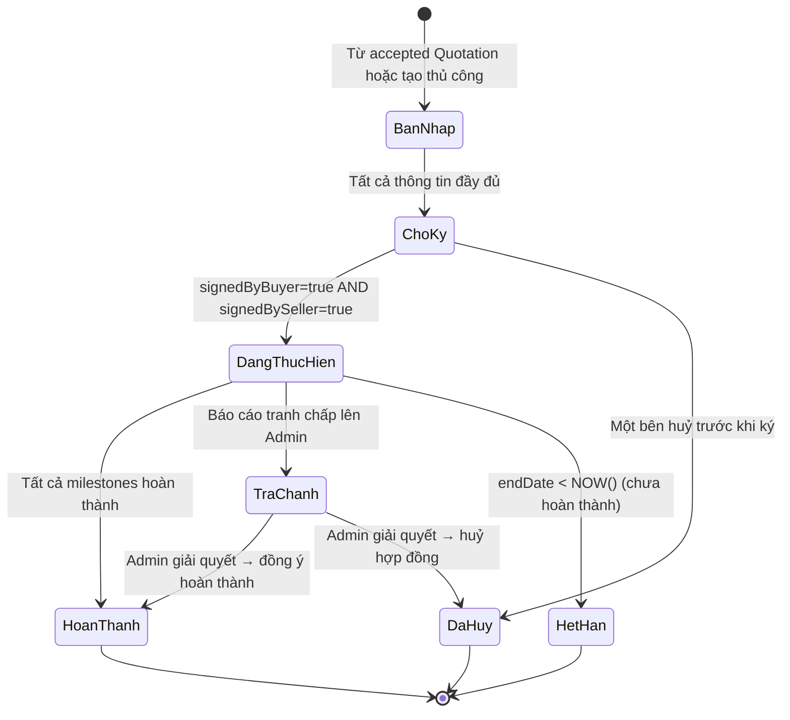

---

## 5. PaymentStatus State Machine

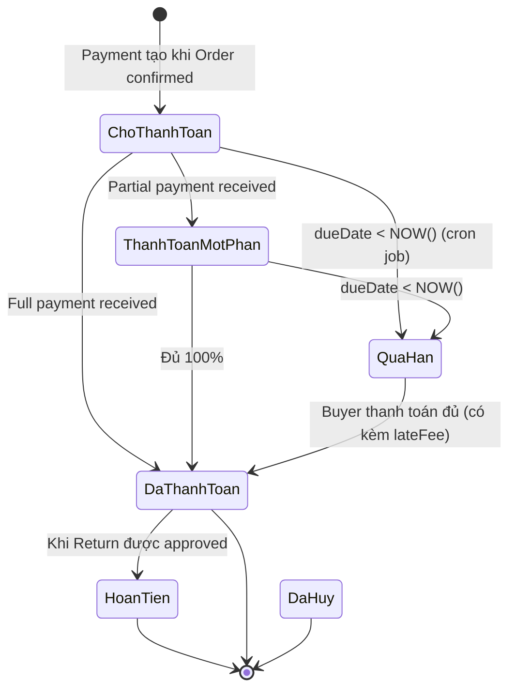

---

## 6. InvoiceStatus State Machine

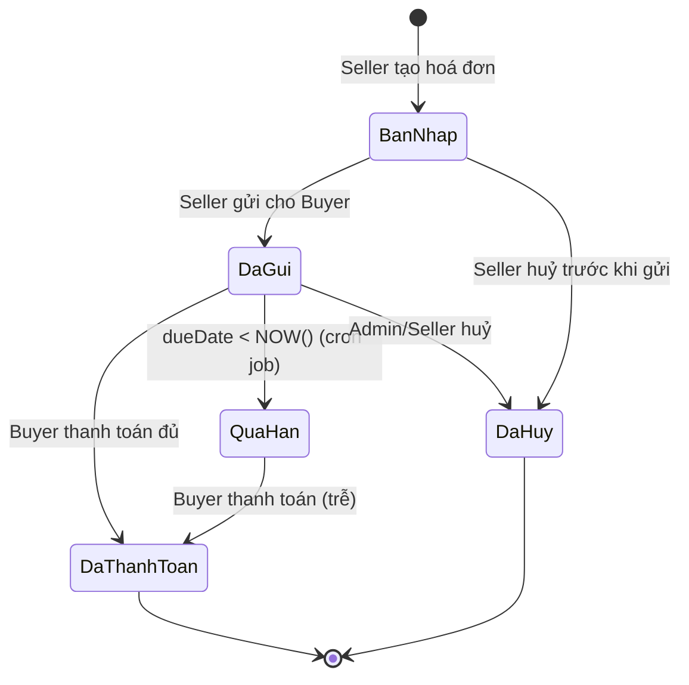

---

## 7. ShipmentStatus State Machine

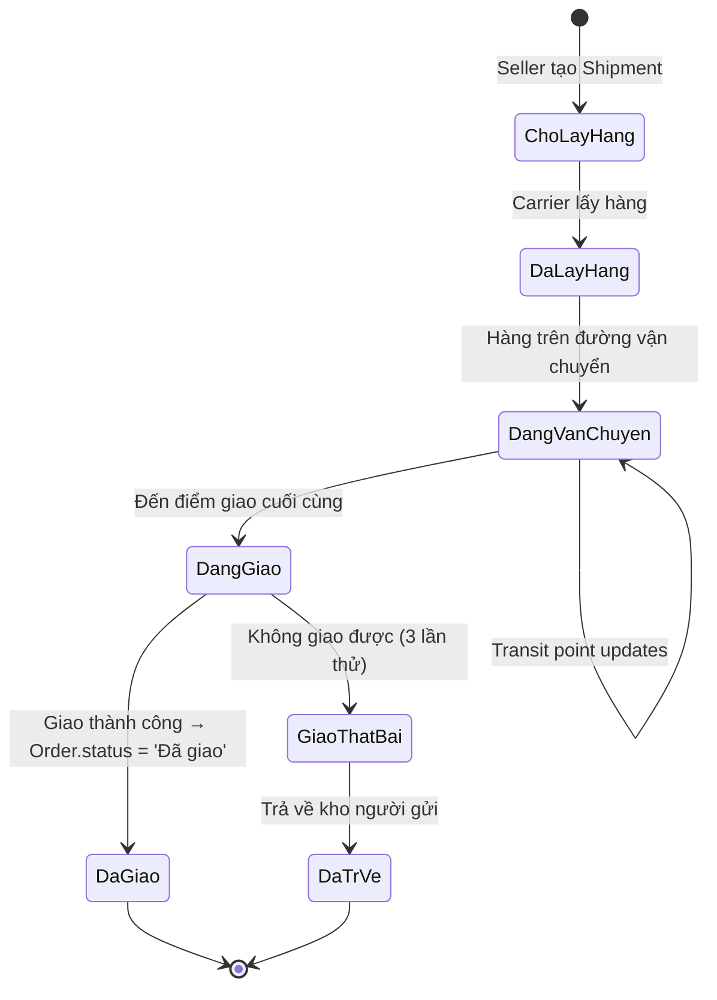

---

## 8. ReturnStatus State Machine

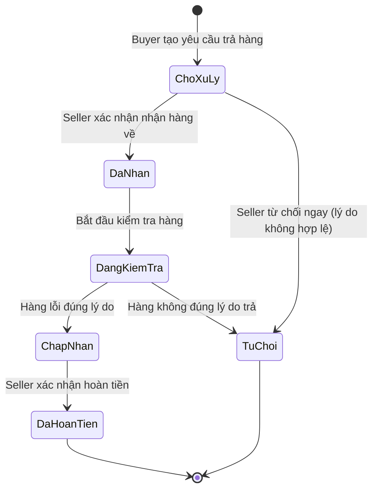

---

## 9. ApprovalStatus State Machine

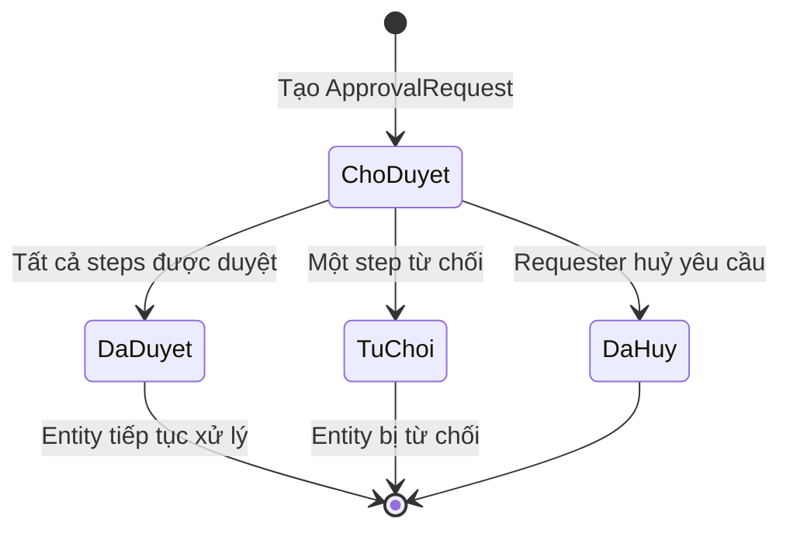

### PRStatus State Machine

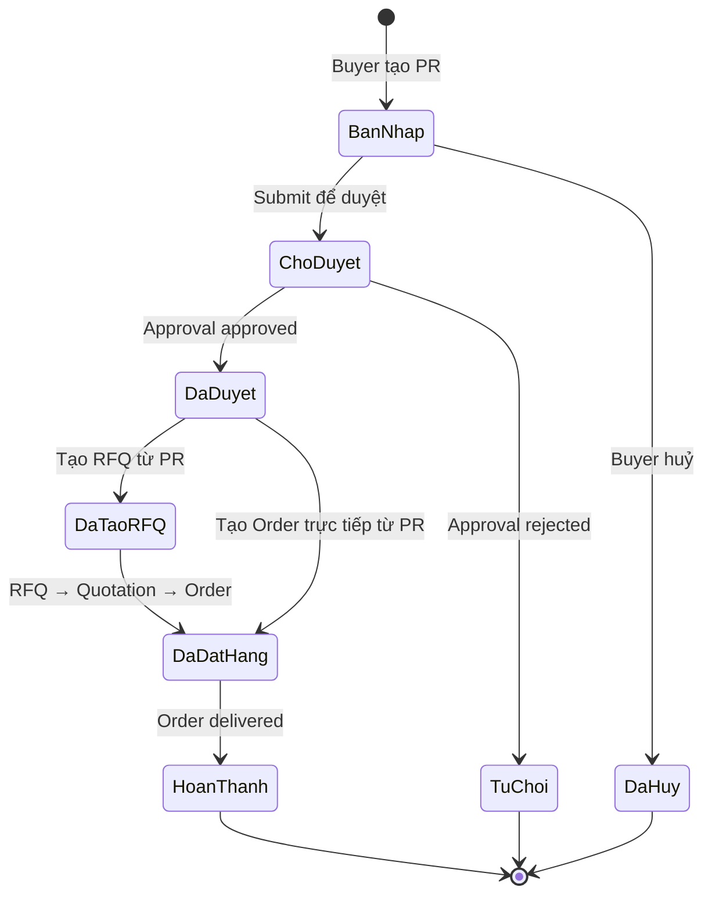

### GRNStatus State Machine

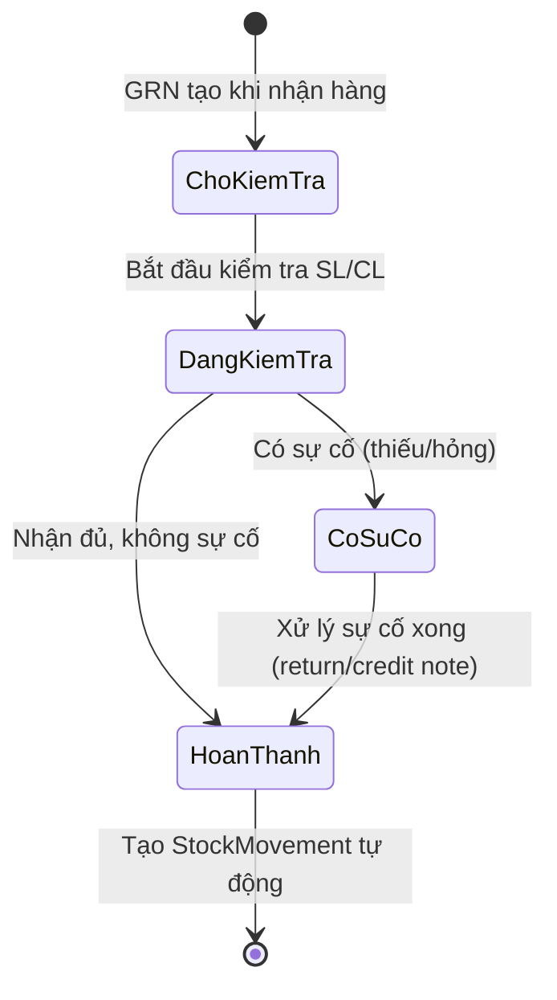

---

## 10. Workflow tổng hợp: Procurement Lifecycle

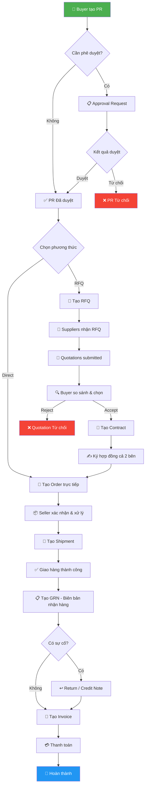

---

## Bảng tổng hợp Status values

| Entity | Status values | Terminal states |
|--------|--------------|-----------------|
| `Order` | 7 values | Đã huỷ, Hoàn trả |
| `RFQ` | 7 values | Hoàn thành, Đã huỷ, Hết hạn, Từ chối |
| `Quotation` | 3 values | Chấp nhận, Từ chối |
| `Contract` | 7 values | Hoàn thành, Đã huỷ, Hết hạn |
| `Payment` | 6 values | Đã thanh toán, Hoàn tiền, Đã huỷ |
| `Invoice` | 5 values | Đã thanh toán, Đã huỷ |
| `Shipment` | 7 values | Đã giao, Đã trả về |
| `Return` | 6 values | Đã hoàn tiền, Từ chối |
| `ApprovalRequest` | 4 values | Đã duyệt, Từ chối, Đã huỷ |
| `PR` | 8 values | Hoàn thành, Đã huỷ, Từ chối |
| `GRN` | 4 values | Hoàn thành |
| `WarehouseTransfer` | 5 values | Đã nhận, Huỷ |
| `StockAlert` | 4 values | Đã xử lý, Bỏ qua |
| `CreditLimit` | 3 values | Đã huỷ |
| `DebitCreditNote` | 5 values | Đã xác nhận, Từ chối, Đã huỷ |

---

## Tài liệu liên quan

- [14-business-rules-part1.md](./14-business-rules-part1.md) — Core Commerce Rules
- [15-business-rules-part2.md](./15-business-rules-part2.md) — Sourcing & Procurement Rules
- [09-api-spec-part1.md](./09-api-spec-part1.md) — API conventions
- [32-vibe-coding-context.md](./32-vibe-coding-context.md) — STATUS ENUM MAP
