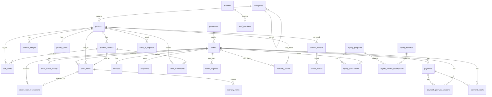

# Database Schema Hiện Tại

Nguồn: `be/src/main/resources/db/migration/`

Tài liệu này mô tả schema thực tế hiện tại theo các migration `V1` đến `V27`. Nội dung tập trung vào bảng, thuộc tính, kiểu dữ liệu, ràng buộc chính và quan hệ giữa các bảng. Các câu lệnh seed/demo data không được mô tả chi tiết, trừ khi ảnh hưởng đến schema.

## 1. Tổng Quan Migration

| Version | File | Vai trò chính |
| --- | --- | --- |
| V1 | `V1__init_core_schema.sql` | Khởi tạo catalog: categories, products, variants, images, phone specs |
| V2 | `V2__cart_items.sql` | Giỏ hàng |
| V3 | `V3__promotions.sql` | Khuyến mãi |
| V4 | `V4__orders_payments.sql` | Đơn hàng, chi tiết đơn, lịch sử trạng thái, thanh toán |
| V5 | `V5__order_stock_reservations.sql` | Giữ tồn kho theo đơn hàng |
| V6 | `V6__invoices.sql` | Hóa đơn |
| V7 | `V7__payment_transaction_ref_unique.sql` | Unique index cho mã giao dịch thanh toán |
| V8 | `V8__shipments.sql` | Vận chuyển |
| V9 | `V9__payment_overdue_refund.sql` | Bổ sung trạng thái quá hạn và thông tin hoàn tiền |
| V13 | `V13__admin_inventory_promotions_after_sales_settings.sql` | Tồn kho, hậu mãi, review, settings, branch, staff, activity log |
| V14 | `V14__admin_qa_data_trade_in.sql` | Trade-in |
| V15 | `V15__customer_after_sales_flow.sql` | Warranty items và index hỗ trợ customer after-sales |
| V16 | `V16__loyalty_program.sql` | Loyalty program, transaction, reward, redemption |
| V17 | `V17__admin_remaining_modules.sql` | Admin users, notifications, suppliers, installment, combos, blog, review replies |
| V20 | `V20__schema_fix_ba_alignment.sql` | Bổ sung field cho branch/staff, chuẩn hóa settings và index activity logs |
| V21 | `V21__customer_notifications.sql` | Notification preferences và read_at |
| V22 | `V22__payment_gateway_sessions.sql` | Phiên thanh toán online |
| V24 | `V24__customer_payment_proofs.sql` | Chứng từ thanh toán |
| V25 | `V25__buyer_public_combos.sql` | Seed combo công khai, không đổi schema |
| V26 | `V26__customer_addresses.sql` | Sổ địa chỉ khách hàng |
| V27 | `V27__customer_profiles.sql` | Hồ sơ khách hàng |

Các migration `V10`, `V11`, `V12`, `V18`, `V19`, `V23`, `V25` chủ yếu bổ sung seed/QA/demo data.

## 2. Enum Types

| Enum | Giá trị | Dùng cho |
| --- | --- | --- |
| `product_status` | `ACTIVE`, `OUT_OF_STOCK`, `DISCONTINUED`, `COMING_SOON`, `INACTIVE` | `products.status` |
| `product_condition` | `NEW`, `LIKE_NEW`, `USED`, `REFURBISHED` | `products.condition` |
| `discount_type` | `PERCENTAGE`, `FIXED_AMOUNT`, `BUY_X_GET_Y`, `FREE_SHIPPING` | `promotions.type` |
| `order_status` | `PENDING`, `CONFIRMED`, `SHIPPING`, `DELIVERED`, `CANCELLED`, `RETURNED` | `orders.status`, `order_status_history` |
| `payment_status` | `UNPAID`, `PAID`, `FAILED`, `REFUNDED`, `PARTIALLY_REFUNDED`, `OVERDUE` | `orders.payment_status`, `payments.status` |
| `payment_method` | `COD`, `BANK_TRANSFER`, `MOMO`, `VNPAY`, `INSTALLMENT` | `orders.payment_method` |
| `invoice_status` | `PENDING`, `PAID`, `OVERDUE`, `CANCELLED` | `invoices.status` |
| `shipment_status` | `AWAITING_PICKUP`, `IN_TRANSIT`, `DELIVERED`, `FAILED` | `shipments.status` |
| `stock_movement_type` | `MANUAL_ADJUSTMENT`, `ORDER_RESERVATION`, `ORDER_RELEASE`, `SALE`, `RETURN` | `stock_movements.type` |
| `return_request_status` | `PENDING`, `APPROVED`, `PROCESSING`, `REFUNDED`, `CLOSED`, `REJECTED` | `return_requests.status` |
| `warranty_claim_status` | `NEW`, `PROCESSING`, `RESOLVED`, `REJECTED` | `warranty_claims.status` |
| `review_status` | `PENDING`, `APPROVED`, `HIDDEN` | `product_reviews.status` |
| `trade_in_condition` | `GOOD`, `FAIR`, `AVERAGE`, `POOR` | `trade_in_requests.condition` |
| `trade_in_status` | `AWAITING_VALUATION`, `VALUED`, `ACCEPTED`, `REJECTED`, `COMPLETED` | `trade_in_requests.status` |
| `warranty_item_status` | `ACTIVE`, `EXPIRED`, `VOIDED` | `warranty_items.status` |
| `loyalty_tier` | `BRONZE`, `SILVER`, `GOLD`, `DIAMOND` | `loyalty_programs.tier` |
| `loyalty_transaction_type` | `EARN`, `REDEEM`, `EXPIRE`, `BONUS` | `loyalty_transactions.type` |
| `loyalty_reward_category` | `VOUCHER`, `GIFT`, `SERVICE`, `UPGRADE` | `loyalty_rewards.category` |
| `admin_user_role` | `CUSTOMER`, `STAFF`, `ADMIN` | `admin_users.role` |
| `admin_user_status` | `ACTIVE`, `INACTIVE`, `LOCKED` | `admin_users.status` |
| `app_notification_type` | `ORDER`, `PAYMENT`, `PROMOTION`, `LOYALTY`, `SYSTEM`, `REVIEW` | `app_notifications.type`, `notification_preferences.type` |
| `app_notification_priority` | `LOW`, `MEDIUM`, `HIGH`, `URGENT` | `app_notifications.priority` |
| `combo_status` | `ACTIVE`, `INACTIVE` | `product_combos.status` |
| `blog_status` | `DRAFT`, `PUBLISHED`, `HIDDEN` | `blog_posts.status` |

## 3. Sơ Đồ Quan Hệ Tổng Quan

Lưu ý: một số field như `customer_id`, `user_id`, `actor_id` hiện được lưu dạng UUID nhưng chưa khai báo foreign key trực tiếp tới `customer_profiles` hoặc `admin_users`. Đây là thiết kế hiện tại trong migration, phù hợp với giai đoạn development/demo.

## 4. Catalog

### 4.1. `categories`

Lưu cây danh mục sản phẩm.

| Cột | Kiểu dữ liệu | Ràng buộc / mặc định | Quan hệ | Mô tả |
| --- | --- | --- | --- | --- |
| `id` | UUID | PK, default `gen_random_uuid()` | | Mã danh mục |
| `name` | VARCHAR(200) | NOT NULL | | Tên danh mục |
| `slug` | VARCHAR(200) | NOT NULL, UNIQUE | | Slug danh mục |
| `description` | TEXT | NOT NULL, default `''` | | Mô tả |
| `icon` | VARCHAR(100) | NOT NULL, default `''` | | Icon |
| `image_url` | TEXT | Nullable | | Ảnh danh mục |
| `parent_id` | UUID | Nullable | FK `categories(id)` ON DELETE SET NULL | Danh mục cha |
| `level` | INT | NOT NULL, default `0` | | Cấp danh mục |
| `path` | VARCHAR(500) | Nullable | | Đường dẫn cây |
| `is_active` | BOOLEAN | NOT NULL, default `TRUE` | | Trạng thái hiển thị |
| `sort_order` | INT | NOT NULL, default `0` | | Thứ tự |
| `product_count` | INT | NOT NULL, default `0` | | Số sản phẩm |
| `meta_title` | VARCHAR(200) | Nullable | | SEO title |
| `meta_description` | TEXT | Nullable | | SEO description |
| `created_at` | TIMESTAMPTZ | NOT NULL, default `NOW()` | | Ngày tạo |
| `updated_at` | TIMESTAMPTZ | NOT NULL, default `NOW()` | | Ngày cập nhật |

Index:

| Index | Cột | Ghi chú |
| --- | --- | --- |
| `idx_categories_parent_id` | `parent_id` | Truy vấn cây danh mục |
| `idx_categories_slug` | `slug` | Tìm theo slug |
| `idx_categories_is_active` | `is_active` | Lọc danh mục active |

Quan hệ:

- `categories.parent_id` tự tham chiếu `categories.id`.
- `products.category_id` tham chiếu `categories.id`.

### 4.2. `products`

Lưu sản phẩm chính.

| Cột | Kiểu dữ liệu | Ràng buộc / mặc định | Quan hệ | Mô tả |
| --- | --- | --- | --- | --- |
| `id` | UUID | PK, default `gen_random_uuid()` | | Mã sản phẩm |
| `name` | VARCHAR(500) | NOT NULL | | Tên sản phẩm |
| `slug` | VARCHAR(500) | NOT NULL, UNIQUE | | Slug sản phẩm |
| `description` | TEXT | NOT NULL, default `''` | | Mô tả HTML/text |
| `short_description` | VARCHAR(1000) | NOT NULL, default `''` | | Mô tả ngắn |
| `category_id` | UUID | NOT NULL | FK `categories(id)` | Danh mục |
| `category_name` | VARCHAR(200) | NOT NULL | | Snapshot tên danh mục |
| `brand` | VARCHAR(100) | NOT NULL | | Thương hiệu |
| `price` | BIGINT | NOT NULL, CHECK `> 0` | | Giá bán |
| `original_price` | BIGINT | Nullable, CHECK `original_price >= price` nếu có | | Giá gốc |
| `discount_percent` | INT | NOT NULL, default `0`, CHECK `0..100` | | % giảm |
| `status` | `product_status` | NOT NULL, default `ACTIVE` | | Trạng thái |
| `condition` | `product_condition` | NOT NULL, default `NEW` | | Tình trạng hàng |
| `rating` | DECIMAL(3,2) | NOT NULL, default `0.00`, CHECK `0..5` | | Điểm đánh giá |
| `review_count` | INT | NOT NULL, default `0` | | Số đánh giá |
| `sold_count` | INT | NOT NULL, default `0` | | Số đã bán |
| `view_count` | INT | NOT NULL, default `0` | | Lượt xem |
| `warranty` | INT | NOT NULL, default `12` | | Số tháng bảo hành |
| `tags` | TEXT[] | NOT NULL, default `{}` | | Tag tìm kiếm |
| `specifications` | JSONB | NOT NULL, default `{}` | | Thông số linh hoạt |
| `color` | VARCHAR(100) | Nullable | | Màu đại diện |
| `is_new` | BOOLEAN | NOT NULL, default `FALSE` | | Sản phẩm mới |
| `is_featured` | BOOLEAN | NOT NULL, default `FALSE` | | Sản phẩm nổi bật |
| `is_hot` | BOOLEAN | NOT NULL, default `FALSE` | | Sản phẩm hot |
| `created_at` | TIMESTAMPTZ | NOT NULL, default `NOW()` | | Ngày tạo |
| `updated_at` | TIMESTAMPTZ | NOT NULL, default `NOW()` | | Ngày cập nhật |

Index:

| Index | Cột / biểu thức | Ghi chú |
| --- | --- | --- |
| `idx_products_category_id` | `category_id` | Lọc theo danh mục |
| `idx_products_brand` | `brand` | Lọc theo thương hiệu |
| `idx_products_status` | `status` | Lọc trạng thái |
| `idx_products_price` | `price` | Sắp xếp/lọc giá |
| `idx_products_rating` | `rating` | Sắp xếp đánh giá |
| `idx_products_is_featured` | `is_featured` | Nhóm nổi bật |
| `idx_products_is_hot` | `is_hot` | Nhóm hot |
| `idx_products_slug` | `slug` | Tìm theo slug |
| `idx_products_fts` | `to_tsvector('simple', name || ' ' || brand)` | Full-text search cơ bản |

Quan hệ:

- Nhiều `products` thuộc một `categories`.
- Một `products` có nhiều `product_variants`, `product_images`, `order_items`, `cart_items`, `stock_movements`, `product_reviews`.
- Một `products` có tối đa một `phone_specs`.

### 4.3. `product_variants`

Lưu biến thể sản phẩm theo SKU, màu, bộ nhớ, RAM và tồn kho.

| Cột | Kiểu dữ liệu | Ràng buộc / mặc định | Quan hệ | Mô tả |
| --- | --- | --- | --- | --- |
| `id` | UUID | PK, default `gen_random_uuid()` | | Mã biến thể |
| `product_id` | UUID | NOT NULL | FK `products(id)` ON DELETE CASCADE | Sản phẩm cha |
| `name` | VARCHAR(300) | NOT NULL | | Tên biến thể |
| `sku` | VARCHAR(100) | NOT NULL, UNIQUE | | Mã SKU |
| `price` | BIGINT | NOT NULL, CHECK `> 0` | | Giá bán biến thể |
| `original_price` | BIGINT | Nullable, CHECK `original_price >= price` nếu có | | Giá gốc |
| `stock` | INT | NOT NULL, default `0`, CHECK `>= 0` | | Tồn kho |
| `color` | VARCHAR(100) | Nullable | | Màu |
| `storage` | VARCHAR(50) | Nullable | | Bộ nhớ |
| `ram` | VARCHAR(50) | Nullable | | RAM |
| `is_active` | BOOLEAN | NOT NULL, default `TRUE` | | Trạng thái bán |
| `created_at` | TIMESTAMPTZ | NOT NULL, default `NOW()` | | Ngày tạo |
| `updated_at` | TIMESTAMPTZ | NOT NULL, default `NOW()` | | Ngày cập nhật |
| `min_stock` | INT | NOT NULL, default `5`, CHECK `>= 0` | | Ngưỡng cảnh báo tồn thấp |
| `imei_serials` | TEXT[] | NOT NULL, default `{}` | | Danh sách IMEI/serial |

Index:

| Index | Cột | Ghi chú |
| --- | --- | --- |
| `idx_product_variants_product_id` | `product_id` | Lấy biến thể theo sản phẩm |
| `idx_product_variants_sku` | `sku` | Tìm theo SKU |

Quan hệ:

- Nhiều `product_variants` thuộc một `products`.
- Được tham chiếu bởi `cart_items`, `order_items`, `order_stock_reservations`, `stock_movements`.

### 4.4. `product_images`

Lưu ảnh sản phẩm.

| Cột | Kiểu dữ liệu | Ràng buộc / mặc định | Quan hệ | Mô tả |
| --- | --- | --- | --- | --- |
| `id` | UUID | PK, default `gen_random_uuid()` | | Mã ảnh |
| `product_id` | UUID | NOT NULL | FK `products(id)` ON DELETE CASCADE | Sản phẩm |
| `url` | TEXT | NOT NULL | | URL ảnh |
| `alt_text` | VARCHAR(300) | Nullable | | Alt text |
| `sort_order` | INT | NOT NULL, default `0` | | Thứ tự ảnh |
| `is_primary` | BOOLEAN | NOT NULL, default `FALSE` | | Ảnh chính |
| `created_at` | TIMESTAMPTZ | NOT NULL, default `NOW()` | | Ngày tạo |

Index:

| Index | Cột / điều kiện | Ghi chú |
| --- | --- | --- |
| `idx_product_images_product_id` | `product_id` | Lấy ảnh theo sản phẩm |
| `idx_product_images_primary` | `product_id WHERE is_primary = TRUE` | Mỗi sản phẩm tối đa một ảnh chính |

### 4.5. `phone_specs`

Lưu thông số chi tiết cho điện thoại.

| Cột | Kiểu dữ liệu | Ràng buộc / mặc định | Quan hệ | Mô tả |
| --- | --- | --- | --- | --- |
| `id` | UUID | PK, default `gen_random_uuid()` | | Mã thông số |
| `product_id` | UUID | NOT NULL, UNIQUE | FK `products(id)` ON DELETE CASCADE | Sản phẩm |
| `chip` | VARCHAR(200) | NOT NULL | | Chip |
| `ram` | VARCHAR(50) | NOT NULL | | RAM |
| `storage` | VARCHAR(50) | NOT NULL | | Bộ nhớ |
| `battery` | VARCHAR(100) | NOT NULL | | Pin |
| `camera` | VARCHAR(300) | NOT NULL | | Camera sau |
| `front_camera` | VARCHAR(100) | NOT NULL | | Camera trước |
| `screen` | VARCHAR(300) | NOT NULL | | Màn hình |
| `os` | VARCHAR(100) | NOT NULL | | Hệ điều hành |
| `connectivity` | VARCHAR(300) | NOT NULL | | Kết nối |
| `weight` | VARCHAR(50) | Nullable | | Khối lượng |
| `dimensions` | VARCHAR(100) | Nullable | | Kích thước |
| `water_resistance` | VARCHAR(50) | Nullable | | Kháng nước |
| `sim_type` | VARCHAR(100) | Nullable | | Loại SIM |
| `charging_speed` | VARCHAR(200) | Nullable | | Sạc |
| `gpu` | VARCHAR(200) | Nullable | | GPU |

Quan hệ:

- Một `products` có tối đa một `phone_specs`.

## 5. Cart Và Promotion

### 5.1. `cart_items`

Lưu giỏ hàng của người dùng.

| Cột | Kiểu dữ liệu | Ràng buộc / mặc định | Quan hệ | Mô tả |
| --- | --- | --- | --- | --- |
| `id` | UUID | PK, default `gen_random_uuid()` | | Mã dòng giỏ hàng |
| `user_id` | UUID | NOT NULL | Không FK hiện tại | Người sở hữu giỏ |
| `product_id` | UUID | NOT NULL | FK `products(id)` | Sản phẩm |
| `variant_id` | UUID | Nullable | FK `product_variants(id)` | Biến thể |
| `product_name` | VARCHAR(500) | NOT NULL | | Snapshot tên sản phẩm |
| `product_image` | TEXT | NOT NULL | | Snapshot ảnh |
| `brand` | VARCHAR(100) | NOT NULL | | Snapshot thương hiệu |
| `variant_name` | VARCHAR(300) | Nullable | | Snapshot biến thể |
| `color` | VARCHAR(100) | Nullable | | Màu |
| `storage` | VARCHAR(50) | Nullable | | Bộ nhớ |
| `quantity` | INT | NOT NULL, default `1`, CHECK `>= 1` | | Số lượng |
| `unit_price` | BIGINT | NOT NULL | | Đơn giá |
| `total_price` | BIGINT | Generated `quantity * unit_price` | | Thành tiền |
| `note` | TEXT | Nullable | | Ghi chú |
| `added_at` | TIMESTAMPTZ | NOT NULL, default `NOW()` | | Ngày thêm |

Index:

| Index | Cột / biểu thức | Ghi chú |
| --- | --- | --- |
| `uk_cart_items_user_product_variant` | `user_id`, `product_id`, `COALESCE(variant_id, zero_uuid)` | Một sản phẩm/biến thể chỉ có một dòng trong giỏ |
| `idx_cart_items_user_id` | `user_id` | Lấy giỏ theo user |
| `idx_cart_items_product_id` | `product_id` | Tìm dòng theo sản phẩm |

### 5.2. `promotions`

Lưu chương trình khuyến mãi/mã giảm giá.

| Cột | Kiểu dữ liệu | Ràng buộc / mặc định | Quan hệ | Mô tả |
| --- | --- | --- | --- | --- |
| `id` | UUID | PK, default `gen_random_uuid()` | | Mã khuyến mãi |
| `code` | VARCHAR(100) | NOT NULL, UNIQUE | | Mã coupon |
| `name` | VARCHAR(300) | NOT NULL | | Tên chương trình |
| `description` | TEXT | NOT NULL, default `''` | | Mô tả |
| `type` | `discount_type` | NOT NULL | | Loại giảm giá |
| `value` | DECIMAL(12,2) | NOT NULL | | Giá trị giảm |
| `min_order_value` | BIGINT | NOT NULL, default `0` | | Đơn tối thiểu |
| `max_discount` | BIGINT | NOT NULL, default `0` | | Giảm tối đa |
| `start_date` | TIMESTAMPTZ | NOT NULL | | Ngày bắt đầu |
| `end_date` | TIMESTAMPTZ | NOT NULL | | Ngày kết thúc |
| `usage_limit` | INT | NOT NULL, default `0` | | Giới hạn lượt dùng |
| `used_count` | INT | NOT NULL, default `0` | | Số lượt đã dùng |
| `applicable_products` | UUID[] | NOT NULL, default `{}` | | Sản phẩm áp dụng |
| `applicable_categories` | UUID[] | NOT NULL, default `{}` | | Danh mục áp dụng |
| `applicable_brands` | TEXT[] | NOT NULL, default `{}` | | Thương hiệu áp dụng |
| `is_active` | BOOLEAN | NOT NULL, default `TRUE` | | Trạng thái |
| `created_at` | TIMESTAMPTZ | NOT NULL, default `NOW()` | | Ngày tạo |
| `updated_at` | TIMESTAMPTZ | NOT NULL, default `NOW()` | | Ngày cập nhật, bổ sung ở V13 |

Index:

| Index | Cột | Ghi chú |
| --- | --- | --- |
| `idx_promotions_code` | `code` | Tìm mã |
| `idx_promotions_is_active` | `is_active` | Lọc mã active |
| `idx_promotions_dates` | `start_date`, `end_date` | Lọc theo thời gian |

Quan hệ:

- `orders.promotion_id` tham chiếu `promotions.id`.

## 6. Orders, Payments, Invoices, Shipments

### 6.1. `order_daily_sequences`

Lưu sequence theo ngày để sinh mã đơn.

| Cột | Kiểu dữ liệu | Ràng buộc / mặc định | Mô tả |
| --- | --- | --- | --- |
| `order_date` | DATE | PK | Ngày sinh mã |
| `next_value` | INT | NOT NULL | Số tiếp theo |

### 6.2. `orders`

Lưu đơn hàng.

| Cột | Kiểu dữ liệu | Ràng buộc / mặc định | Quan hệ | Mô tả |
| --- | --- | --- | --- | --- |
| `id` | UUID | PK, default `gen_random_uuid()` | | Mã đơn |
| `order_number` | VARCHAR(50) | NOT NULL, UNIQUE | | Mã đơn hiển thị |
| `customer_id` | UUID | NOT NULL | Không FK hiện tại | Khách hàng |
| `customer_name` | VARCHAR(200) | NOT NULL | | Snapshot tên khách |
| `customer_email` | VARCHAR(200) | NOT NULL | | Snapshot email |
| `customer_phone` | VARCHAR(20) | NOT NULL | | Snapshot SĐT |
| `subtotal` | BIGINT | NOT NULL | | Tổng tiền hàng |
| `shipping_fee` | BIGINT | NOT NULL, default `0` | | Phí giao hàng |
| `discount` | BIGINT | NOT NULL, default `0` | | Giảm giá |
| `total_amount` | BIGINT | NOT NULL | | Tổng thanh toán |
| `status` | `order_status` | NOT NULL, default `PENDING` | | Trạng thái đơn |
| `shipping_address` | JSONB | NOT NULL | | Snapshot địa chỉ |
| `shipping_address_id` | UUID | Nullable | Không FK hiện tại | Mã địa chỉ |
| `payment_method` | `payment_method` | NOT NULL | | Phương thức thanh toán |
| `payment_status` | `payment_status` | NOT NULL, default `UNPAID` | | Trạng thái thanh toán |
| `promotion_code` | VARCHAR(100) | Nullable | | Mã coupon snapshot |
| `promotion_id` | UUID | Nullable | FK `promotions(id)` | Coupon áp dụng |
| `discount_amount` | BIGINT | NOT NULL, default `0` | | Số tiền giảm |
| `notes` | TEXT | Nullable | | Ghi chú khách |
| `internal_notes` | TEXT | Nullable | | Ghi chú nội bộ |
| `expected_delivery_date` | DATE | Nullable | | Ngày giao dự kiến |
| `actual_delivery_date` | DATE | Nullable | | Ngày giao thực tế |
| `cancel_reason` | TEXT | Nullable | | Lý do hủy |
| `cancelled_at` | TIMESTAMPTZ | Nullable | | Thời điểm hủy |
| `created_at` | TIMESTAMPTZ | NOT NULL, default `NOW()` | | Ngày tạo |
| `updated_at` | TIMESTAMPTZ | NOT NULL, default `NOW()` | | Ngày cập nhật |

Index:

| Index | Cột | Ghi chú |
| --- | --- | --- |
| `idx_orders_customer_id` | `customer_id` | Lấy đơn theo khách |
| `idx_orders_status` | `status` | Lọc trạng thái |
| `idx_orders_payment_status` | `payment_status` | Lọc thanh toán |
| `idx_orders_created_at` | `created_at DESC` | Sắp xếp mới nhất |
| `idx_orders_order_number` | `order_number` | Tìm theo mã đơn |

Quan hệ:

- Một `orders` có nhiều `order_items`, `order_status_history`, `payments`, `order_stock_reservations`.
- Một `orders` có tối đa một `invoices` và một `shipments` do `order_id UNIQUE`.
- Một `orders` có thể có `return_requests`, `warranty_claims`, `payment_gateway_sessions`, `payment_proofs`.

### 6.3. `order_items`

Lưu dòng sản phẩm trong đơn hàng.

| Cột | Kiểu dữ liệu | Ràng buộc / mặc định | Quan hệ | Mô tả |
| --- | --- | --- | --- | --- |
| `id` | UUID | PK, default `gen_random_uuid()` | | Mã dòng đơn |
| `order_id` | UUID | NOT NULL | FK `orders(id)` ON DELETE CASCADE | Đơn hàng |
| `product_id` | UUID | NOT NULL | FK `products(id)` | Sản phẩm |
| `variant_id` | UUID | Nullable | FK `product_variants(id)` | Biến thể |
| `product_name` | VARCHAR(500) | NOT NULL | | Snapshot tên |
| `product_image` | TEXT | NOT NULL | | Snapshot ảnh |
| `brand` | VARCHAR(100) | NOT NULL | | Snapshot thương hiệu |
| `variant_name` | VARCHAR(300) | Nullable | | Snapshot biến thể |
| `sku` | VARCHAR(100) | Nullable | | SKU |
| `color` | VARCHAR(100) | Nullable | | Màu |
| `storage` | VARCHAR(50) | Nullable | | Bộ nhớ |
| `quantity` | INT | NOT NULL, CHECK `>= 1` | | Số lượng |
| `unit_price` | BIGINT | NOT NULL | | Đơn giá |
| `original_price` | BIGINT | Nullable | | Giá gốc |
| `discount` | BIGINT | NOT NULL, default `0` | | Giảm giá dòng |
| `total_price` | BIGINT | NOT NULL | | Thành tiền |
| `note` | TEXT | Nullable | | Ghi chú |

Index:

| Index | Cột | Ghi chú |
| --- | --- | --- |
| `idx_order_items_order_id` | `order_id` | Lấy dòng theo đơn |
| `idx_order_items_product_id` | `product_id` | Thống kê theo sản phẩm |

### 6.4. `order_status_history`

Lưu lịch sử đổi trạng thái đơn.

| Cột | Kiểu dữ liệu | Ràng buộc / mặc định | Quan hệ | Mô tả |
| --- | --- | --- | --- | --- |
| `id` | UUID | PK, default `gen_random_uuid()` | | Mã lịch sử |
| `order_id` | UUID | NOT NULL | FK `orders(id)` ON DELETE CASCADE | Đơn hàng |
| `from_status` | `order_status` | Nullable | | Trạng thái cũ |
| `to_status` | `order_status` | NOT NULL | | Trạng thái mới |
| `changed_by` | UUID | NOT NULL | Không FK hiện tại | Người đổi |
| `changed_by_name` | VARCHAR(200) | NOT NULL | | Tên người đổi |
| `note` | TEXT | Nullable | | Ghi chú |
| `created_at` | TIMESTAMPTZ | NOT NULL, default `NOW()` | | Thời điểm đổi |

Index:

| Index | Cột |
| --- | --- |
| `idx_order_status_history_order_id` | `order_id` |

### 6.5. `payments`

Lưu thanh toán của đơn hàng.

| Cột | Kiểu dữ liệu | Ràng buộc / mặc định | Quan hệ | Mô tả |
| --- | --- | --- | --- | --- |
| `id` | UUID | PK, default `gen_random_uuid()` | | Mã thanh toán |
| `order_id` | UUID | NOT NULL | FK `orders(id)` | Đơn hàng |
| `order_number` | VARCHAR(50) | NOT NULL | | Snapshot mã đơn |
| `customer_id` | UUID | NOT NULL | Không FK hiện tại | Khách hàng |
| `amount` | BIGINT | NOT NULL | | Số tiền cần thanh toán |
| `paid_amount` | BIGINT | NOT NULL, default `0` | | Đã thanh toán |
| `remaining_amount` | BIGINT | NOT NULL | | Còn lại |
| `due_date` | DATE | NOT NULL | | Hạn thanh toán |
| `status` | `payment_status` | NOT NULL, default `UNPAID` | | Trạng thái |
| `method` | VARCHAR(100) | NOT NULL | | Phương thức |
| `transaction_ref` | VARCHAR(200) | Nullable, unique index nếu not null | | Mã giao dịch |
| `payment_url` | TEXT | Nullable | | URL thanh toán |
| `paid_at` | TIMESTAMPTZ | Nullable | | Thời điểm thanh toán |
| `created_at` | TIMESTAMPTZ | NOT NULL, default `NOW()` | | Ngày tạo |
| `refund_amount` | BIGINT | Nullable | | Số tiền hoàn |
| `refund_reason` | TEXT | Nullable | | Lý do hoàn |
| `refund_method` | VARCHAR(100) | Nullable | | Phương thức hoàn |
| `refunded_at` | TIMESTAMPTZ | Nullable | | Thời điểm hoàn |

Index:

| Index | Cột / điều kiện |
| --- | --- |
| `idx_payments_order_id` | `order_id` |
| `idx_payments_customer_id` | `customer_id` |
| `idx_payments_status` | `status` |
| `idx_payments_due_date` | `due_date` |
| `idx_payments_transaction_ref_unique` | `transaction_ref WHERE transaction_ref IS NOT NULL` |

### 6.6. `invoice_daily_sequences`

Lưu sequence theo ngày để sinh số hóa đơn.

| Cột | Kiểu dữ liệu | Ràng buộc / mặc định | Mô tả |
| --- | --- | --- | --- |
| `invoice_date` | DATE | PK | Ngày |
| `next_value` | INT | NOT NULL | Số tiếp theo |

### 6.7. `invoices`

Lưu hóa đơn.

| Cột | Kiểu dữ liệu | Ràng buộc / mặc định | Quan hệ | Mô tả |
| --- | --- | --- | --- | --- |
| `id` | UUID | PK, default `gen_random_uuid()` | | Mã hóa đơn |
| `invoice_number` | VARCHAR(100) | NOT NULL, UNIQUE | | Số hóa đơn |
| `order_id` | UUID | NOT NULL, UNIQUE | FK `orders(id)` | Đơn hàng |
| `order_number` | VARCHAR(50) | NOT NULL | | Snapshot mã đơn |
| `customer_id` | UUID | NOT NULL | Không FK hiện tại | Khách hàng |
| `customer_name` | VARCHAR(200) | NOT NULL | | Tên khách |
| `total_amount` | BIGINT | NOT NULL | | Tổng tiền |
| `tax_amount` | BIGINT | NOT NULL, default `0` | | Thuế |
| `status` | `invoice_status` | NOT NULL, default `PENDING` | | Trạng thái |
| `issue_date` | DATE | NOT NULL | | Ngày phát hành |
| `due_date` | DATE | NOT NULL | | Hạn thanh toán |
| `paid_at` | TIMESTAMPTZ | Nullable | | Thời điểm thanh toán |
| `created_at` | TIMESTAMPTZ | NOT NULL, default `NOW()` | | Ngày tạo |

Index:

| Index | Cột |
| --- | --- |
| `idx_invoices_order_id` | `order_id` |
| `idx_invoices_customer_id` | `customer_id` |
| `idx_invoices_status` | `status` |

### 6.8. `shipments`

Lưu thông tin vận chuyển.

| Cột | Kiểu dữ liệu | Ràng buộc / mặc định | Quan hệ | Mô tả |
| --- | --- | --- | --- | --- |
| `id` | UUID | PK, default `gen_random_uuid()` | | Mã vận chuyển |
| `order_id` | UUID | NOT NULL, UNIQUE | FK `orders(id)` | Đơn hàng |
| `order_number` | VARCHAR(50) | NOT NULL | | Mã đơn |
| `tracking_number` | VARCHAR(200) | NOT NULL, UNIQUE | | Mã vận đơn |
| `carrier_name` | VARCHAR(200) | NOT NULL | | Đơn vị vận chuyển |
| `status` | `shipment_status` | NOT NULL, default `AWAITING_PICKUP` | | Trạng thái |
| `estimated_delivery` | DATE | NOT NULL | | Dự kiến giao |
| `actual_delivery` | TIMESTAMPTZ | Nullable | | Giao thực tế |
| `created_at` | TIMESTAMPTZ | NOT NULL, default `NOW()` | | Ngày tạo |
| `updated_at` | TIMESTAMPTZ | NOT NULL, default `NOW()` | | Ngày cập nhật |

Index:

| Index | Cột |
| --- | --- |
| `idx_shipments_order_id` | `order_id` |
| `idx_shipments_status` | `status` |

### 6.9. `payment_gateway_sessions`

Lưu phiên thanh toán online qua MOMO/VNPAY local bridge.

| Cột | Kiểu dữ liệu | Ràng buộc / mặc định | Quan hệ | Mô tả |
| --- | --- | --- | --- | --- |
| `id` | UUID | PK, default `gen_random_uuid()` | | Mã phiên |
| `payment_id` | UUID | NOT NULL | FK `payments(id)` ON DELETE CASCADE | Thanh toán |
| `order_id` | UUID | NOT NULL | FK `orders(id)` ON DELETE CASCADE | Đơn hàng |
| `provider` | VARCHAR(20) | NOT NULL, CHECK `MOMO`, `VNPAY` | | Nhà cung cấp |
| `request_id` | VARCHAR(100) | NOT NULL, UNIQUE | | Mã request |
| `transaction_ref` | VARCHAR(200) | UNIQUE | | Mã giao dịch |
| `amount` | BIGINT | NOT NULL, CHECK `> 0` | | Số tiền |
| `status` | VARCHAR(20) | NOT NULL, default `PENDING`, CHECK `PENDING/PAID/FAILED/CANCELLED` | | Trạng thái |
| `payment_url` | TEXT | NOT NULL | | URL thanh toán |
| `return_url` | TEXT | Nullable | | URL quay về |
| `callback_url` | TEXT | Nullable | | URL callback |
| `raw_payload` | JSONB | NOT NULL, default `{}` | | Payload thô |
| `created_at` | TIMESTAMPTZ | NOT NULL, default `NOW()` | | Ngày tạo |
| `updated_at` | TIMESTAMPTZ | NOT NULL, default `NOW()` | | Ngày cập nhật |
| `paid_at` | TIMESTAMPTZ | Nullable | | Thời điểm thanh toán |

Index:

| Index | Cột |
| --- | --- |
| `idx_payment_gateway_sessions_payment_id` | `payment_id` |
| `idx_payment_gateway_sessions_request_id` | `request_id` |
| `idx_payment_gateway_sessions_transaction_ref` | `transaction_ref` |
| `idx_payment_gateway_sessions_status` | `status` |

### 6.10. `payment_proofs`

Lưu chứng từ thanh toán do khách upload/khai báo.

| Cột | Kiểu dữ liệu | Ràng buộc / mặc định | Quan hệ | Mô tả |
| --- | --- | --- | --- | --- |
| `id` | UUID | PK, default `gen_random_uuid()` | | Mã chứng từ |
| `payment_id` | UUID | NOT NULL | FK `payments(id)` ON DELETE CASCADE | Thanh toán |
| `order_id` | UUID | NOT NULL | FK `orders(id)` ON DELETE CASCADE | Đơn hàng |
| `customer_id` | UUID | NOT NULL | Không FK hiện tại | Khách hàng |
| `proof_url` | TEXT | NOT NULL | | File/ảnh chứng từ |
| `note` | TEXT | Nullable | | Ghi chú |
| `amount` | BIGINT | NOT NULL, default `0` | | Số tiền |
| `method` | VARCHAR(100) | NOT NULL, default `BANK_TRANSFER` | | Phương thức |
| `transaction_ref` | VARCHAR(200) | Nullable, unique index nếu not null | | Mã giao dịch |
| `status` | VARCHAR(50) | NOT NULL, default `PENDING_REVIEW` | | Trạng thái duyệt |
| `created_at` | TIMESTAMPTZ | NOT NULL, default `NOW()` | | Ngày tạo |

Index:

| Index | Cột / điều kiện |
| --- | --- |
| `idx_payment_proofs_payment_id` | `payment_id`, `created_at DESC` |
| `idx_payment_proofs_customer_id` | `customer_id`, `created_at DESC` |
| `idx_payment_proofs_transaction_ref_unique` | `transaction_ref WHERE transaction_ref IS NOT NULL` |

## 7. Inventory

### 7.1. `order_stock_reservations`

Lưu thông tin giữ tồn kho cho từng dòng đơn.

| Cột | Kiểu dữ liệu | Ràng buộc / mặc định | Quan hệ | Mô tả |
| --- | --- | --- | --- | --- |
| `id` | UUID | PK, default `gen_random_uuid()` | | Mã giữ kho |
| `order_id` | UUID | NOT NULL | FK `orders(id)` ON DELETE CASCADE | Đơn hàng |
| `order_item_id` | UUID | NOT NULL, UNIQUE | FK `order_items(id)` ON DELETE CASCADE | Dòng đơn |
| `product_id` | UUID | NOT NULL | FK `products(id)` | Sản phẩm |
| `variant_id` | UUID | NOT NULL | FK `product_variants(id)` | Biến thể |
| `quantity` | INT | NOT NULL, CHECK `> 0` | | Số lượng giữ |
| `reserved_at` | TIMESTAMPTZ | NOT NULL, default `NOW()` | | Thời điểm giữ |
| `released_at` | TIMESTAMPTZ | Nullable | | Thời điểm nhả |

Index:

| Index | Cột |
| --- | --- |
| `idx_order_stock_reservations_order_id` | `order_id` |
| `idx_order_stock_reservations_variant_id` | `variant_id` |
| `idx_order_stock_reservations_released_at` | `released_at` |

### 7.2. `stock_movements`

Lưu lịch sử biến động tồn kho.

| Cột | Kiểu dữ liệu | Ràng buộc / mặc định | Quan hệ | Mô tả |
| --- | --- | --- | --- | --- |
| `id` | UUID | PK, default `gen_random_uuid()` | | Mã biến động |
| `variant_id` | UUID | NOT NULL | FK `product_variants(id)` ON DELETE CASCADE | Biến thể |
| `product_id` | UUID | NOT NULL | FK `products(id)` ON DELETE CASCADE | Sản phẩm |
| `type` | `stock_movement_type` | NOT NULL | | Loại biến động |
| `quantity_before` | INT | NOT NULL | | Tồn trước |
| `quantity_after` | INT | NOT NULL | | Tồn sau |
| `delta` | INT | NOT NULL | | Chênh lệch |
| `reason` | TEXT | NOT NULL, default `''` | | Lý do |
| `reference_type` | VARCHAR(50) | Nullable | | Loại tham chiếu |
| `reference_id` | UUID | Nullable | | ID tham chiếu |
| `created_by` | UUID | Nullable | Không FK hiện tại | Người tạo |
| `created_by_name` | VARCHAR(200) | Nullable | | Tên người tạo |
| `created_at` | TIMESTAMPTZ | NOT NULL, default `NOW()` | | Ngày tạo |

Index:

| Index | Cột |
| --- | --- |
| `idx_stock_movements_variant` | `variant_id`, `created_at DESC` |
| `idx_stock_movements_product` | `product_id`, `created_at DESC` |

## 8. After-Sales Và Review

### 8.1. `return_requests`

Lưu yêu cầu đổi/trả hàng.

| Cột | Kiểu dữ liệu | Ràng buộc / mặc định | Quan hệ | Mô tả |
| --- | --- | --- | --- | --- |
| `id` | UUID | PK, default `gen_random_uuid()` | | Mã yêu cầu |
| `return_number` | VARCHAR(50) | NOT NULL, UNIQUE | | Mã đổi trả |
| `order_id` | UUID | Nullable | FK `orders(id)` ON DELETE SET NULL | Đơn hàng |
| `customer_id` | UUID | Nullable | Không FK hiện tại | Khách hàng |
| `customer_name` | VARCHAR(200) | NOT NULL | | Tên khách |
| `customer_phone` | VARCHAR(50) | NOT NULL | | SĐT |
| `reason` | TEXT | NOT NULL, default `''` | | Lý do |
| `status` | `return_request_status` | NOT NULL, default `PENDING` | | Trạng thái |
| `refund_amount` | BIGINT | NOT NULL, default `0` | | Tiền hoàn |
| `dispute_resolution` | TEXT | Nullable | | Hướng xử lý |
| `created_at` | TIMESTAMPTZ | NOT NULL, default `NOW()` | | Ngày tạo |
| `updated_at` | TIMESTAMPTZ | NOT NULL, default `NOW()` | | Ngày cập nhật |

Index:

| Index | Cột |
| --- | --- |
| `idx_return_requests_status` | `status` |
| `idx_return_requests_customer_id` | `customer_id`, `created_at DESC` |

### 8.2. `warranty_claims`

Lưu yêu cầu bảo hành.

| Cột | Kiểu dữ liệu | Ràng buộc / mặc định | Quan hệ | Mô tả |
| --- | --- | --- | --- | --- |
| `id` | UUID | PK, default `gen_random_uuid()` | | Mã yêu cầu |
| `claim_number` | VARCHAR(50) | NOT NULL, UNIQUE | | Mã bảo hành |
| `order_id` | UUID | Nullable | FK `orders(id)` ON DELETE SET NULL | Đơn hàng |
| `product_id` | UUID | Nullable | FK `products(id)` ON DELETE SET NULL | Sản phẩm |
| `customer_id` | UUID | Nullable | Không FK hiện tại | Khách hàng |
| `customer_name` | VARCHAR(200) | NOT NULL | | Tên khách |
| `customer_phone` | VARCHAR(50) | NOT NULL | | SĐT |
| `issue_description` | TEXT | NOT NULL, default `''` | | Mô tả lỗi |
| `status` | `warranty_claim_status` | NOT NULL, default `NEW` | | Trạng thái |
| `resolution_note` | TEXT | Nullable | | Ghi chú xử lý |
| `created_at` | TIMESTAMPTZ | NOT NULL, default `NOW()` | | Ngày tạo |
| `updated_at` | TIMESTAMPTZ | NOT NULL, default `NOW()` | | Ngày cập nhật |

Index:

| Index | Cột |
| --- | --- |
| `idx_warranty_claims_status` | `status` |
| `idx_warranty_claims_customer_id` | `customer_id`, `created_at DESC` |

### 8.3. `warranty_items`

Lưu sản phẩm bảo hành được sinh từ đơn hàng đã giao.

| Cột | Kiểu dữ liệu | Ràng buộc / mặc định | Quan hệ | Mô tả |
| --- | --- | --- | --- | --- |
| `id` | UUID | PK, default `gen_random_uuid()` | | Mã bảo hành |
| `order_id` | UUID | NOT NULL | FK `orders(id)` ON DELETE CASCADE | Đơn hàng |
| `order_item_id` | UUID | Nullable | FK `order_items(id)` ON DELETE SET NULL | Dòng đơn |
| `product_id` | UUID | Nullable | FK `products(id)` ON DELETE SET NULL | Sản phẩm |
| `customer_id` | UUID | NOT NULL | Không FK hiện tại | Khách hàng |
| `customer_name` | VARCHAR(200) | NOT NULL | | Tên khách |
| `customer_phone` | VARCHAR(50) | NOT NULL | | SĐT |
| `product_name` | VARCHAR(300) | NOT NULL | | Tên sản phẩm |
| `product_image` | TEXT | Nullable | | Ảnh |
| `brand` | VARCHAR(100) | Nullable | | Thương hiệu |
| `serial_number` | VARCHAR(100) | Nullable | | Serial/IMEI |
| `warranty_months` | INT | NOT NULL, default `12`, CHECK `> 0` | | Số tháng bảo hành |
| `warranty_start` | DATE | NOT NULL, default `CURRENT_DATE` | | Ngày bắt đầu |
| `warranty_expiry` | DATE | NOT NULL | | Ngày hết hạn |
| `status` | `warranty_item_status` | NOT NULL, default `ACTIVE` | | Trạng thái |
| `created_at` | TIMESTAMPTZ | NOT NULL, default `NOW()` | | Ngày tạo |
| `updated_at` | TIMESTAMPTZ | NOT NULL, default `NOW()` | | Ngày cập nhật |

Index:

| Index | Cột |
| --- | --- |
| `idx_warranty_items_customer_id` | `customer_id`, `created_at DESC` |
| `idx_warranty_items_order_id` | `order_id` |

### 8.4. `trade_in_requests`

Lưu yêu cầu thu cũ đổi mới.

| Cột | Kiểu dữ liệu | Ràng buộc / mặc định | Quan hệ | Mô tả |
| --- | --- | --- | --- | --- |
| `id` | UUID | PK, default `gen_random_uuid()` | | Mã yêu cầu |
| `request_number` | VARCHAR(50) | NOT NULL, UNIQUE | | Mã yêu cầu |
| `customer_id` | UUID | Nullable | Không FK hiện tại | Khách hàng |
| `customer_name` | VARCHAR(200) | NOT NULL | | Tên khách |
| `customer_phone` | VARCHAR(50) | NOT NULL | | SĐT |
| `device_name` | VARCHAR(300) | NOT NULL | | Tên thiết bị |
| `brand` | VARCHAR(100) | NOT NULL | | Thương hiệu |
| `model` | VARCHAR(200) | NOT NULL | | Model |
| `condition` | `trade_in_condition` | NOT NULL | | Tình trạng |
| `estimated_value` | BIGINT | NOT NULL, default `0` | | Giá ước tính |
| `final_valuation` | BIGINT | Nullable | | Giá định cuối |
| `target_product_id` | UUID | Nullable | FK `products(id)` ON DELETE SET NULL | Sản phẩm muốn đổi |
| `status` | `trade_in_status` | NOT NULL, default `AWAITING_VALUATION` | | Trạng thái |
| `images` | TEXT[] | NOT NULL, default `{}` | | Ảnh thiết bị |
| `admin_note` | TEXT | Nullable | | Ghi chú admin |
| `created_at` | TIMESTAMPTZ | NOT NULL, default `NOW()` | | Ngày tạo |
| `updated_at` | TIMESTAMPTZ | NOT NULL, default `NOW()` | | Ngày cập nhật |

Index:

| Index | Cột |
| --- | --- |
| `idx_trade_in_requests_status` | `status` |
| `idx_trade_in_requests_customer_id` | `customer_id` |

### 8.5. `product_reviews`

Lưu đánh giá sản phẩm.

| Cột | Kiểu dữ liệu | Ràng buộc / mặc định | Quan hệ | Mô tả |
| --- | --- | --- | --- | --- |
| `id` | UUID | PK, default `gen_random_uuid()` | | Mã review |
| `product_id` | UUID | Nullable | FK `products(id)` ON DELETE CASCADE | Sản phẩm |
| `order_id` | UUID | Nullable | FK `orders(id)` ON DELETE SET NULL | Đơn hàng |
| `customer_id` | UUID | Nullable | Không FK hiện tại | Khách hàng |
| `customer_name` | VARCHAR(200) | NOT NULL | | Tên khách |
| `rating` | INT | NOT NULL, CHECK `1..5` | | Điểm |
| `title` | VARCHAR(300) | NOT NULL, default `''` | | Tiêu đề |
| `content` | TEXT | NOT NULL, default `''` | | Nội dung |
| `status` | `review_status` | NOT NULL, default `PENDING` | | Trạng thái duyệt |
| `created_at` | TIMESTAMPTZ | NOT NULL, default `NOW()` | | Ngày tạo |
| `updated_at` | TIMESTAMPTZ | NOT NULL, default `NOW()` | | Ngày cập nhật |

Index:

| Index | Cột |
| --- | --- |
| `idx_product_reviews_status` | `status` |

### 8.6. `review_replies`

Lưu phản hồi của admin cho review.

| Cột | Kiểu dữ liệu | Ràng buộc / mặc định | Quan hệ | Mô tả |
| --- | --- | --- | --- | --- |
| `id` | UUID | PK, default `gen_random_uuid()` | | Mã phản hồi |
| `review_id` | UUID | NOT NULL | FK `product_reviews(id)` ON DELETE CASCADE | Review |
| `admin_name` | VARCHAR(200) | NOT NULL, default `Admin CELLPHONES` | | Người phản hồi |
| `content` | TEXT | NOT NULL | | Nội dung |
| `created_at` | TIMESTAMPTZ | NOT NULL, default `NOW()` | | Ngày tạo |

## 9. Loyalty Và Notification

### 9.1. `loyalty_programs`

Lưu chương trình thành viên của khách hàng.

| Cột | Kiểu dữ liệu | Ràng buộc / mặc định | Quan hệ | Mô tả |
| --- | --- | --- | --- | --- |
| `id` | UUID | PK, default `gen_random_uuid()` | | Mã chương trình |
| `customer_id` | UUID | NOT NULL, UNIQUE | Không FK hiện tại | Khách hàng |
| `customer_name` | VARCHAR(200) | NOT NULL | | Tên khách |
| `customer_email` | VARCHAR(200) | NOT NULL, default `''` | | Email |
| `tier` | `loyalty_tier` | NOT NULL, default `BRONZE` | | Hạng |
| `points` | INT | NOT NULL, default `0`, CHECK `>= 0` | | Điểm hiện tại |
| `total_earned_points` | INT | NOT NULL, default `0`, CHECK `>= 0` | | Tổng điểm đã kiếm |
| `total_spend` | BIGINT | NOT NULL, default `0`, CHECK `>= 0` | | Tổng chi tiêu |
| `points_expiry` | DATE | NOT NULL, default `CURRENT_DATE + 12 months` | | Hạn điểm |
| `joined_at` | TIMESTAMPTZ | NOT NULL, default `NOW()` | | Ngày tham gia |
| `updated_at` | TIMESTAMPTZ | NOT NULL, default `NOW()` | | Ngày cập nhật |

### 9.2. `loyalty_transactions`

Lưu lịch sử điểm.

| Cột | Kiểu dữ liệu | Ràng buộc / mặc định | Quan hệ | Mô tả |
| --- | --- | --- | --- | --- |
| `id` | UUID | PK, default `gen_random_uuid()` | | Mã giao dịch điểm |
| `loyalty_program_id` | UUID | NOT NULL | FK `loyalty_programs(id)` ON DELETE CASCADE | Chương trình |
| `customer_id` | UUID | NOT NULL | Không FK hiện tại | Khách hàng |
| `type` | `loyalty_transaction_type` | NOT NULL | | Loại giao dịch |
| `points` | INT | NOT NULL | | Điểm cộng/trừ |
| `balance_after` | INT | NOT NULL | | Số dư sau giao dịch |
| `description` | TEXT | NOT NULL, default `''` | | Mô tả |
| `order_id` | UUID | Nullable | FK `orders(id)` ON DELETE SET NULL | Đơn liên quan |
| `reward_id` | UUID | Nullable | Không FK hiện tại | Phần thưởng |
| `created_at` | TIMESTAMPTZ | NOT NULL, default `NOW()` | | Ngày tạo |

Index:

| Index | Cột / điều kiện |
| --- | --- |
| `idx_loyalty_transactions_customer` | `customer_id`, `created_at DESC` |
| `idx_loyalty_transactions_program` | `loyalty_program_id`, `created_at DESC` |
| `idx_loyalty_transactions_order_earn` | `order_id`, `type WHERE type = 'EARN'` |

### 9.3. `loyalty_rewards`

Lưu phần thưởng loyalty.

| Cột | Kiểu dữ liệu | Ràng buộc / mặc định | Mô tả |
| --- | --- | --- | --- |
| `id` | UUID | PK, default `gen_random_uuid()` | Mã phần thưởng |
| `name` | VARCHAR(300) | NOT NULL | Tên |
| `description` | TEXT | NOT NULL, default `''` | Mô tả |
| `points_cost` | INT | NOT NULL, CHECK `> 0` | Điểm đổi |
| `category` | `loyalty_reward_category` | NOT NULL | Loại |
| `available` | BOOLEAN | NOT NULL, default `TRUE` | Có thể đổi |
| `stock` | INT | NOT NULL, default `-1`, CHECK `>= -1` | Tồn kho, `-1` là không giới hạn |
| `image_url` | TEXT | Nullable | Ảnh |
| `created_at` | TIMESTAMPTZ | NOT NULL, default `NOW()` | Ngày tạo |
| `updated_at` | TIMESTAMPTZ | NOT NULL, default `NOW()` | Ngày cập nhật |

Index:

| Index | Cột |
| --- | --- |
| `idx_loyalty_rewards_available` | `available`, `category` |

### 9.4. `loyalty_reward_redemptions`

Lưu lượt đổi thưởng.

| Cột | Kiểu dữ liệu | Ràng buộc / mặc định | Quan hệ | Mô tả |
| --- | --- | --- | --- | --- |
| `id` | UUID | PK, default `gen_random_uuid()` | | Mã đổi thưởng |
| `reward_code` | VARCHAR(80) | NOT NULL, UNIQUE | | Mã đổi |
| `reward_id` | UUID | NOT NULL | FK `loyalty_rewards(id)` | Phần thưởng |
| `loyalty_program_id` | UUID | NOT NULL | FK `loyalty_programs(id)` ON DELETE CASCADE | Chương trình |
| `customer_id` | UUID | NOT NULL | Không FK hiện tại | Khách hàng |
| `points_cost` | INT | NOT NULL | | Điểm đã dùng |
| `status` | VARCHAR(50) | NOT NULL, default `ISSUED` | | Trạng thái |
| `created_at` | TIMESTAMPTZ | NOT NULL, default `NOW()` | | Ngày tạo |

Index:

| Index | Cột |
| --- | --- |
| `idx_loyalty_redemptions_customer` | `customer_id`, `created_at DESC` |

### 9.5. `app_notifications`

Lưu thông báo trong ứng dụng.

| Cột | Kiểu dữ liệu | Ràng buộc / mặc định | Mô tả |
| --- | --- | --- | --- |
| `id` | UUID | PK, default `gen_random_uuid()` | Mã thông báo |
| `user_id` | UUID | NOT NULL | Người nhận, chưa FK |
| `type` | `app_notification_type` | NOT NULL | Loại |
| `title` | VARCHAR(300) | NOT NULL | Tiêu đề |
| `message` | TEXT | NOT NULL, default `''` | Nội dung |
| `is_read` | BOOLEAN | NOT NULL, default `FALSE` | Đã đọc |
| `priority` | `app_notification_priority` | NOT NULL, default `MEDIUM` | Độ ưu tiên |
| `category` | VARCHAR(100) | NOT NULL, default `system` | Nhóm |
| `entity_type` | VARCHAR(100) | Nullable | Loại đối tượng liên quan |
| `entity_id` | UUID | Nullable | ID đối tượng liên quan |
| `action_url` | TEXT | Nullable | Link hành động |
| `action_label` | VARCHAR(100) | Nullable | Nhãn hành động |
| `is_actionable` | BOOLEAN | NOT NULL, default `FALSE` | Có hành động |
| `created_at` | TIMESTAMPTZ | NOT NULL, default `NOW()` | Ngày tạo |
| `read_at` | TIMESTAMPTZ | Nullable | Thời điểm đọc, bổ sung ở V21 |

Index:

| Index | Cột |
| --- | --- |
| `idx_app_notifications_user_created` | `user_id`, `created_at DESC` |
| `idx_app_notifications_user_read` | `user_id`, `is_read` |

### 9.6. `notification_preferences`

Lưu cấu hình nhận thông báo của người dùng.

| Cột | Kiểu dữ liệu | Ràng buộc / mặc định | Mô tả |
| --- | --- | --- | --- |
| `id` | UUID | PK, default `gen_random_uuid()` | Mã cấu hình |
| `user_id` | UUID | NOT NULL | Người dùng, chưa FK |
| `type` | `app_notification_type` | NOT NULL | Loại thông báo |
| `label` | VARCHAR(200) | NOT NULL | Nhãn hiển thị |
| `enabled` | BOOLEAN | NOT NULL, default `TRUE` | Bật/tắt |
| `channel` | VARCHAR(20) | NOT NULL, CHECK `inApp/email/sms/push` | Kênh |
| `created_at` | TIMESTAMPTZ | NOT NULL, default `NOW()` | Ngày tạo |
| `updated_at` | TIMESTAMPTZ | NOT NULL, default `NOW()` | Ngày cập nhật |

Ràng buộc:

| Constraint / Index | Cột |
| --- | --- |
| `uq_notification_preferences_user_type_channel` | UNIQUE `user_id`, `type`, `channel` |
| `idx_notification_preferences_user` | `user_id` |

## 10. Admin, Content Và Settings

### 10.1. `admin_users`

Lưu tài khoản dùng cho màn hình admin users.

| Cột | Kiểu dữ liệu | Ràng buộc / mặc định | Mô tả |
| --- | --- | --- | --- |
| `id` | UUID | PK, default `gen_random_uuid()` | Mã user |
| `full_name` | VARCHAR(200) | NOT NULL | Họ tên |
| `email` | VARCHAR(200) | NOT NULL, UNIQUE | Email |
| `phone` | VARCHAR(50) | NOT NULL, default `''` | SĐT |
| `role` | `admin_user_role` | NOT NULL, default `CUSTOMER` | Vai trò |
| `status` | `admin_user_status` | NOT NULL, default `ACTIVE` | Trạng thái |
| `avatar_url` | TEXT | Nullable | Ảnh đại diện |
| `created_at` | TIMESTAMPTZ | NOT NULL, default `NOW()` | Ngày tạo |
| `updated_at` | TIMESTAMPTZ | NOT NULL, default `NOW()` | Ngày cập nhật |

### 10.2. `branches`

Lưu chi nhánh/cửa hàng.

| Cột | Kiểu dữ liệu | Ràng buộc / mặc định | Mô tả |
| --- | --- | --- | --- |
| `id` | UUID | PK, default `gen_random_uuid()` | Mã chi nhánh |
| `name` | VARCHAR(300) | NOT NULL | Tên |
| `phone` | VARCHAR(50) | NOT NULL, default `''` | SĐT |
| `address` | TEXT | NOT NULL, default `''` | Địa chỉ |
| `is_active` | BOOLEAN | NOT NULL, default `TRUE` | Trạng thái |
| `created_at` | TIMESTAMPTZ | NOT NULL, default `NOW()` | Ngày tạo |
| `updated_at` | TIMESTAMPTZ | NOT NULL, default `NOW()` | Ngày cập nhật |
| `district` | VARCHAR(255) | Nullable | Quận/huyện, bổ sung V20 |
| `city` | VARCHAR(255) | Nullable | Thành phố, bổ sung V20 |
| `working_hours` | VARCHAR(255) | Nullable | Giờ làm việc, bổ sung V20 |
| `lat` | DECIMAL(10,7) | Nullable | Vĩ độ, bổ sung V20 |
| `lng` | DECIMAL(10,7) | Nullable | Kinh độ, bổ sung V20 |

Quan hệ:

- `staff_members.branch_id` tham chiếu `branches.id`.

### 10.3. `staff_members`

Lưu nhân viên vận hành.

| Cột | Kiểu dữ liệu | Ràng buộc / mặc định | Quan hệ | Mô tả |
| --- | --- | --- | --- | --- |
| `id` | UUID | PK, default `gen_random_uuid()` | | Mã nhân viên |
| `full_name` | VARCHAR(200) | NOT NULL | | Họ tên |
| `email` | VARCHAR(200) | NOT NULL, UNIQUE | | Email |
| `role` | VARCHAR(100) | NOT NULL, default `STAFF` | | Vai trò |
| `is_active` | BOOLEAN | NOT NULL, default `TRUE` | | Trạng thái |
| `created_at` | TIMESTAMPTZ | NOT NULL, default `NOW()` | | Ngày tạo |
| `updated_at` | TIMESTAMPTZ | NOT NULL, default `NOW()` | | Ngày cập nhật |
| `phone` | VARCHAR(20) | Nullable | | SĐT, bổ sung V20 |
| `branch_id` | UUID | Nullable | FK `branches(id)` ON DELETE SET NULL | Chi nhánh |
| `joined_at` | DATE | Nullable | | Ngày vào làm |

### 10.4. `admin_activity_logs`

Lưu nhật ký thao tác admin.

| Cột | Kiểu dữ liệu | Ràng buộc / mặc định | Mô tả |
| --- | --- | --- | --- |
| `id` | UUID | PK, default `gen_random_uuid()` | Mã log |
| `actor_id` | UUID | Nullable | Người thao tác, chưa FK |
| `actor_name` | VARCHAR(200) | Nullable | Tên người thao tác |
| `action` | VARCHAR(100) | NOT NULL | Hành động |
| `entity_type` | VARCHAR(100) | NOT NULL | Loại đối tượng |
| `entity_id` | UUID | Nullable | ID đối tượng |
| `note` | TEXT | NOT NULL, default `''` | Ghi chú |
| `created_at` | TIMESTAMPTZ | NOT NULL, default `NOW()` | Ngày tạo |

Index:

| Index | Cột |
| --- | --- |
| `idx_activity_logs_action` | `action` |
| `idx_activity_logs_entity_type` | `entity_type` |
| `idx_activity_logs_actor_id` | `actor_id` |
| `idx_activity_logs_created_at` | `created_at DESC` |

### 10.5. `admin_settings`

Lưu cấu hình hệ thống dạng key-value.

| Cột | Kiểu dữ liệu | Ràng buộc / mặc định | Mô tả |
| --- | --- | --- | --- |
| `setting_key` | VARCHAR(100) | PK | Khóa cấu hình |
| `setting_value` | JSONB | NOT NULL, default `{}` | Giá trị |
| `updated_at` | TIMESTAMPTZ | NOT NULL, default `NOW()` | Ngày cập nhật |

### 10.6. `banners`

Lưu banner giao diện.

| Cột | Kiểu dữ liệu | Ràng buộc / mặc định | Mô tả |
| --- | --- | --- | --- |
| `id` | UUID | PK, default `gen_random_uuid()` | Mã banner |
| `title` | VARCHAR(300) | NOT NULL | Tiêu đề |
| `image_url` | TEXT | NOT NULL | Ảnh |
| `link_url` | TEXT | Nullable | Link |
| `position` | VARCHAR(100) | NOT NULL, default `HOME` | Vị trí |
| `is_active` | BOOLEAN | NOT NULL, default `TRUE` | Trạng thái |
| `sort_order` | INT | NOT NULL, default `0` | Thứ tự |
| `created_at` | TIMESTAMPTZ | NOT NULL, default `NOW()` | Ngày tạo |
| `updated_at` | TIMESTAMPTZ | NOT NULL, default `NOW()` | Ngày cập nhật |

### 10.7. `email_templates`

Lưu template email.

| Cột | Kiểu dữ liệu | Ràng buộc / mặc định | Mô tả |
| --- | --- | --- | --- |
| `id` | UUID | PK, default `gen_random_uuid()` | Mã template |
| `template_key` | VARCHAR(100) | NOT NULL, UNIQUE | Khóa template |
| `subject` | VARCHAR(300) | NOT NULL | Tiêu đề email |
| `body` | TEXT | NOT NULL | Nội dung |
| `is_active` | BOOLEAN | NOT NULL, default `TRUE` | Trạng thái |
| `updated_at` | TIMESTAMPTZ | NOT NULL, default `NOW()` | Ngày cập nhật |

### 10.8. `seo_settings`

Lưu cấu hình SEO theo trang.

| Cột | Kiểu dữ liệu | Ràng buộc / mặc định | Mô tả |
| --- | --- | --- | --- |
| `id` | UUID | PK, default `gen_random_uuid()` | Mã SEO |
| `page_key` | VARCHAR(100) | NOT NULL, UNIQUE | Khóa trang |
| `title` | VARCHAR(300) | NOT NULL | Title |
| `description` | TEXT | NOT NULL, default `''` | Description |
| `keywords` | TEXT[] | NOT NULL, default `{}` | Từ khóa |
| `updated_at` | TIMESTAMPTZ | NOT NULL, default `NOW()` | Ngày cập nhật |

### 10.9. `internal_suppliers`

Lưu nhà cung cấp nội bộ.

| Cột | Kiểu dữ liệu | Ràng buộc / mặc định | Mô tả |
| --- | --- | --- | --- |
| `id` | UUID | PK, default `gen_random_uuid()` | Mã nhà cung cấp |
| `name` | VARCHAR(300) | NOT NULL | Tên |
| `contact_person` | VARCHAR(200) | NOT NULL, default `''` | Người liên hệ |
| `phone` | VARCHAR(50) | NOT NULL, default `''` | SĐT |
| `email` | VARCHAR(200) | NOT NULL, default `''` | Email |
| `address` | TEXT | NOT NULL, default `''` | Địa chỉ |
| `categories` | TEXT[] | NOT NULL, default `{}` | Nhóm hàng |
| `payment_terms` | TEXT | NOT NULL, default `''` | Điều khoản thanh toán |
| `is_active` | BOOLEAN | NOT NULL, default `TRUE` | Trạng thái |
| `created_at` | TIMESTAMPTZ | NOT NULL, default `NOW()` | Ngày tạo |
| `updated_at` | TIMESTAMPTZ | NOT NULL, default `NOW()` | Ngày cập nhật |

### 10.10. `installment_plans`

Lưu gói trả góp.

| Cột | Kiểu dữ liệu | Ràng buộc / mặc định | Mô tả |
| --- | --- | --- | --- |
| `id` | UUID | PK, default `gen_random_uuid()` | Mã gói |
| `bank_name` | VARCHAR(200) | NOT NULL | Ngân hàng/đơn vị |
| `logo_url` | TEXT | Nullable | Logo |
| `months` | INT | NOT NULL, CHECK `> 0` | Kỳ hạn |
| `interest_rate` | NUMERIC(5,2) | NOT NULL, default `0` | Lãi suất |
| `min_amount` | BIGINT | NOT NULL, default `0` | Số tiền tối thiểu |
| `max_amount` | BIGINT | Nullable | Số tiền tối đa |
| `is_active` | BOOLEAN | NOT NULL, default `TRUE` | Trạng thái |
| `created_at` | TIMESTAMPTZ | NOT NULL, default `NOW()` | Ngày tạo |
| `updated_at` | TIMESTAMPTZ | NOT NULL, default `NOW()` | Ngày cập nhật |

### 10.11. `product_combos`

Lưu combo sản phẩm.

| Cột | Kiểu dữ liệu | Ràng buộc / mặc định | Mô tả |
| --- | --- | --- | --- |
| `id` | UUID | PK, default `gen_random_uuid()` | Mã combo |
| `name` | VARCHAR(300) | NOT NULL | Tên combo |
| `description` | TEXT | NOT NULL, default `''` | Mô tả |
| `product_ids` | UUID[] | NOT NULL, default `{}` | Danh sách sản phẩm, chưa FK |
| `price` | BIGINT | NOT NULL, default `0` | Giá combo |
| `status` | `combo_status` | NOT NULL, default `ACTIVE` | Trạng thái |
| `created_at` | TIMESTAMPTZ | NOT NULL, default `NOW()` | Ngày tạo |
| `updated_at` | TIMESTAMPTZ | NOT NULL, default `NOW()` | Ngày cập nhật |

### 10.12. `blog_posts`

Lưu bài viết blog/nội dung.

| Cột | Kiểu dữ liệu | Ràng buộc / mặc định | Mô tả |
| --- | --- | --- | --- |
| `id` | UUID | PK, default `gen_random_uuid()` | Mã bài viết |
| `title` | VARCHAR(300) | NOT NULL | Tiêu đề |
| `slug` | VARCHAR(300) | NOT NULL, UNIQUE | Slug |
| `content` | TEXT | NOT NULL, default `''` | Nội dung |
| `excerpt` | TEXT | NOT NULL, default `''` | Tóm tắt |
| `status` | `blog_status` | NOT NULL, default `DRAFT` | Trạng thái |
| `cover_image` | TEXT | Nullable | Ảnh bìa |
| `created_at` | TIMESTAMPTZ | NOT NULL, default `NOW()` | Ngày tạo |
| `updated_at` | TIMESTAMPTZ | NOT NULL, default `NOW()` | Ngày cập nhật |

## 11. Customer Profile Và Address

### 11.1. `customer_profiles`

Lưu hồ sơ khách hàng độc lập phục vụ buyer/customer screens.

| Cột | Kiểu dữ liệu | Ràng buộc / mặc định | Mô tả |
| --- | --- | --- | --- |
| `id` | UUID | PK | Mã khách hàng |
| `full_name` | VARCHAR(150) | NOT NULL | Họ tên |
| `email` | VARCHAR(200) | NOT NULL, UNIQUE | Email |
| `phone` | VARCHAR(30) | NOT NULL | SĐT |
| `role` | VARCHAR(30) | NOT NULL, default `CUSTOMER` | Vai trò |
| `status` | VARCHAR(30) | NOT NULL, default `ACTIVE` | Trạng thái |
| `avatar_url` | TEXT | Nullable | Ảnh đại diện |
| `address` | TEXT | Nullable | Địa chỉ tóm tắt |
| `date_of_birth` | DATE | Nullable | Ngày sinh |
| `gender` | VARCHAR(20) | Nullable | Giới tính |
| `email_verified` | BOOLEAN | NOT NULL, default `FALSE` | Xác thực email |
| `phone_verified` | BOOLEAN | NOT NULL, default `FALSE` | Xác thực SĐT |
| `last_login_at` | TIMESTAMPTZ | Nullable | Lần đăng nhập cuối |
| `created_at` | TIMESTAMPTZ | NOT NULL, default `NOW()` | Ngày tạo |
| `updated_at` | TIMESTAMPTZ | NOT NULL, default `NOW()` | Ngày cập nhật |

### 11.2. `customer_addresses`

Lưu sổ địa chỉ của khách hàng.

| Cột | Kiểu dữ liệu | Ràng buộc / mặc định | Mô tả |
| --- | --- | --- | --- |
| `id` | UUID | PK | Mã địa chỉ |
| `user_id` | UUID | NOT NULL, chưa FK | Khách hàng |
| `label` | VARCHAR(120) | NOT NULL | Nhãn địa chỉ |
| `full_name` | VARCHAR(150) | NOT NULL | Người nhận |
| `phone` | VARCHAR(30) | NOT NULL | SĐT |
| `address` | TEXT | NOT NULL | Địa chỉ chi tiết |
| `ward` | VARCHAR(120) | NOT NULL | Phường/xã |
| `district` | VARCHAR(120) | NOT NULL | Quận/huyện |
| `city` | VARCHAR(120) | NOT NULL | Tỉnh/thành |
| `country` | VARCHAR(120) | NOT NULL, default `Viet Nam` | Quốc gia |
| `postal_code` | VARCHAR(30) | Nullable | Mã bưu chính |
| `type` | VARCHAR(30) | Nullable | Loại địa chỉ |
| `is_default` | BOOLEAN | NOT NULL, default `FALSE` | Địa chỉ mặc định |
| `notes` | TEXT | Nullable | Ghi chú |
| `created_at` | TIMESTAMPTZ | NOT NULL, default `NOW()` | Ngày tạo |
| `updated_at` | TIMESTAMPTZ | NOT NULL, default `NOW()` | Ngày cập nhật |

Index:

| Index | Cột / điều kiện |
| --- | --- |
| `idx_customer_addresses_user_id` | `user_id` |
| `ux_customer_addresses_default` | `user_id WHERE is_default = TRUE` |

## 12. Quan Hệ Chính Theo Nghiệp Vụ

### 12.1. Catalog

| Quan hệ | Kiểu | Ràng buộc |
| --- | --- | --- |
| `categories.parent_id -> categories.id` | 1-n tự tham chiếu | ON DELETE SET NULL |
| `products.category_id -> categories.id` | n-1 | Không cascade |
| `product_variants.product_id -> products.id` | n-1 | ON DELETE CASCADE |
| `product_images.product_id -> products.id` | n-1 | ON DELETE CASCADE |
| `phone_specs.product_id -> products.id` | 1-1 | UNIQUE, ON DELETE CASCADE |

### 12.2. Cart Và Order

| Quan hệ | Kiểu | Ràng buộc |
| --- | --- | --- |
| `cart_items.product_id -> products.id` | n-1 | Không cascade |
| `cart_items.variant_id -> product_variants.id` | n-1 | Nullable |
| `orders.promotion_id -> promotions.id` | n-1 | Nullable |
| `order_items.order_id -> orders.id` | n-1 | ON DELETE CASCADE |
| `order_items.product_id -> products.id` | n-1 | Không cascade |
| `order_items.variant_id -> product_variants.id` | n-1 | Nullable |
| `order_status_history.order_id -> orders.id` | n-1 | ON DELETE CASCADE |

### 12.3. Payment, Invoice, Shipment

| Quan hệ | Kiểu | Ràng buộc |
| --- | --- | --- |
| `payments.order_id -> orders.id` | n-1 | Không cascade |
| `invoices.order_id -> orders.id` | 1-1 | UNIQUE |
| `shipments.order_id -> orders.id` | 1-1 | UNIQUE |
| `payment_gateway_sessions.payment_id -> payments.id` | n-1 | ON DELETE CASCADE |
| `payment_gateway_sessions.order_id -> orders.id` | n-1 | ON DELETE CASCADE |
| `payment_proofs.payment_id -> payments.id` | n-1 | ON DELETE CASCADE |
| `payment_proofs.order_id -> orders.id` | n-1 | ON DELETE CASCADE |

### 12.4. Inventory

| Quan hệ | Kiểu | Ràng buộc |
| --- | --- | --- |
| `order_stock_reservations.order_id -> orders.id` | n-1 | ON DELETE CASCADE |
| `order_stock_reservations.order_item_id -> order_items.id` | 1-1 | UNIQUE, ON DELETE CASCADE |
| `order_stock_reservations.product_id -> products.id` | n-1 | Không cascade |
| `order_stock_reservations.variant_id -> product_variants.id` | n-1 | Không cascade |
| `stock_movements.product_id -> products.id` | n-1 | ON DELETE CASCADE |
| `stock_movements.variant_id -> product_variants.id` | n-1 | ON DELETE CASCADE |

### 12.5. After-Sales

| Quan hệ | Kiểu | Ràng buộc |
| --- | --- | --- |
| `return_requests.order_id -> orders.id` | n-1 | Nullable, ON DELETE SET NULL |
| `warranty_claims.order_id -> orders.id` | n-1 | Nullable, ON DELETE SET NULL |
| `warranty_claims.product_id -> products.id` | n-1 | Nullable, ON DELETE SET NULL |
| `warranty_items.order_id -> orders.id` | n-1 | ON DELETE CASCADE |
| `warranty_items.order_item_id -> order_items.id` | n-1 | Nullable, ON DELETE SET NULL |
| `warranty_items.product_id -> products.id` | n-1 | Nullable, ON DELETE SET NULL |
| `trade_in_requests.target_product_id -> products.id` | n-1 | Nullable, ON DELETE SET NULL |
| `product_reviews.product_id -> products.id` | n-1 | Nullable, ON DELETE CASCADE |
| `product_reviews.order_id -> orders.id` | n-1 | Nullable, ON DELETE SET NULL |
| `review_replies.review_id -> product_reviews.id` | n-1 | ON DELETE CASCADE |

### 12.6. Loyalty, Admin, Content

| Quan hệ | Kiểu | Ràng buộc |
| --- | --- | --- |
| `loyalty_transactions.loyalty_program_id -> loyalty_programs.id` | n-1 | ON DELETE CASCADE |
| `loyalty_transactions.order_id -> orders.id` | n-1 | Nullable, ON DELETE SET NULL |
| `loyalty_reward_redemptions.reward_id -> loyalty_rewards.id` | n-1 | Không cascade |
| `loyalty_reward_redemptions.loyalty_program_id -> loyalty_programs.id` | n-1 | ON DELETE CASCADE |
| `staff_members.branch_id -> branches.id` | n-1 | Nullable, ON DELETE SET NULL |

## 13. Lưu Ý Thiết Kế Hiện Tại

- Database dùng UUID làm khóa chính cho hầu hết bảng nghiệp vụ.
- Nhiều bảng lưu snapshot dữ liệu như `customer_name`, `customer_phone`, `product_name`, `product_image`, `brand`. Cách này giúp lịch sử đơn hàng không bị thay đổi khi dữ liệu gốc thay đổi.
- Một số mối quan hệ người dùng hiện chưa khai báo FK thật, ví dụ `orders.customer_id`, `cart_items.user_id`, `app_notifications.user_id`, `customer_addresses.user_id`. Đây là trạng thái hiện tại của migration và cần được lưu ý nếu chuẩn hóa production.
- Các bảng `*_daily_sequences` dùng để sinh mã nghiệp vụ theo ngày cho đơn hàng và hóa đơn.
- Một số quan hệ dùng array UUID thay vì bảng junction, ví dụ `product_combos.product_ids`, `promotions.applicable_products`, `promotions.applicable_categories`. Cách này đơn giản cho demo nhưng khó enforce FK ở mức database.
- `product_images` có partial unique index để đảm bảo mỗi sản phẩm chỉ có một ảnh chính.
- `cart_items` có unique index theo `user_id + product_id + variant_id` để hỗ trợ merge sản phẩm trùng trong giỏ.
- `loyalty_transactions` có partial unique index với `order_id` và `type = 'EARN'` để tránh cộng điểm hai lần cho cùng một đơn hàng.
